# Halona Fruist — Đặc tả yêu cầu phần mềm (SRS)

> Tài liệu đặc tả yêu cầu cho website bán nông sản sạch **Halona Fruist** — bản dựng lại của `nongsan.maugiaodien.com` theo kiến trúc ba lớp Next.js (TypeScript) — FastAPI (Python) — MySQL. Nội dung gồm: **(0)** Giới thiệu & kiến trúc, **(1)** Tác nhân, **(2)** Sơ đồ Use Case tổng quát, **(3)** Sơ đồ chi tiết & đặc tả use case theo phân hệ, **(4)** Ma trận Tác nhân × Use Case, **(5)** Sơ đồ tuần tự (Sequence Diagram), **(6)** Sơ đồ hoạt động (Activity Diagram), **(7)** Sơ đồ lớp (Class Diagram), **(8)** Sơ đồ thực thể – quan hệ (ERD), **(9)** Thiết kế cơ sở dữ liệu (DDL, chỉ mục, quy tắc tầng ứng dụng), **(10)** Yêu cầu phi chức năng, **(Phụ lục A)** Danh mục API endpoint.
>
> Mọi mô tả trong tài liệu này được đối chiếu trực tiếp với mã nguồn trong repo — đây là đặc tả của hệ thống **đang chạy**, không phải bản thiết kế mong muốn.

---

## 0. Giới thiệu

### 0.1. Mục đích tài liệu

Tài liệu mô tả đầy đủ **những gì hệ thống làm** (yêu cầu chức năng), **làm tốt tới mức nào** (yêu cầu phi chức năng) và **dữ liệu được tổ chức ra sao** (mô hình lớp, ERD, lược đồ CSDL). Người đọc mục tiêu: giảng viên chấm đồ án, lập trình viên tiếp nhận mã nguồn, người kiểm thử.

### 0.2. Phạm vi hệ thống

| Trong phạm vi | Ngoài phạm vi |
|---|---|
| Trưng bày catalog sản phẩm: trang chủ, cửa hàng, danh mục, chi tiết, tìm kiếm | Cổng thanh toán trực tuyến thật (VNPay/Momo) — hệ thống chỉ ghi nhận **hình thức** thanh toán |
| Giỏ hàng phía trình duyệt và luồng đặt hàng cho cả khách vãng lai lẫn thành viên | Gửi email/SMS xác nhận đơn |
| Tài khoản: đăng ký, đăng nhập, hồ sơ, lịch sử đơn | Trừ tồn kho khi đặt hàng (cột `stock` chỉ mang tính hiển thị/quản trị) |
| Nội dung: tin tức, chuyên mục, giới thiệu, form liên hệ | Vận chuyển, tính phí ship, mã giảm giá |
| Khu quản trị: thống kê, sản phẩm, đơn hàng, bài viết, tin nhắn liên hệ | Đa ngôn ngữ, đa tiền tệ |
| SEO: `sitemap.xml`, `robots.txt`, metadata theo trang | Quản lý người dùng từ giao diện quản trị (chỉ có sẵn qua CSDL/seed) |
| Trợ lý ảo tư vấn bán hàng chạy trên Gemini: giải đáp về sản phẩm, tư vấn chọn hoa quả, hướng dẫn bảo quản, gợi ý công thức | Trợ lý **không** đặt hàng hộ, không sửa giỏ hàng, không tra cứu đơn; không có giọng nói, không streaming từng chữ |

### 0.3. Kiến trúc tổng thể

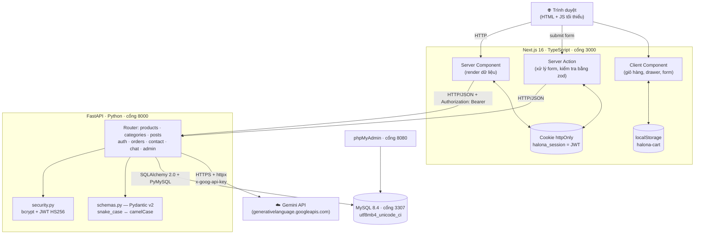
```mermaid
flowchart TD
    B["🌐 Trình duyệt<br/>(HTML + JS tối thiểu)"]

    subgraph FE["Next.js 16 · TypeScript · cổng 3000"]
        RSC["Server Component<br/>(render dữ liệu)"]
        SA["Server Action<br/>(xử lý form, kiểm tra bằng zod)"]
        CC["Client Component<br/>(giỏ hàng, drawer, form)"]
        LS[("localStorage<br/>halona-cart")]
        CK[("Cookie httpOnly<br/>halona_session = JWT")]
    end

    subgraph BE["FastAPI · Python · cổng 8000"]
        RT["Router: products · categories · posts<br/>auth · orders · contact · chat · admin"]
        SEC["security.py<br/>bcrypt + JWT HS256"]
        SCH["schemas.py — Pydantic v2<br/>snake_case ↔ camelCase"]
    end

    DB[("MySQL 8.4 · cổng 3307<br/>utf8mb4_unicode_ci")]
    PMA["phpMyAdmin · cổng 8080"]
    GM["☁️ Gemini API<br/>(generativelanguage.googleapis.com)"]

    B -->|HTTP| RSC
    B -->|submit form| SA
    B --> CC
    CC <--> LS
    RSC -->|"HTTP/JSON + Authorization: Bearer"| RT
    SA -->|"HTTP/JSON"| RT
    SA <--> CK
    RSC <--> CK
    RT --> SEC
    RT --> SCH
    RT -->|"SQLAlchemy 2.0 + PyMySQL"| DB
    PMA --> DB
    RT -->|"HTTPS + httpx<br/>x-goog-api-key"| GM
```

Hai ràng buộc kiến trúc quan trọng nhất:

1. **Trình duyệt không bao giờ nói chuyện trực tiếp với CSDL, và Next.js cũng vậy.** Mọi truy vấn đều đi qua HTTP tới FastAPI. Lớp gọi API duy nhất là `src/lib/api.ts`, được đánh dấu `import 'server-only'` nên không thể vô tình bị bundle vào JavaScript phía client.
2. **JWT không bao giờ rời khỏi máy chủ Next.js.** Token do FastAPI cấp được ghi thẳng vào cookie `httpOnly`; Server Component và Server Action đọc cookie đó rồi gắn header `Authorization` khi gọi API. JavaScript trong trình duyệt không đọc được token.
3. **Khoá Gemini chỉ nằm ở backend.** Trình duyệt không bao giờ gọi thẳng Gemini; khung chat đi qua Server Action → `api.ts` → FastAPI, và chỉ FastAPI đọc `GEMINI_API_KEY` từ `backend/.env`. Khoá cũng được gửi ở header `x-goog-api-key` thay vì `?key=` để không lọt vào log truy cập.

### 0.4. Thuật ngữ và quy ước

| Thuật ngữ | Ý nghĩa trong tài liệu này |
|---|---|
| **Slug** | Chuỗi định danh thân thiện trên URL, chỉ gồm `a-z`, `0-9` và dấu `-`. Ví dụ `tao-nhap-khau`. |
| **Server Component (RSC)** | Component React chạy **trên máy chủ**, được phép `await` gọi API và đọc cookie. Không gửi mã JS về trình duyệt. |
| **Server Action (SA)** | Hàm `'use server'` xử lý submit form: kiểm tra dữ liệu bằng `zod`, gọi API, rồi `redirect`/`revalidatePath`. |
| **COD / BANK** | Hai hình thức thanh toán: nhận hàng trả tiền / chuyển khoản ngân hàng. |
| **Mã đơn (`code`)** | Mã hiển thị cho khách, dạng `HL-XXXXXX`, sinh bằng `secrets.token_hex(3)`. Khác với khoá chính `id` (UUID). |
| **Tồn theo báo cáo (`stock`)** | Số tồn do quản trị viên khai báo. Hệ thống **không** tự trừ khi có đơn. |
| **`utf8mb4_unicode_ci`** | Đối chiếu ký tự của MySQL bỏ qua cả hoa/thường lẫn **dấu tiếng Việt** — nền tảng cho tìm kiếm không dấu. |
| **UI / SA / API / DB / LS** | Ký hiệu participant dùng thống nhất ở mục 5 (xem bảng quy ước đầu mục 5). |

Tên bảng và cột trong CSDL viết `snake_case` không dấu; JSON trả về cho frontend là `camelCase` — việc đổi tên do lớp `ApiModel` trong `backend/app/schemas.py` đảm nhiệm ở một chỗ duy nhất.

---

## 1. Tác nhân (Actors)

| Tác nhân | Mô tả | Quyền hạn chính |
|---|---|---|
| **Khách vãng lai** (Guest) | Người truy cập chưa đăng nhập. | Xem toàn bộ catalog và tin tức; tìm kiếm; thêm/sửa giỏ hàng; **đặt hàng không cần tài khoản**; tra cứu đơn theo mã; gửi tin nhắn liên hệ; đăng ký/đăng nhập. |
| **Khách hàng** (`role = USER`) | Người dùng đã đăng ký và đăng nhập. | Toàn bộ quyền của Khách vãng lai, cộng thêm: form thanh toán **tự điền sẵn** thông tin hồ sơ; xem danh sách đơn của mình; xem chi tiết đơn của mình; cập nhật hồ sơ (họ tên, điện thoại, địa chỉ). |
| **Quản trị viên** (`role = ADMIN`) | Người vận hành cửa hàng. | Toàn bộ quyền của Khách hàng, cộng thêm khu `/admin`: xem bảng điều khiển, thêm/sửa/xoá sản phẩm và gán danh mục, đổi trạng thái đơn hàng, xem bài viết, đánh dấu tin nhắn liên hệ đã xử lý. Xem được chi tiết đơn của **mọi** khách. |
| **Gemini API** (tác nhân ngoài, thứ cấp) | Dịch vụ mô hình ngôn ngữ của Google, do backend gọi qua REST. | Sinh câu trả lời tư vấn từ system prompt (đã nhồi sẵn danh mục sản phẩm) và ngữ cảnh hội thoại. **Không** truy cập CSDL, không biết gì ngoài những gì backend gửi trong mỗi request. |
| **Hệ thống** (tác nhân thứ cấp) | Các xử lý tự động, không do người dùng bấm. | Sinh mã đơn `HL-XXXXXX`; **tính lại tổng tiền từ CSDL** khi tạo đơn; chụp tên/giá/ảnh sản phẩm vào dòng đơn hàng; cấp và thẩm định JWT; chọn sản phẩm liên quan; sinh `sitemap.xml` và `robots.txt`; quy đổi thời điểm sang ISO UTC có hậu tố `Z`; nhồi danh mục sản phẩm vào system prompt và dò tên sản phẩm trong câu trả lời của trợ lý để gắn thẻ liên kết. |

**Ghi chú:**
- Hệ thống **không có** vai trò riêng cho bộ phận kho hay biên tập viên — mọi thao tác quản trị đều thuộc về `ADMIN`. Cột `role` chỉ nhận hai giá trị `USER` và `ADMIN`.
- Tài khoản mới đăng ký luôn nhận `role = USER`; **không có giao diện nào thăng quyền** — muốn tạo `ADMIN` phải sửa trực tiếp trong CSDL hoặc chạy `python seed.py`.
- Khách vãng lai đặt hàng thành công sẽ tạo đơn có `user_id = NULL`; đơn này **không** được gắn về tài khoản sau này kể cả khi khách dùng cùng email đăng ký.
- **Gemini API là tác nhân ngoài, có thể vắng mặt.** Thiếu `GEMINI_API_KEY` thì toàn bộ 25 use case còn lại vẫn chạy bình thường, chỉ UC-TL-01 trả 503 kèm thông báo tiếng Việt. Đây là lựa chọn có chủ đích để tính năng này phát triển và bàn giao được trước khi có khoá thật.

---

## 2. Sơ đồ Use Case tổng quát (Overall Use Case Diagram)


```mermaid
flowchart LR
    GU["👤 Khách vãng lai"]
    CU["🧑 Khách hàng"]
    AD["🛡️ Quản trị viên"]
    SYS["⚙️ Hệ thống<br/>(tự động)"]
    GM["☁️ Gemini API<br/>(dịch vụ ngoài)"]

    subgraph HALONA["Hệ thống Halona Fruist"]
        subgraph G1["Danh mục sản phẩm"]
            UC1(["UC-CT-01<br/>Xem trang chủ"])
            UC2(["UC-CT-02<br/>Duyệt cửa hàng<br/>và danh mục"])
            UC3(["UC-CT-03<br/>Xem chi tiết<br/>sản phẩm"])
            UC4(["UC-CT-04<br/>Tìm kiếm sản phẩm"])
        end
        subgraph G2["Giỏ hàng & Đặt hàng"]
            UC5(["UC-GH-01<br/>Quản lý giỏ hàng"])
            UC6(["UC-GH-02<br/>Thanh toán<br/>và tạo đơn hàng"])
            UC7(["UC-GH-03<br/>Tra cứu đơn<br/>theo mã"])
            UC8(["UC-GH-04<br/>Xem lịch sử<br/>đơn hàng"])
        end
        subgraph G3["Tài khoản"]
            UC9(["UC-TK-01<br/>Đăng ký"])
            UC10(["UC-TK-02<br/>Đăng nhập /<br/>Đăng xuất"])
            UC11(["UC-TK-03<br/>Cập nhật hồ sơ"])
            UC12(["UC-TK-04<br/>Phân quyền và<br/>phiên đăng nhập"])
        end
        subgraph G4["Nội dung & Liên hệ"]
            UC13(["UC-ND-01<br/>Xem tin tức<br/>và chuyên mục"])
            UC14(["UC-ND-02<br/>Xem trang<br/>giới thiệu"])
            UC15(["UC-ND-03<br/>Gửi tin nhắn<br/>liên hệ"])
        end
        subgraph G5["Quản trị"]
            UC16(["UC-QT-01<br/>Bảng điều khiển"])
            UC17(["UC-QT-02<br/>Quản lý sản phẩm"])
            UC18(["UC-QT-03<br/>Quản lý đơn hàng"])
            UC19(["UC-QT-04<br/>Quản lý bài viết"])
            UC20(["UC-QT-05<br/>Xử lý tin nhắn<br/>liên hệ"])
        end
        subgraph G6["Hệ thống chung"]
            UC21(["UC-HT-01<br/>SEO: sitemap,<br/>robots, metadata"])
            UC22(["UC-HT-02<br/>Xử lý lỗi và<br/>mất kết nối API"])
        end

        subgraph G7["Trợ lý ảo"]
            UC23(["UC-TL-01<br/>Hỏi trợ lý<br/>tư vấn"])
            UC24(["UC-TL-02<br/>Xem lại lịch sử<br/>trò chuyện"])
            UC25(["UC-TL-03<br/>Xoá cuộc<br/>trò chuyện"])
            UC26(["UC-QT-06<br/>Giám sát hội thoại<br/>trợ lý ảo"])
        end
    end

    GU --- UC1
    GU --- UC2
    GU --- UC3
    GU --- UC4
    GU --- UC5
    GU --- UC6
    GU --- UC7
    GU --- UC9
    GU --- UC10
    GU --- UC13
    GU --- UC14
    GU --- UC15

    CU --- UC6
    CU --- UC8
    CU --- UC10
    CU --- UC11

    AD --- UC16
    AD --- UC17
    AD --- UC18
    AD --- UC19
    AD --- UC20
    AD -. "kế thừa mọi use case<br/>của Khách hàng" .- HALONA

    UC6 --- SYS
    UC12 --- SYS
    UC21 --- SYS
    UC22 --- SYS

    GU --- UC23
    GU --- UC24
    GU --- UC25
    CU --- UC23
    CU --- UC24
    CU --- UC25
    AD --- UC26
    UC23 --- GM
    UC23 --- SYS
```

**Ghi chú:**
- **Khách vãng lai đặt hàng được** (UC-GH-02) — đây là quyết định thiết kế có chủ đích, xem `OptionalUser` trong `backend/app/routers/orders.py`. Khách hàng đã đăng nhập dùng chung use case đó nhưng được điền sẵn form.
- **UC-GH-03 (tra cứu đơn theo mã) công khai** để trang cảm ơn hiển thị được cho khách vãng lai; **UC-GH-04 (lịch sử đơn)** thì bắt buộc đăng nhập.
- Quản trị viên kế thừa mọi use case của Khách hàng (đường nét đứt tới biên hệ thống), vì `ADMIN` cũng là một bản ghi trong bảng `users`.
- **Hệ thống** là tác nhân thứ cấp cho các use case có xử lý tự động: tính lại tiền và sinh mã đơn (UC-GH-02), cấp/thẩm định JWT (UC-TK-04), sinh sitemap/robots (UC-HT-01), chuyển lỗi kết nối thành thông báo tiếng Việt (UC-HT-02), nhồi danh mục sản phẩm vào prompt và dò tên sản phẩm trong câu trả lời (UC-TL-01).
- **Gemini API** là tác nhân **ngoài**, chỉ tham gia UC-TL-01. Đây là phụ thuộc duy nhất của hệ thống vào một dịch vụ bên thứ ba, và được thiết kế để vắng mặt được: thiếu khoá thì use case này trả 503, mọi use case khác không bị ảnh hưởng.

---

## 3. Sơ đồ chi tiết & Đặc tả theo phân hệ

### 3.1. Phân hệ Danh mục sản phẩm (Catalog)

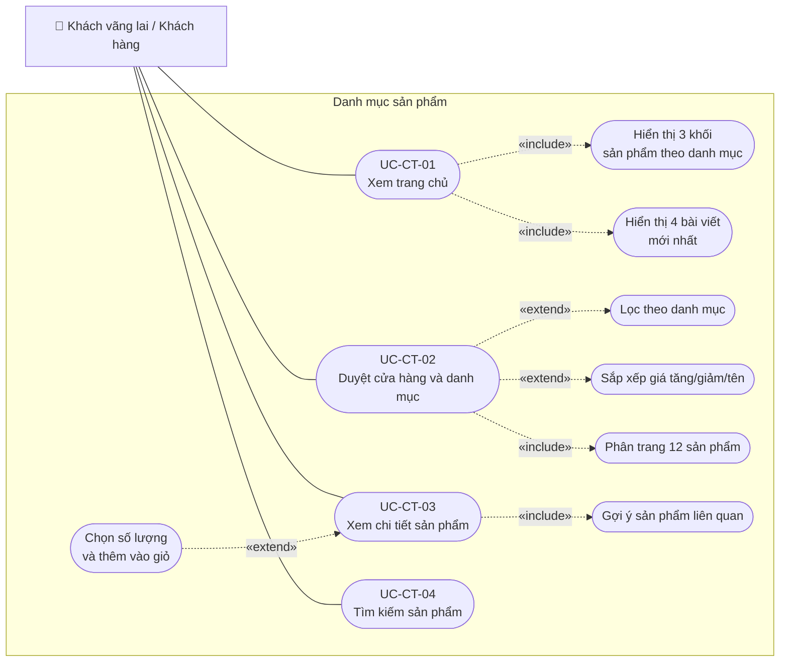
```mermaid
flowchart LR
    GU["👤 Khách vãng lai / Khách hàng"]

    subgraph CT["Danh mục sản phẩm"]
        A1(["UC-CT-01<br/>Xem trang chủ"])
        A1a(["Hiển thị 3 khối<br/>sản phẩm theo danh mục"])
        A1b(["Hiển thị 4 bài viết<br/>mới nhất"])

        A2(["UC-CT-02<br/>Duyệt cửa hàng và danh mục"])
        A2a(["Lọc theo danh mục"])
        A2b(["Sắp xếp giá tăng/giảm/tên"])
        A2c(["Phân trang 12 sản phẩm"])

        A3(["UC-CT-03<br/>Xem chi tiết sản phẩm"])
        A3a(["Gợi ý sản phẩm liên quan"])
        A3b(["Chọn số lượng<br/>và thêm vào giỏ"])

        A4(["UC-CT-04<br/>Tìm kiếm sản phẩm"])
    end

    GU --- A1
    GU --- A2
    GU --- A3
    GU --- A4

    A1 -. "«include»" .-> A1a
    A1 -. "«include»" .-> A1b
    A2 -. "«extend»" .-> A2a
    A2 -. "«extend»" .-> A2b
    A2 -. "«include»" .-> A2c
    A3 -. "«include»" .-> A3a
    A3b -. "«extend»" .-> A3
```

#### UC-CT-01 — Xem trang chủ

| Mục | Nội dung |
|---|---|
| **Mã UC** | UC-CT-01 |
| **Tác nhân** | Khách vãng lai, Khách hàng, Quản trị viên |
| **Mô tả** | Trang chủ dựng lại đúng **9 khối theo thứ tự của bản gốc**: slider chính, 3 banner khuyến mãi, khối sản phẩm "Trái cây nhập khẩu", 2 banner rộng, khối "Trái cây nội địa", khối "Nước ép" (nền tối), dải cam kết dịch vụ, khối tin tức, khối liên hệ kèm video YouTube. |
| **Tiền điều kiện** | Backend API đang chạy; CSDL đã có dữ liệu (chạy `python seed.py`). |
| **Luồng chính** | 1. Người dùng mở `/`.<br>2. Server Component gọi **song song** ba nhóm dữ liệu: danh mục sản phẩm, sản phẩm của ba danh mục `trai-cay-nhap-khau` / `trai-cay-noi-dia` / `nuoc-ep`, và 4 bài viết mới nhất.<br>3. Hệ thống ghép danh mục với danh sách sản phẩm tương ứng và render các khối.<br>4. Người dùng có thể bấm "Xem tất cả" của mỗi khối để sang trang danh mục tương ứng. |
| **Luồng thay thế / Quy tắc** | - Danh mục nào **không tồn tại trong CSDL** thì khối tương ứng **bị bỏ qua** (không render khối rỗng) — mã dùng phép kiểm `category && {...}`.<br>- Ba khối này gọi `products.list` **không truyền `page_size`**, tức lấy toàn bộ sản phẩm của danh mục chứ không phân trang.<br>- Ảnh nền footer và slide 1 không có trong kho lưu trữ nên được dựng lại bằng HTML/CSS và gradient (xem README).<br>- Backend chết → toàn trang hiển thị màn hình lỗi của UC-HT-02, không phải trang trắng. |
| **Hậu điều kiện** | Người dùng thấy toàn cảnh catalog và có lối vào cửa hàng, danh mục, tin tức. |

#### UC-CT-02 — Duyệt cửa hàng và danh mục sản phẩm

| Mục | Nội dung |
|---|---|
| **Mã UC** | UC-CT-02 |
| **Tác nhân** | Khách vãng lai, Khách hàng, Quản trị viên |
| **Mô tả** | Hai trang dùng chung một cơ chế: `/cua-hang` liệt kê **toàn bộ** sản phẩm, `/danh-muc-san-pham/{slug}` liệt kê sản phẩm của **một danh mục**. Cả hai đều có thanh bên danh mục (kèm số lượng sản phẩm), ô sắp xếp và thanh phân trang. |
| **Tiền điều kiện** | Không. |
| **Luồng chính** | 1. Người dùng mở `/cua-hang` hoặc bấm vào một danh mục ở thanh bên.<br>2. Hệ thống đọc tham số URL `?sap-xep=` và `?trang=`.<br>3. Hệ thống gọi song song: danh sách danh mục (kèm số đếm), (với trang danh mục) thông tin danh mục theo slug, và trang sản phẩm tương ứng.<br>4. Hệ thống hiển thị "Hiển thị *n* trên *tổng* sản phẩm", lưới sản phẩm và thanh phân trang. |
| **Luồng thay thế / Quy tắc** | - **Phân trang cố định 12 sản phẩm/trang** (`PAGE_SIZE` trong `src/lib/catalog.ts`), thực hiện bằng `OFFSET/LIMIT` phía CSDL.<br>- `?trang=` không phải số nguyên dương → hệ thống **âm thầm quay về trang 1** (`parsePage`), không báo lỗi.<br>- Ba giá trị sắp xếp hợp lệ: `gia-tang`, `gia-giam`, `ten`. Giá trị lạ → dùng **thứ tự mặc định** `created_at` tăng dần (`SORTS.get(sort or "", ...)`), không báo lỗi.<br>- Sắp xếp theo giá dùng cột `price` (**giá niêm yết**), không dùng `sale_price` — sản phẩm đang giảm giá vẫn xếp theo giá gốc.<br>- Slug danh mục không tồn tại → trang 404 (UC-HT-02). Ba lời gọi API vẫn chạy **song song** rồi mới kiểm tra 404, vì lời gọi lọc sản phẩm chỉ cần slug trên URL.<br>- Số đếm ở thanh bên (`productCount`, `postCount`) do backend tính bằng truy vấn con tương quan, thay cho `_count` của Prisma ở bản trước. |
| **Hậu điều kiện** | Người dùng chọn được sản phẩm để xem chi tiết. |

#### UC-CT-03 — Xem chi tiết sản phẩm

| Mục | Nội dung |
|---|---|
| **Mã UC** | UC-CT-03 |
| **Tác nhân** | Khách vãng lai, Khách hàng, Quản trị viên |
| **Mô tả** | Trang `/san-pham/{slug}` hiển thị ảnh, tên, giá (kèm giá gạch ngang nếu đang khuyến mãi), mô tả ngắn, mô tả chi tiết, danh mục, ô chọn số lượng, nút thêm vào giỏ và **tối đa 4 sản phẩm liên quan**. |
| **Tiền điều kiện** | Sản phẩm tồn tại trong CSDL. |
| **Luồng chính** | 1. Người dùng bấm vào một sản phẩm ở bất kỳ lưới nào.<br>2. Hệ thống truy vấn sản phẩm theo slug, nạp kèm danh mục.<br>3. Hệ thống chọn **sản phẩm liên quan**: cùng **danh mục đầu tiên** của sản phẩm, loại chính nó, giới hạn 4.<br>4. Người dùng chọn số lượng rồi bấm "Thêm vào giỏ" → chuyển sang UC-GH-01. |
| **Luồng thay thế / Quy tắc** | - Slug không tồn tại → API trả 404, lớp `api.ts` đổi thành `null`, trang gọi `notFound()` → giao diện 404.<br>- Sản phẩm **không thuộc danh mục nào** → danh sách liên quan rỗng, khối liên quan không hiển thị.<br>- Danh mục của sản phẩm được sắp theo `Category.position`, nên "danh mục đầu tiên" là danh mục có `position` nhỏ nhất.<br>- Giá đưa vào giỏ là **giá thực tế** `sale_price` nếu có, ngược lại `price`; con số này chỉ để hiển thị — khi đặt hàng backend tính lại (UC-GH-02).<br>- `stock` được hiển thị ở khu quản trị nhưng **không chặn** việc thêm vào giỏ hay đặt hàng. |
| **Hậu điều kiện** | Sản phẩm được thêm vào giỏ hàng, hoặc người dùng chuyển sang sản phẩm liên quan. |

#### UC-CT-04 — Tìm kiếm sản phẩm

| Mục | Nội dung |
|---|---|
| **Mã UC** | UC-CT-04 |
| **Tác nhân** | Khách vãng lai, Khách hàng, Quản trị viên |
| **Mô tả** | Ô tìm kiếm trên header dẫn tới `/tim-kiem?q=...`; hệ thống tìm từ khoá trong **tên**, **mô tả ngắn** và **mô tả chi tiết** của sản phẩm. |
| **Tiền điều kiện** | Không. |
| **Luồng chính** | 1. Người dùng gõ từ khoá vào ô tìm kiếm và nhấn Enter.<br>2. Hệ thống chuẩn hoá từ khoá (cắt khoảng trắng thừa).<br>3. Hệ thống gọi `GET /api/products?q=...&sort=ten` — điều kiện `LIKE %q%` trên ba cột, sắp xếp theo tên.<br>4. Hệ thống hiển thị số kết quả và lưới sản phẩm. |
| **Luồng thay thế / Quy tắc** | - Từ khoá rỗng → **không gọi API**, hiển thị lời nhắc "Nhập từ khoá vào ô tìm kiếm ở đầu trang."<br>- **Tìm kiếm bỏ dấu và không phân biệt hoa/thường** nhờ đối chiếu `utf8mb4_unicode_ci` của MySQL: gõ `tao` vẫn ra `Táo nhập khẩu`. Đây là khác biệt so với bản SQLite trước đây (chỉ bỏ qua hoa/thường với ký tự ASCII).<br>- Trang tìm kiếm **không phân trang** — gọi API không truyền `page_size` nên trả toàn bộ kết quả khớp.<br>- Không có kết quả → lưới rỗng kèm số "0 kết quả"; không phải lỗi. |
| **Hậu điều kiện** | Người dùng tới được sản phẩm cần tìm. |

---

### 3.2. Phân hệ Giỏ hàng & Đặt hàng

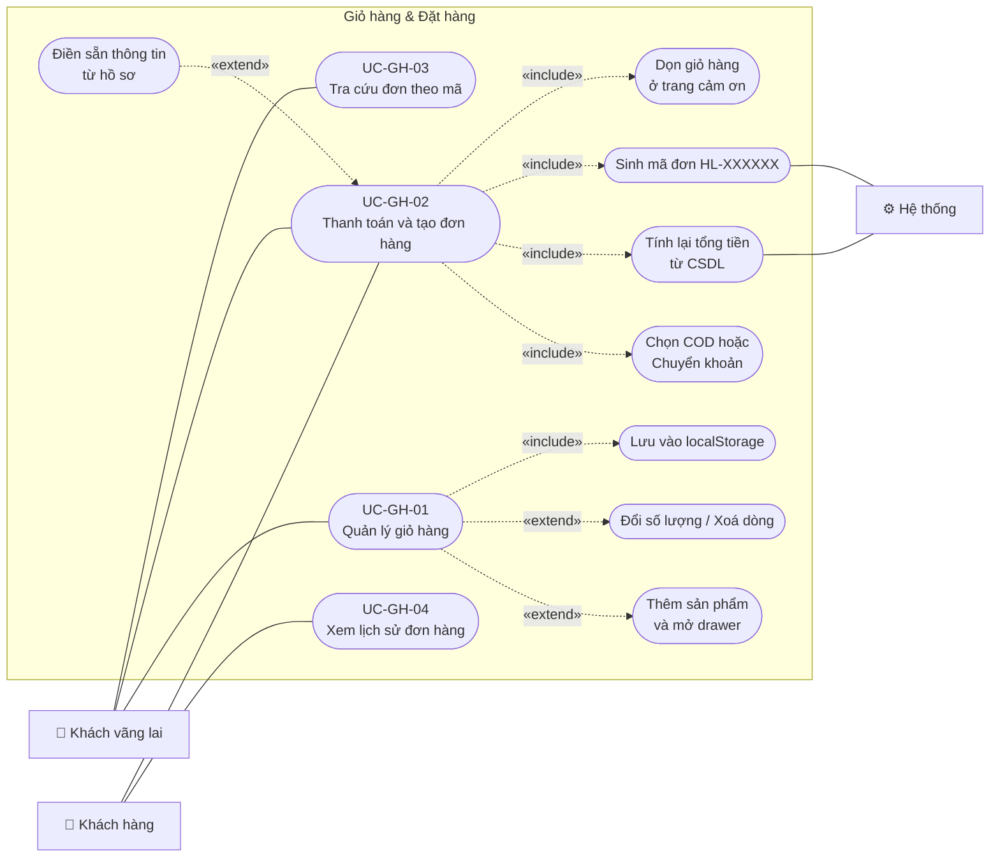
```mermaid
flowchart LR
    GU["👤 Khách vãng lai"]
    CU["🧑 Khách hàng"]
    SYS["⚙️ Hệ thống"]

    subgraph GH["Giỏ hàng & Đặt hàng"]
        B1(["UC-GH-01<br/>Quản lý giỏ hàng"])
        B1a(["Thêm sản phẩm<br/>và mở drawer"])
        B1b(["Đổi số lượng / Xoá dòng"])
        B1c(["Lưu vào localStorage"])

        B2(["UC-GH-02<br/>Thanh toán và tạo đơn hàng"])
        B2a(["Điền sẵn thông tin<br/>từ hồ sơ"])
        B2b(["Chọn COD hoặc<br/>Chuyển khoản"])
        B2c(["Tính lại tổng tiền<br/>từ CSDL"])
        B2d(["Sinh mã đơn HL-XXXXXX"])
        B2e(["Dọn giỏ hàng<br/>ở trang cảm ơn"])

        B3(["UC-GH-03<br/>Tra cứu đơn theo mã"])
        B4(["UC-GH-04<br/>Xem lịch sử đơn hàng"])
    end

    GU --- B1
    GU --- B2
    GU --- B3
    CU --- B4
    CU --- B2

    B1 -. "«extend»" .-> B1a
    B1 -. "«extend»" .-> B1b
    B1 -. "«include»" .-> B1c
    B2a -. "«extend»" .-> B2
    B2 -. "«include»" .-> B2b
    B2 -. "«include»" .-> B2c
    B2 -. "«include»" .-> B2d
    B2 -. "«include»" .-> B2e
    B2c --- SYS
    B2d --- SYS
```

#### UC-GH-01 — Quản lý giỏ hàng

| Mục | Nội dung |
|---|---|
| **Mã UC** | UC-GH-01 |
| **Tác nhân** | Khách vãng lai, Khách hàng |
| **Mô tả** | Giỏ hàng sống **hoàn toàn ở phía trình duyệt**, lưu trong `localStorage` khoá `halona-cart`. Có hai giao diện: **ngăn kéo (drawer)** trượt ra từ header và **trang giỏ hàng** `/gio-hang`. |
| **Tiền điều kiện** | Trình duyệt cho phép ghi `localStorage` (không bắt buộc — xem quy tắc). |
| **Luồng chính** | 1. Người dùng bấm "Thêm vào giỏ" ở card sản phẩm hoặc trang chi tiết.<br>2. Hệ thống cộng dồn nếu sản phẩm **đã có** trong giỏ, ngược lại thêm dòng mới, rồi **tự mở drawer**.<br>3. Người dùng đổi số lượng hoặc xoá dòng ở drawer / trang giỏ hàng.<br>4. Mỗi lần giỏ đổi, hệ thống ghi lại toàn bộ giỏ xuống `localStorage`.<br>5. Người dùng bấm "Thanh toán" → chuyển sang UC-GH-02. |
| **Luồng thay thế / Quy tắc** | - **Giỏ được đọc trong `useEffect` sau khi mount**, không phải lúc render đầu: máy chủ không truy cập được `localStorage` nên lần render đầu bắt buộc là giỏ rỗng. Đây là cách tránh lỗi hydration; trong lúc đó `isLoading = true` để giao diện hiện "Đang tải giỏ hàng...".<br>- Dữ liệu trong `localStorage` **hỏng hoặc sai kiểu bị lọc bỏ từng dòng**, không làm mất cả giỏ (`readStorage`).<br>- Đặt số lượng **≤ 0 tương đương xoá dòng**.<br>- Chế độ riêng tư của trình duyệt có thể chặn ghi → lỗi bị **nuốt có chủ đích**, giỏ vẫn dùng được trong phiên hiện tại.<br>- Khi drawer mở, hệ thống **khoá cuộn nền** (`body.style.overflow = 'hidden'`) và khôi phục giá trị cũ khi đóng.<br>- Giỏ hàng **không đồng bộ giữa các thiết bị** và **không lưu vào CSDL** — đăng nhập ở máy khác sẽ thấy giỏ rỗng.<br>- Giá trong giỏ là **ảnh chụp tại thời điểm thêm**; nếu quản trị viên đổi giá sau đó, số tiền hiển thị ở giỏ có thể lệch cho tới khi đặt hàng (backend tính lại — xem UC-GH-02). |
| **Hậu điều kiện** | Giỏ hàng phản ánh đúng lựa chọn của người dùng và sẵn sàng cho bước thanh toán. |

#### UC-GH-02 — Thanh toán và tạo đơn hàng

| Mục | Nội dung |
|---|---|
| **Mã UC** | UC-GH-02 |
| **Tác nhân** | Khách vãng lai, Khách hàng; Hệ thống (tính tiền, sinh mã đơn) |
| **Mô tả** | Trang `/thanh-toan` thu thập thông tin người nhận (họ tên, email, điện thoại, địa chỉ, ghi chú), hình thức thanh toán (COD hoặc chuyển khoản) và tóm tắt giỏ hàng, rồi tạo đơn hàng trong CSDL. |
| **Tiền điều kiện** | Giỏ hàng có ít nhất một dòng. |
| **Luồng chính** | 1. Người dùng mở `/thanh-toan`. Nếu **đã đăng nhập**, hệ thống điền sẵn họ tên, email, điện thoại, địa chỉ từ hồ sơ.<br>2. Người dùng điền/sửa thông tin, chọn hình thức thanh toán, bấm "Đặt hàng".<br>3. Trình duyệt gửi kèm **trường ẩn `items`** chứa JSON `[{productId, quantity}]` lấy từ giỏ.<br>4. Server Action kiểm tra dữ liệu bằng `zod`; hợp lệ thì gọi `POST /api/orders`.<br>5. Backend **đọc lại từng sản phẩm trong CSDL**, lấy `sale_price` nếu có, ngược lại `price`, rồi tính `total = Σ(giá × số lượng)`.<br>6. Backend chụp `name`, `price`, `image` của từng sản phẩm vào `order_items`, sinh mã `HL-XXXXXX`, gán `user_id` nếu có token, lưu đơn với trạng thái `PENDING`.<br>7. Server Action chuyển hướng tới `/dat-hang-thanh-cong/{code}`.<br>8. Trang cảm ơn hiển thị mã đơn, chi tiết đơn và **dọn sạch giỏ hàng** (`ClearCartOnMount`). |
| **Luồng thay thế / Quy tắc** | - **Giá luôn được tính lại ở backend.** Client chỉ gửi `productId` và `quantity`; kể cả có sửa payload cũng không ảnh hưởng tổng tiền. Đây là quy tắc bảo mật cốt lõi của phân hệ.<br>- **Kiểm tra dữ liệu hai lớp có chủ đích**: `zod` ở Server Action sinh lỗi tiếng Việt **theo từng ô nhập** cho `useActionState`; `pydantic` chặn lại ở biên API để cả request không đi qua giao diện cũng bị lọc. Ví dụ điện thoại `^0\d{9,10}$` xuất hiện ở cả hai nơi.<br>- Ràng buộc dữ liệu: họ tên ≥ 2 ký tự · email đúng định dạng · điện thoại bắt đầu bằng `0`, 10–11 chữ số · địa chỉ ≥ 8 ký tự · ghi chú ≤ 500 ký tự · số lượng mỗi dòng 1–999 · ít nhất 1 dòng.<br>- Một `productId` **không còn tồn tại** → backend trả 400 "Một số sản phẩm không còn tồn tại. Vui lòng kiểm tra lại giỏ hàng."<br>- Trường ẩn `items` hỏng hoặc rỗng → Server Action trả lỗi chung "Giỏ hàng trống hoặc không hợp lệ." mà không gọi API.<br>- Hai hình thức thanh toán chỉ được **ghi nhận**; hệ thống **không** tích hợp cổng thanh toán và **không** kiểm tra đã chuyển khoản hay chưa.<br>- Hệ thống **không trừ `stock`** khi tạo đơn.<br>- Đơn của khách vãng lai có `user_id = NULL` nên **không xuất hiện** ở "Đơn hàng của tôi" (UC-GH-04), nhưng vẫn tra cứu được bằng mã (UC-GH-03).<br>- Mã đơn sinh bằng `secrets.token_hex(3)` (24 bit ≈ 16,7 triệu tổ hợp) và cột `code` có ràng buộc UNIQUE — xác suất trùng cực thấp nhưng khi trùng sẽ là lỗi 500; hệ thống **không thử lại**.<br>- `redirect()` của Next ném lỗi để điều hướng nên phải gọi **ngoài** khối `try/catch` bắt `ApiError`. |
| **Hậu điều kiện** | Đơn hàng tồn tại trong CSDL ở trạng thái `PENDING`; giỏ hàng đã được dọn; khách có mã đơn để tra cứu. |

#### UC-GH-03 — Tra cứu đơn hàng theo mã

| Mục | Nội dung |
|---|---|
| **Mã UC** | UC-GH-03 |
| **Tác nhân** | Khách vãng lai, Khách hàng |
| **Mô tả** | Trang cảm ơn `/dat-hang-thanh-cong/{code}` hiển thị chi tiết đơn theo **mã đơn**, không yêu cầu đăng nhập. |
| **Tiền điều kiện** | Đơn hàng với mã tương ứng tồn tại. |
| **Luồng chính** | 1. Hệ thống chuyển hướng tới trang này ngay sau khi đặt hàng thành công (hoặc khách mở lại đường dẫn đã lưu).<br>2. Hệ thống gọi `GET /api/orders/{code}`, nạp kèm các dòng đơn hàng.<br>3. Hệ thống hiển thị mã đơn, thông tin người nhận, danh sách sản phẩm, hình thức thanh toán và tổng tiền. |
| **Luồng thay thế / Quy tắc** | - **Endpoint này công khai có chủ đích** — khách vãng lai không có tài khoản nào để đối chiếu chủ đơn. Đổi lại, ai biết mã đơn đều xem được nội dung đơn. Rủi ro được chấp nhận vì mã sinh ngẫu nhiên 6 ký tự hex và không hiển thị công khai ở đâu.<br>- Mã không tồn tại → `notFound()` → trang 404.<br>- Trang này chỉ **hiển thị**, không cho sửa hay huỷ đơn. |
| **Hậu điều kiện** | Khách xác nhận được đơn đã ghi nhận và có mã để đối chiếu khi liên hệ. |

#### UC-GH-04 — Xem lịch sử đơn hàng

| Mục | Nội dung |
|---|---|
| **Mã UC** | UC-GH-04 |
| **Tác nhân** | Khách hàng, Quản trị viên |
| **Mô tả** | `/tai-khoan/don-hang` liệt kê đơn của chính người đang đăng nhập (mã đơn, ngày đặt, số sản phẩm, trạng thái, tổng tiền); `/tai-khoan/don-hang/{code}` xem chi tiết một đơn. |
| **Tiền điều kiện** | Đã đăng nhập. |
| **Luồng chính** | 1. Người dùng vào mục "Đơn hàng của tôi".<br>2. Hệ thống gọi `GET /api/orders` kèm token; backend lọc `user_id = <người đang đăng nhập>`, sắp xếp mới nhất trước.<br>3. Người dùng bấm vào mã đơn để xem chi tiết. |
| **Luồng thay thế / Quy tắc** | - Chưa đăng nhập → **chuyển hướng** tới `/tai-khoan/dang-nhap`.<br>- Không có đơn nào → hiển thị trạng thái rỗng kèm nút "Mua sắm ngay", không phải lỗi.<br>- **Chi tiết đơn kiểm chủ sở hữu ở frontend**: `order.userId !== session.id && session.role !== 'ADMIN'` → `notFound()`. Backend không kiểm vì endpoint tra theo mã vốn công khai (UC-GH-03); đây là điểm cần lưu ý khi mở rộng hệ thống.<br>- **Quản trị viên xem được chi tiết đơn của mọi khách** qua chính đường dẫn này.<br>- Cột "Số sản phẩm" dùng `itemCount` — trường **suy ra** từ độ dài `items` bởi `@computed_field` của Pydantic, không lưu trong CSDL.<br>- Đơn đặt lúc còn là khách vãng lai (`user_id = NULL`) **không bao giờ** xuất hiện ở đây. |
| **Hậu điều kiện** | Khách hàng theo dõi được trạng thái các đơn của mình. |

---

### 3.3. Phân hệ Tài khoản

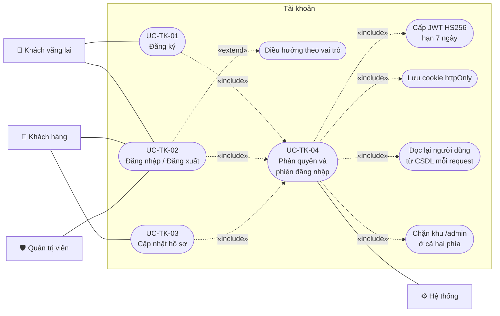
```mermaid
flowchart LR
    GU["👤 Khách vãng lai"]
    CU["🧑 Khách hàng"]
    AD["🛡️ Quản trị viên"]
    SYS["⚙️ Hệ thống"]

    subgraph TK["Tài khoản"]
        C1(["UC-TK-01<br/>Đăng ký"])
        C2(["UC-TK-02<br/>Đăng nhập / Đăng xuất"])
        C2a(["Điều hướng theo vai trò"])
        C3(["UC-TK-03<br/>Cập nhật hồ sơ"])
        C4(["UC-TK-04<br/>Phân quyền và<br/>phiên đăng nhập"])
        C4a(["Cấp JWT HS256<br/>hạn 7 ngày"])
        C4b(["Lưu cookie httpOnly"])
        C4c(["Đọc lại người dùng<br/>từ CSDL mỗi request"])
        C4d(["Chặn khu /admin<br/>ở cả hai phía"])
    end

    GU --- C1
    GU --- C2
    CU --- C2
    CU --- C3
    AD --- C2

    C1 -. "«include»" .-> C4
    C2 -. "«include»" .-> C4
    C3 -. "«include»" .-> C4
    C2 -. "«extend»" .-> C2a
    C4 -. "«include»" .-> C4a
    C4 -. "«include»" .-> C4b
    C4 -. "«include»" .-> C4c
    C4 -. "«include»" .-> C4d
    C4 --- SYS
```

#### UC-TK-01 — Đăng ký tài khoản

| Mục | Nội dung |
|---|---|
| **Mã UC** | UC-TK-01 |
| **Tác nhân** | Khách vãng lai |
| **Mô tả** | Tạo tài khoản mới bằng họ tên, email và mật khẩu; đăng ký thành công thì **đăng nhập luôn**. |
| **Tiền điều kiện** | Email chưa được đăng ký. |
| **Luồng chính** | 1. Người dùng mở `/tai-khoan/dang-ky` và điền họ tên, email, mật khẩu, nhập lại mật khẩu.<br>2. Server Action kiểm tra bằng `zod`: họ tên ≥ 2 ký tự, email hợp lệ, mật khẩu ≥ 6 ký tự, hai lần nhập khớp nhau.<br>3. Backend kiểm tra email chưa tồn tại, băm mật khẩu bằng **bcrypt**, tạo bản ghi `users` với `role = USER`.<br>4. Backend trả về JWT + hồ sơ; Server Action ghi token vào cookie `httpOnly`.<br>5. Hệ thống chuyển hướng tới `/tai-khoan`. |
| **Luồng thay thế / Quy tắc** | - Email **đã đăng ký** → backend trả **409**; Server Action gắn thông báo vào **đúng ô email** thay vì lỗi chung, để người dùng sửa ngay tại chỗ.<br>- Trường "nhập lại mật khẩu" **chỉ tồn tại ở frontend** (`.refine()` của zod) — API không nhận trường này.<br>- Mật khẩu được **cắt còn 72 byte** trước khi băm: `bcryptjs` của bản Next.js cũ cắt ngầm còn thư viện `bcrypt` của Python thì ném lỗi, cắt tay để hai bên hành xử giống nhau và dữ liệu cũ vẫn đăng nhập được.<br>- **Không có** xác minh email, captcha hay giới hạn số lần thử.<br>- Vai trò luôn là `USER`; API không nhận trường `role`. |
| **Hậu điều kiện** | Tài khoản tồn tại trong CSDL, phiên đăng nhập đã được thiết lập. |

#### UC-TK-02 — Đăng nhập / Đăng xuất

| Mục | Nội dung |
|---|---|
| **Mã UC** | UC-TK-02 |
| **Tác nhân** | Khách vãng lai (đăng nhập), Khách hàng, Quản trị viên (đăng xuất) |
| **Mô tả** | Xác thực bằng email + mật khẩu, cấp phiên 7 ngày; đăng xuất xoá cookie phiên. |
| **Tiền điều kiện** | Tài khoản tồn tại và đang hoạt động. |
| **Luồng chính** | 1. Người dùng mở `/tai-khoan/dang-nhap`, nhập email và mật khẩu.<br>2. Backend tìm người dùng theo email và đối chiếu mật khẩu bằng `bcrypt.checkpw`.<br>3. Backend ký JWT HS256 với payload `{sub, email, name, role, iat, exp}`, hạn **7 ngày**.<br>4. Server Action ghi token vào cookie `halona_session` (`httpOnly`, `sameSite=lax`, `secure` khi production, `maxAge` 7 ngày).<br>5. Hệ thống **điều hướng theo vai trò**: `ADMIN` → `/admin`, còn lại → `/tai-khoan`.<br>6. Đăng xuất: xoá cookie, `revalidatePath('/', 'layout')` để header cập nhật, rồi về trang chủ. |
| **Luồng thay thế / Quy tắc** | - Sai email **và** sai mật khẩu đều trả **cùng một thông báo** "Email hoặc mật khẩu không đúng." — không để lộ email nào đã đăng ký.<br>- Chuỗi băm trong CSDL bị hỏng → `verify_password` bắt `ValueError` và **coi như sai mật khẩu**, không làm sập API.<br>- Hạn cookie (`MAX_AGE_SECONDS`) và hạn token (`TOKEN_TTL_SECONDS`) đều là 7 ngày và phải giữ khớp nhau; lệch nhau sẽ sinh trạng thái "có cookie nhưng token hết hạn".<br>- **Không có** cơ chế làm mới token, ghi nhớ đăng nhập dài hạn, quên mật khẩu, hay thu hồi token đang lưu hành.<br>- `AUTH_SECRET` bắt buộc phải có trong `backend/.env`, nếu không API **không khởi động được**. |
| **Hậu điều kiện** | Cookie phiên được thiết lập/xoá; giao diện phản ánh đúng trạng thái đăng nhập. |

#### UC-TK-03 — Cập nhật hồ sơ

| Mục | Nội dung |
|---|---|
| **Mã UC** | UC-TK-03 |
| **Tác nhân** | Khách hàng, Quản trị viên |
| **Mô tả** | Trang `/tai-khoan` cho phép sửa họ tên, số điện thoại và địa chỉ — các thông tin này sau đó **điền sẵn vào form thanh toán**. |
| **Tiền điều kiện** | Đã đăng nhập. |
| **Luồng chính** | 1. Người dùng sửa thông tin và bấm "Lưu".<br>2. Server Action xác nhận còn phiên, kiểm tra dữ liệu bằng `zod`.<br>3. Backend cập nhật `PATCH /api/auth/me` và trả hồ sơ mới.<br>4. Hệ thống `revalidatePath('/tai-khoan')` và hiển thị thông báo thành công. |
| **Luồng thay thế / Quy tắc** | - **Email và mật khẩu không sửa được** ở đây; hệ thống chưa có chức năng đổi mật khẩu.<br>- Điện thoại được phép **để trống**, nhưng nếu nhập thì phải khớp `^0\d{9,10}$`; địa chỉ tối đa 300 ký tự ở frontend (cột CSDL cho 500).<br>- Chuỗi rỗng được quy về `NULL` trước khi lưu, để không có bản ghi mang chuỗi rỗng lẫn `NULL` cùng nghĩa.<br>- Phiên hết hạn giữa chừng → trả lỗi chung "Bạn cần đăng nhập để cập nhật thông tin." |
| **Hậu điều kiện** | Hồ sơ được cập nhật; lần thanh toán sau được điền sẵn dữ liệu mới. |

#### UC-TK-04 — Phân quyền và phiên đăng nhập

| Mục | Nội dung |
|---|---|
| **Mã UC** | UC-TK-04 |
| **Tác nhân** | Hệ thống (chính); mọi tác nhân người dùng (chịu tác động) |
| **Mô tả** | Cơ chế nền cho toàn hệ thống: giữ phiên bằng JWT trong cookie `httpOnly`, xác định người dùng hiện tại ở mỗi request, và chặn khu quản trị ở **cả frontend lẫn backend**. |
| **Tiền điều kiện** | `AUTH_SECRET` được cấu hình giống nhau cho mọi tiến trình backend. |
| **Luồng chính** | 1. Server Component / Server Action gọi `getCurrentUser()`.<br>2. Lớp `api.ts` đọc token từ cookie và gắn header `Authorization: Bearer <token>`.<br>3. Backend giải mã token; hợp lệ thì **đọc lại bản ghi `users` từ CSDL** theo `sub`.<br>4. Người dùng được gắn vào request cho các dependency `current_user` / `admin_user` / `optional_user`.<br>5. Router `/api/admin/*` gắn `Depends(admin_user)` ở **cấp router**, nên mọi endpoint dưới đó — kể cả endpoint thêm về sau — đều được bảo vệ. |
| **Luồng thay thế / Quy tắc** | - **Đọc lại CSDL mỗi request thay vì tin payload token**: quyền bị đổi hoặc tài khoản bị xoá **có hiệu lực ngay**, không phải chờ token hết hạn. Đổi lại là thêm một truy vấn cho mỗi request cần xác thực.<br>- Thiếu token hoặc token hỏng/hết hạn → **401**; đúng token nhưng `role != ADMIN` → **403**.<br>- Frontend chặn **sớm** để báo lỗi thân thiện: `AdminLayout` chuyển hướng (chưa đăng nhập → `/tai-khoan/dang-nhap`, `USER` → `/tai-khoan`) và `assertAdmin()` trong các Server Action quản trị. Đây **không phải** lớp bảo vệ duy nhất — backend vẫn kiểm lại.<br>- `getCurrentUser()` coi lỗi **401 là "chưa đăng nhập"** và trả `null`; các lỗi khác được ném tiếp để không che giấu sự cố thật.<br>- `HTTPBearer(auto_error=False)` để endpoint tạo đơn hàng vẫn chạy được khi **không có** token (khách vãng lai). |
| **Hậu điều kiện** | Mỗi request được gắn đúng danh tính và quyền; khu quản trị không thể truy cập bằng cách gọi thẳng API. |

---

### 3.4. Phân hệ Nội dung & Liên hệ

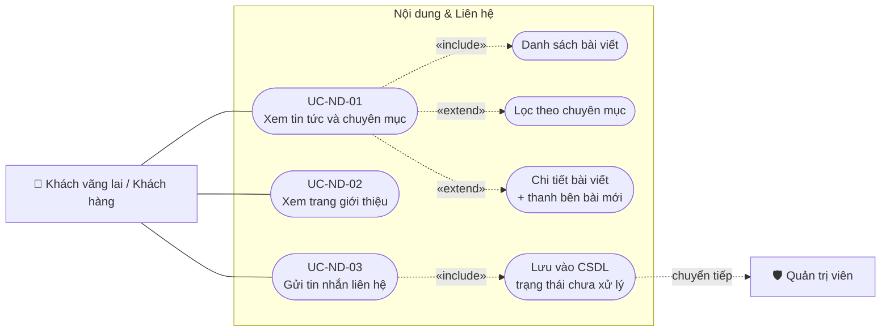
```mermaid
flowchart LR
    GU["👤 Khách vãng lai / Khách hàng"]
    AD["🛡️ Quản trị viên"]

    subgraph ND["Nội dung & Liên hệ"]
        D1(["UC-ND-01<br/>Xem tin tức và chuyên mục"])
        D1a(["Danh sách bài viết"])
        D1b(["Lọc theo chuyên mục"])
        D1c(["Chi tiết bài viết<br/>+ thanh bên bài mới"])
        D2(["UC-ND-02<br/>Xem trang giới thiệu"])
        D3(["UC-ND-03<br/>Gửi tin nhắn liên hệ"])
        D3a(["Lưu vào CSDL<br/>trạng thái chưa xử lý"])
    end

    GU --- D1
    GU --- D2
    GU --- D3
    D1 -. "«include»" .-> D1a
    D1 -. "«extend»" .-> D1b
    D1 -. "«extend»" .-> D1c
    D3 -. "«include»" .-> D3a
    D3a -. "chuyển tiếp" .-> AD
```

#### UC-ND-01 — Xem tin tức và chuyên mục

| Mục | Nội dung |
|---|---|
| **Mã UC** | UC-ND-01 |
| **Tác nhân** | Khách vãng lai, Khách hàng, Quản trị viên |
| **Mô tả** | Ba trang: `/tin-tuc` (toàn bộ bài viết), `/chuyen-muc/{slug}` (bài viết của một chuyên mục) và `/tin-tuc/{slug}` (chi tiết bài). Mọi trang đều có **thanh bên** gồm danh sách chuyên mục và 4 bài mới nhất. |
| **Tiền điều kiện** | Không. |
| **Luồng chính** | 1. Người dùng mở trang tin tức.<br>2. Hệ thống gọi song song: danh sách bài viết và dữ liệu thanh bên (`getSidebarData` — chuyên mục dạng `post` + 4 bài mới nhất).<br>3. Bài viết được sắp xếp **mới nhất trước** theo `published_at`.<br>4. Người dùng bấm vào bài để xem chi tiết; nội dung HTML được render kèm chuyên mục của bài. |
| **Luồng thay thế / Quy tắc** | - **Tin tức không phân trang** ở bất kỳ trang nào — API chỉ nhận `limit`, không có `page`/`page_size`.<br>- Nội dung bài (`content`) là **HTML lấy nguyên từ RSS lưu trữ** của site gốc, được nạp trong `seed.py`; hệ thống không có trình soạn thảo bài viết.<br>- Bảng `categories` **dùng chung** cho danh mục sản phẩm và chuyên mục bài viết, phân biệt bằng cột `kind` (`product` hoặc `post`) — nên mọi truy vấn chuyên mục đều phải truyền `kind=post`.<br>- Tham số `exclude` của API dùng để loại chính bài đang xem ra khỏi danh sách "bài liên quan".<br>- Slug không tồn tại → trang 404. |
| **Hậu điều kiện** | Người dùng đọc được nội dung và điều hướng sang bài khác qua thanh bên. |

#### UC-ND-02 — Xem trang giới thiệu

| Mục | Nội dung |
|---|---|
| **Mã UC** | UC-ND-02 |
| **Tác nhân** | Khách vãng lai, Khách hàng, Quản trị viên |
| **Mô tả** | Trang `/gioi-thieu` trình bày thông tin doanh nghiệp theo bốn phần có neo (`#linh-vuc`, `#chat-luong`, `#triet-li`, `#nang-luc`) — đúng bốn mục mà footer bản gốc trỏ tới. |
| **Tiền điều kiện** | Không. |
| **Luồng chính** | 1. Người dùng bấm "Giới thiệu" ở menu hoặc một mục trong khối "VỀ CHÚNG TÔI" ở footer.<br>2. Hệ thống hiển thị trang và cuộn tới neo tương ứng. |
| **Luồng thay thế / Quy tắc** | - Nội dung là **tĩnh, viết thẳng trong mã nguồn**, không đọc từ CSDL — trang gốc không có trong kho lưu trữ nên phần này được tự dựng theo đúng design token của bản gốc.<br>- Danh sách liên kết footer khai báo tập trung tại `ABOUT_LINKS` trong `src/lib/site.ts`. |
| **Hậu điều kiện** | Người dùng nắm được thông tin doanh nghiệp. |

#### UC-ND-03 — Gửi tin nhắn liên hệ

| Mục | Nội dung |
|---|---|
| **Mã UC** | UC-ND-03 |
| **Tác nhân** | Khách vãng lai, Khách hàng |
| **Mô tả** | Form liên hệ (ở trang `/lien-he` và ở khối liên hệ cuối trang chủ) ghi tin nhắn vào CSDL để quản trị viên xử lý sau (UC-QT-05). |
| **Tiền điều kiện** | Không cần đăng nhập. |
| **Luồng chính** | 1. Người dùng điền họ tên, email, điện thoại (tuỳ chọn), tiêu đề (tuỳ chọn), nội dung.<br>2. Server Action kiểm tra bằng `zod`, gọi `POST /api/contact`.<br>3. Backend lưu bản ghi `contact_messages` với `handled = FALSE`.<br>4. Giao diện hiển thị thông báo đã gửi thành công. |
| **Luồng thay thế / Quy tắc** | - Ràng buộc: họ tên ≥ 2 ký tự · email hợp lệ · điện thoại để trống được, nếu nhập thì `^0\d{9,10}$` · tiêu đề ≤ 150 ký tự · nội dung ≥ 10 ký tự.<br>- Lỗi API **không bị nuốt** — được hiển thị thành lỗi chung trên form thay vì im lặng báo thành công.<br>- Chuỗi rỗng của điện thoại/tiêu đề được quy về `NULL`.<br>- Hệ thống **không gửi email** cho quản trị viên; tin nhắn chỉ nằm trong CSDL và hiện ở bảng điều khiển dưới dạng số "Liên hệ chưa xử lý".<br>- **Không có** captcha hay chống spam. |
| **Hậu điều kiện** | Tin nhắn nằm trong hàng chờ xử lý của quản trị viên. |

---

### 3.5. Phân hệ Quản trị

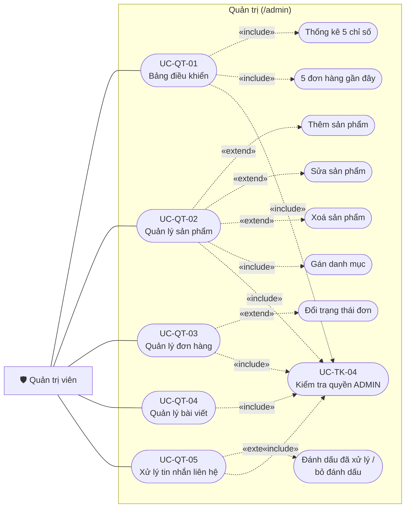
```mermaid
flowchart LR
    AD["🛡️ Quản trị viên"]

    subgraph QT["Quản trị (/admin)"]
        E1(["UC-QT-01<br/>Bảng điều khiển"])
        E1a(["Thống kê 5 chỉ số"])
        E1b(["5 đơn hàng gần đây"])

        E2(["UC-QT-02<br/>Quản lý sản phẩm"])
        E2a(["Thêm sản phẩm"])
        E2b(["Sửa sản phẩm"])
        E2c(["Xoá sản phẩm"])
        E2d(["Gán danh mục"])

        E3(["UC-QT-03<br/>Quản lý đơn hàng"])
        E3a(["Đổi trạng thái đơn"])

        E4(["UC-QT-04<br/>Quản lý bài viết"])
        E5(["UC-QT-05<br/>Xử lý tin nhắn liên hệ"])
        E5a(["Đánh dấu đã xử lý /<br/>bỏ đánh dấu"])

        E6(["UC-TK-04<br/>Kiểm tra quyền ADMIN"])
    end

    AD --- E1
    AD --- E2
    AD --- E3
    AD --- E4
    AD --- E5

    E1 -. "«include»" .-> E1a
    E1 -. "«include»" .-> E1b
    E2 -. "«extend»" .-> E2a
    E2 -. "«extend»" .-> E2b
    E2 -. "«extend»" .-> E2c
    E2 -. "«include»" .-> E2d
    E3 -. "«extend»" .-> E3a
    E5 -. "«extend»" .-> E5a
    E1 -. "«include»" .-> E6
    E2 -. "«include»" .-> E6
    E3 -. "«include»" .-> E6
    E4 -. "«include»" .-> E6
    E5 -. "«include»" .-> E6
```

#### UC-QT-01 — Bảng điều khiển

| Mục | Nội dung |
|---|---|
| **Mã UC** | UC-QT-01 |
| **Tác nhân** | Quản trị viên |
| **Mô tả** | Trang `/admin` tổng hợp **5 chỉ số** (số sản phẩm, số đơn hàng, số bài viết, số liên hệ chưa xử lý, doanh thu) và bảng **5 đơn hàng gần đây nhất**. |
| **Tiền điều kiện** | Đăng nhập với `role = ADMIN`. |
| **Luồng chính** | 1. Quản trị viên mở `/admin`.<br>2. `AdminLayout` xác nhận quyền; nếu không đủ quyền thì chuyển hướng.<br>3. Hệ thống gọi `GET /api/admin/stats` — một lời gọi trả về cả 5 chỉ số lẫn danh sách đơn gần đây.<br>4. Mỗi ô chỉ số là một liên kết tới trang quản lý tương ứng. |
| **Luồng thay thế / Quy tắc** | - **Doanh thu = tổng `total` của mọi đơn có `status != 'CANCELLED'`** — nghĩa là đơn `PENDING` (chưa xác nhận) **đã được tính vào** doanh thu. Đây là quy ước cần biết khi đọc con số này.<br>- "Liên hệ chưa xử lý" đếm bản ghi `contact_messages` có `handled = FALSE`.<br>- Ô "Doanh thu" **không** có liên kết đi tiếp.<br>- Chưa có đơn nào → bảng đơn gần đây hiển thị trạng thái rỗng.<br>- Các chỉ số được tính trực tiếp bằng `COUNT`/`SUM` mỗi lần tải trang, không có cache hay bảng tổng hợp. |
| **Hậu điều kiện** | Quản trị viên nắm được tình hình chung và có lối vào từng khu quản lý. |

#### UC-QT-02 — Quản lý sản phẩm

| Mục | Nội dung |
|---|---|
| **Mã UC** | UC-QT-02 |
| **Tác nhân** | Quản trị viên |
| **Mô tả** | Danh sách sản phẩm tại `/admin/san-pham`, form thêm mới tại `/admin/san-pham/moi`, form sửa tại `/admin/san-pham/{id}`, kèm nút xoá trên từng dòng. Form gồm: tên, slug, giá, giá khuyến mãi, tồn kho, đường dẫn ảnh, mô tả ngắn, mô tả chi tiết và **các danh mục** (chọn nhiều). |
| **Tiền điều kiện** | Đăng nhập với `role = ADMIN`. |
| **Luồng chính** | 1. Quản trị viên mở danh sách sản phẩm (`GET /api/admin/products`, sắp theo `created_at` tăng dần).<br>2. Bấm "Thêm sản phẩm" hoặc "Sửa" trên một dòng.<br>3. Server Action `saveProduct` kiểm tra quyền, kiểm tra dữ liệu bằng `zod`, rồi gọi `POST` (tạo) hoặc `PUT` (sửa).<br>4. Backend kiểm tra slug chưa trùng và giá khuyến mãi hợp lệ, lưu sản phẩm, gán lại danh mục.<br>5. Hệ thống `revalidatePath('/admin/san-pham')` và `revalidatePath('/')` rồi chuyển về danh sách. |
| **Luồng thay thế / Quy tắc** | - **Slug trùng** → backend trả **409**; Server Action gắn lỗi vào **đúng ô slug** để sửa tại chỗ. Khi sửa, chính sản phẩm đang sửa được loại khỏi phép kiểm (`Product.id != product_id`).<br>- **Giá khuyến mãi phải nhỏ hơn giá gốc**, vi phạm → **422**. Quy tắc này được kiểm ở **cả hai phía** (`.refine()` của zod và `_assert_sale_price` của backend).<br>- Slug phải khớp `^[a-z0-9-]+$`; giá > 0; tồn kho ≥ 0; mô tả ngắn và chi tiết ≥ 5 ký tự.<br>- **`hover_image` bị loại khỏi thao tác sửa** một cách có chủ đích: form quản trị không có ô này nên `ProductIn` luôn mang `None`, ghi đè vào sẽ **xoá mất ảnh hover đang lưu**. Muốn đổi ảnh hover phải sửa trực tiếp trong CSDL.<br>- **Xoá sản phẩm là xoá cứng.** Các dòng `order_items` trỏ tới nó được đặt `product_id = NULL` (`ON DELETE SET NULL`) — đơn hàng cũ **vẫn giữ nguyên** tên, giá và ảnh vì đã được chụp lại lúc đặt.<br>- Xoá hai lần (bấm nút liên tiếp) → backend trả 404, Server Action **coi như thành công** và không ném lỗi.<br>- `categoryIds` chứa id không tồn tại → dòng đó **bị bỏ qua âm thầm** (`_load_categories` chỉ nạp những id tìm thấy).<br>- Ảnh nhập bằng **đường dẫn văn bản**, hệ thống **không** có chức năng tải ảnh lên.<br>- Không có phân trang ở danh sách quản trị — toàn bộ sản phẩm được trả về một lần. |
| **Hậu điều kiện** | Catalog phía khách hàng phản ánh thay đổi ngay sau khi `revalidatePath` chạy. |

#### UC-QT-03 — Quản lý đơn hàng

| Mục | Nội dung |
|---|---|
| **Mã UC** | UC-QT-03 |
| **Tác nhân** | Quản trị viên |
| **Mô tả** | `/admin/don-hang` liệt kê toàn bộ đơn hàng (mới nhất trước) kèm ô chọn cho phép đổi trạng thái. |
| **Tiền điều kiện** | Đăng nhập với `role = ADMIN`. |
| **Luồng chính** | 1. Quản trị viên mở danh sách đơn (`GET /api/admin/orders`, nạp kèm dòng đơn hàng).<br>2. Chọn trạng thái mới cho một đơn.<br>3. Server Action kiểm tra quyền và **đối chiếu giá trị trạng thái với danh sách hợp lệ** trước khi gọi `PATCH /api/admin/orders/{id}`.<br>4. Backend cập nhật `status`, `updated_at` tự động đổi theo `onupdate`.<br>5. Hệ thống `revalidatePath('/admin/don-hang')`. |
| **Vòng đời trạng thái** | `PENDING` (Chờ xác nhận — mặc định khi tạo đơn) → `CONFIRMED` (Đã xác nhận) → `SHIPPING` (Đang giao) → `COMPLETED` (Hoàn thành); nhánh `CANCELLED` (Đã huỷ) có thể xảy ra từ bất kỳ trạng thái nào. |
| **Luồng thay thế / Quy tắc** | - **Hệ thống không ràng buộc thứ tự chuyển trạng thái.** Quản trị viên có thể nhảy thẳng từ `PENDING` sang `COMPLETED`, hoặc đưa một đơn `CANCELLED` trở lại `PENDING`. Enum chỉ giới hạn **tập giá trị**, không giới hạn **đường đi**.<br>- Trạng thái không nằm trong 5 giá trị hợp lệ → Server Action **im lặng bỏ qua**; nếu gọi thẳng API thì `Literal` của Pydantic trả **422**.<br>- Nhãn tiếng Việt và màu hiển thị khai báo tập trung tại `ORDER_STATUSES` (`src/lib/orderStatus.ts`); trạng thái lạ được hiển thị nguyên văn với màu xám thay vì làm hỏng giao diện.<br>- Quản trị viên **không sửa được** nội dung đơn (sản phẩm, số lượng, tổng tiền, thông tin người nhận) và **không xoá được** đơn.<br>- Huỷ đơn chỉ đổi trạng thái — không hoàn kho (hệ thống vốn không trừ kho) và không hoàn tiền. |
| **Hậu điều kiện** | Trạng thái mới hiển thị ngay cho khách ở UC-GH-04, và đơn `CANCELLED` bị loại khỏi doanh thu ở UC-QT-01. |

#### UC-QT-04 — Quản lý bài viết

| Mục | Nội dung |
|---|---|
| **Mã UC** | UC-QT-04 |
| **Tác nhân** | Quản trị viên |
| **Mô tả** | `/admin/bai-viet` liệt kê toàn bộ bài viết (mới nhất trước) kèm chuyên mục, dùng để **tra soát** nội dung. |
| **Tiền điều kiện** | Đăng nhập với `role = ADMIN`. |
| **Luồng chính** | 1. Quản trị viên mở `/admin/bai-viet`.<br>2. Hệ thống gọi `GET /api/admin/posts`, nạp kèm chuyên mục.<br>3. Bảng hiển thị tiêu đề, chuyên mục, ngày đăng và liên kết xem bài trên trang công khai. |
| **Luồng thay thế / Quy tắc** | - **Chỉ đọc.** Hệ thống **không có** thêm/sửa/xoá bài viết — nội dung được nạp một lần từ RSS lưu trữ qua `seed.py`, đúng tinh thần của một bản clone.<br>- Vì vậy phân hệ này chỉ có **một** endpoint (`GET`), khác với sản phẩm (đủ CRUD). |
| **Hậu điều kiện** | Quản trị viên đối chiếu được nội dung đang xuất bản. |

#### UC-QT-05 — Xử lý tin nhắn liên hệ

| Mục | Nội dung |
|---|---|
| **Mã UC** | UC-QT-05 |
| **Tác nhân** | Quản trị viên |
| **Mô tả** | `/admin/lien-he` liệt kê tin nhắn liên hệ (mới nhất trước) và cho phép **bật/tắt** cờ "đã xử lý". |
| **Tiền điều kiện** | Đăng nhập với `role = ADMIN`. |
| **Luồng chính** | 1. Quản trị viên mở `/admin/lien-he`.<br>2. Đọc nội dung tin nhắn, liên hệ khách qua email/điện thoại ghi trong tin.<br>3. Bấm nút đánh dấu → `PATCH /api/admin/contacts/{id}`.<br>4. Backend **đảo giá trị** `handled` và trả bản ghi mới; hệ thống `revalidatePath('/admin/lien-he')`. |
| **Luồng thay thế / Quy tắc** | - Endpoint là **toggle**, không nhận giá trị mong muốn — bấm hai lần sẽ quay về trạng thái cũ. Hệ quả: hai quản trị viên bấm gần như đồng thời có thể **triệt tiêu lẫn nhau**; hệ thống không có cơ chế khoá lạc quan.<br>- Tin nhắn **không xoá được** từ giao diện.<br>- Việc trả lời khách diễn ra **ngoài hệ thống** (email/điện thoại); cờ `handled` chỉ để đánh dấu nội bộ.<br>- Số "Liên hệ chưa xử lý" ở bảng điều khiển (UC-QT-01) cập nhật theo cờ này. |
| **Hậu điều kiện** | Hàng chờ liên hệ phản ánh đúng công việc còn lại. |

---

### 3.6. Phân hệ Hệ thống chung

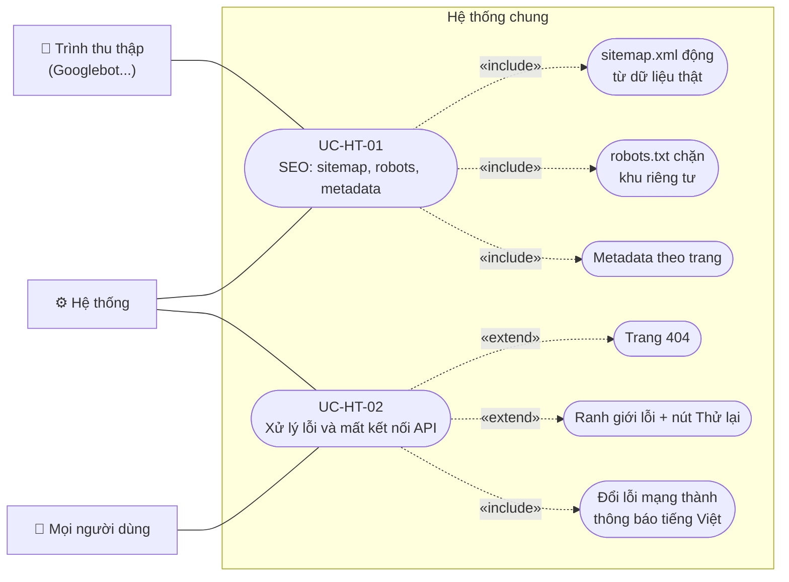
```mermaid
flowchart LR
    SYS["⚙️ Hệ thống"]
    BOT["🤖 Trình thu thập<br/>(Googlebot...)"]
    ALL["🧑 Mọi người dùng"]

    subgraph HT["Hệ thống chung"]
        F1(["UC-HT-01<br/>SEO: sitemap, robots, metadata"])
        F1a(["sitemap.xml động<br/>từ dữ liệu thật"])
        F1b(["robots.txt chặn<br/>khu riêng tư"])
        F1c(["Metadata theo trang"])

        F2(["UC-HT-02<br/>Xử lý lỗi và mất kết nối API"])
        F2a(["Trang 404"])
        F2b(["Ranh giới lỗi + nút Thử lại"])
        F2c(["Đổi lỗi mạng thành<br/>thông báo tiếng Việt"])
    end

    BOT --- F1
    ALL --- F2
    SYS --- F1
    SYS --- F2

    F1 -. "«include»" .-> F1a
    F1 -. "«include»" .-> F1b
    F1 -. "«include»" .-> F1c
    F2 -. "«extend»" .-> F2a
    F2 -. "«extend»" .-> F2b
    F2 -. "«include»" .-> F2c
```

#### UC-HT-01 — SEO: sitemap, robots và metadata

| Mục | Nội dung |
|---|---|
| **Mã UC** | UC-HT-01 |
| **Tác nhân** | Hệ thống (phát sinh); trình thu thập của công cụ tìm kiếm (tiêu thụ) |
| **Mô tả** | Hệ thống tự sinh `sitemap.xml`, `robots.txt` và thẻ metadata cho từng trang từ **dữ liệu thật trong CSDL**. |
| **Tiền điều kiện** | `NEXT_PUBLIC_SITE_URL` trỏ đúng địa chỉ triển khai; backend đang chạy. |
| **Luồng chính** | 1. Trình thu thập yêu cầu `/sitemap.xml`.<br>2. Hệ thống gọi song song danh sách sản phẩm, bài viết và danh mục.<br>3. Hệ thống sinh URL cho 5 trang tĩnh (`/`, `/cua-hang`, `/tin-tuc`, `/gioi-thieu`, `/lien-he`), mọi danh mục (`/danh-muc-san-pham/...` hoặc `/chuyen-muc/...` tuỳ `kind`), mọi sản phẩm và mọi bài viết.<br>4. `lastModified` lấy `updatedAt` của sản phẩm và `publishedAt` của bài viết.<br>5. `/robots.txt` cho phép thu thập toàn site trừ các khu riêng tư. |
| **Luồng thay thế / Quy tắc** | - `robots.txt` **chặn** `/admin`, `/tai-khoan`, `/thanh-toan`, `/gio-hang`, `/dat-hang-thanh-cong` — nhóm cuối quan trọng vì đường dẫn đó chứa mã đơn có thể tra cứu công khai (UC-GH-03).<br>- `sitemap.ts` khai `dynamic = 'force-dynamic'` vì dữ liệu lấy từ API lúc chạy, **không prerender tĩnh được**.<br>- Vì `sitemap.xml` và `generateStaticParams` của trang danh mục đọc dữ liệu thật, **`npm run build` yêu cầu backend đang chạy**.<br>- `metadataBase` lấy từ `NEXT_PUBLIC_SITE_URL`; **quên đổi khi triển khai thì mọi URL tuyệt đối vẫn trỏ về `localhost`**.<br>- Tiêu đề trang theo mẫu `%s \| Halona Fruist`; trang danh mục và sản phẩm sinh metadata động qua `generateMetadata`. |
| **Hậu điều kiện** | Công cụ tìm kiếm lập chỉ mục đúng phần công khai và bỏ qua phần riêng tư. |

#### UC-HT-02 — Xử lý lỗi và mất kết nối API

| Mục | Nội dung |
|---|---|
| **Mã UC** | UC-HT-02 |
| **Tác nhân** | Hệ thống; mọi người dùng (chịu tác động) |
| **Mô tả** | Ba tầng xử lý sự cố: **404** cho tài nguyên không tồn tại, **ranh giới lỗi** cho ngoại lệ khi render, và **chuyển lỗi mạng thành thông báo tiếng Việt** ở lớp gọi API. |
| **Tiền điều kiện** | Không. |
| **Luồng chính** | 1. Lớp `api.ts` gọi backend.<br>2. Không kết nối được → ném `ApiError(503, 'Không kết nối được tới máy chủ API.')` kèm lỗi gốc trong `cause`.<br>3. Backend trả lỗi có thân JSON → hệ thống đọc trường `detail` và dùng làm thông điệp.<br>4. Ngoại lệ lọt tới tầng render → `error.tsx` hiển thị "Đã có lỗi xảy ra" kèm nút **Thử lại** và liên kết về trang chủ.<br>5. `notFound()` → `not-found.tsx` hiển thị trang 404 kèm lối về trang chủ và cửa hàng. |
| **Luồng thay thế / Quy tắc** | - **Chỉ `TypeError` mới được coi là lỗi mạng.** Các ngoại lệ khác từ `fetch` là **tín hiệu điều khiển nội bộ của Next** (`NEXT_REDIRECT`, `NEXT_NOT_FOUND`, `DYNAMIC_SERVER_USAGE`…) và **phải được ném tiếp** — nuốt chúng sẽ làm hỏng luồng render và luồng chuyển hướng.<br>- FastAPI trả `detail` là **chuỗi** với `HTTPException` nhưng là **mảng** khi Pydantic bắt lỗi ở biên API. Lớp `readDetail` xử lý cả hai; bỏ nhánh mảng thì mọi lỗi nhập liệu đều hiện thành "Lỗi API (HTTP 422)".<br>- HTTP **204** (xoá thành công) được trả về `undefined` chứ không cố đọc JSON.<br>- Lời gọi "tìm theo slug" dùng `findOrNull` — **404 trả `null`** thay vì ném lỗi, để trang tự quyết định gọi `notFound()`.<br>- `error.tsx` là Client Component (`'use client'`) vì cần nút `reset()`; `global-error.tsx` bắt lỗi ở tầng layout gốc.<br>- Hệ thống **không ghi log tập trung** và **không** báo lỗi về máy chủ giám sát. |
| **Hậu điều kiện** | Người dùng luôn nhận được thông báo tiếng Việt có nghĩa và lối đi tiếp, thay vì trang trắng. |

---

### 3.7. Phân hệ Trợ lý ảo (AI)

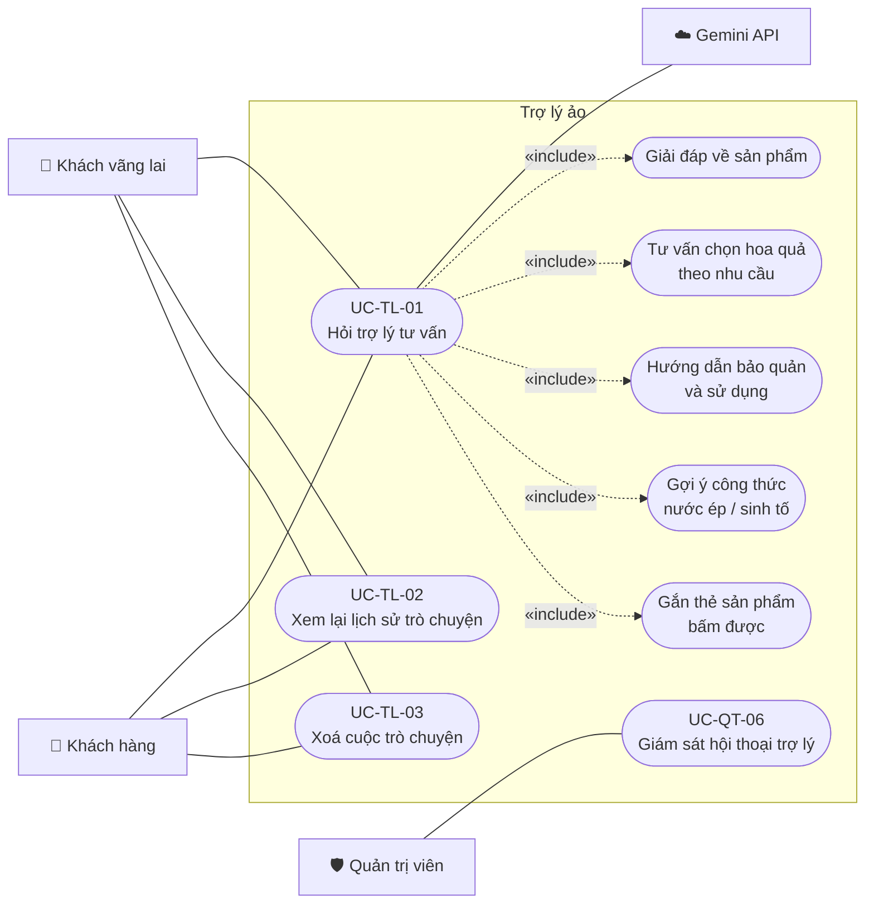
```mermaid
flowchart LR
    GU["🧑 Khách vãng lai"]
    CU["👤 Khách hàng"]
    AD["🛡️ Quản trị viên"]
    GM["☁️ Gemini API"]

    subgraph TL["Trợ lý ảo"]
        T1(["UC-TL-01<br/>Hỏi trợ lý tư vấn"])
        T1a(["Giải đáp về sản phẩm"])
        T1b(["Tư vấn chọn hoa quả<br/>theo nhu cầu"])
        T1c(["Hướng dẫn bảo quản<br/>và sử dụng"])
        T1d(["Gợi ý công thức<br/>nước ép / sinh tố"])
        T1e(["Gắn thẻ sản phẩm<br/>bấm được"])

        T2(["UC-TL-02<br/>Xem lại lịch sử trò chuyện"])
        T3(["UC-TL-03<br/>Xoá cuộc trò chuyện"])
        T4(["UC-QT-06<br/>Giám sát hội thoại trợ lý"])
    end

    GU --- T1
    CU --- T1
    GU --- T2
    CU --- T2
    GU --- T3
    CU --- T3
    AD --- T4
    T1 --- GM

    T1 -. "«include»" .-> T1a
    T1 -. "«include»" .-> T1b
    T1 -. "«include»" .-> T1c
    T1 -. "«include»" .-> T1d
    T1 -. "«include»" .-> T1e
```

#### UC-TL-01 — Hỏi trợ lý tư vấn

| Mục | Nội dung |
|---|---|
| **Mã UC** | UC-TL-01 |
| **Tác nhân** | Khách vãng lai, Khách hàng · (tác nhân phụ: Gemini API) |
| **Mô tả** | Nút nổi ở góc phải mọi trang phía khách hàng mở khung chat. Trợ lý trả lời bốn nhóm việc: giải đáp về sản phẩm đang bán, tư vấn chọn hoa quả theo nhu cầu, hướng dẫn bảo quản/sử dụng, và gợi ý công thức món ăn — nước ép — sinh tố. |
| **Tiền điều kiện** | Backend có `GEMINI_API_KEY` trong `backend/.env`. Không cần đăng nhập. |
| **Luồng chính** | 1. Khách mở khung chat; giao diện gọi `loadChatHistory(clientKey)` để nạp lịch sử cũ.<br>2. Khách gõ câu hỏi; bong bóng của khách hiện **ngay**, kèm chỉ báo đang gõ.<br>3. Server Action `sendChatMessage` gọi `POST /api/chat/messages`.<br>4. Backend kiểm cấu hình, kiểm chủ sở hữu phiên, kiểm hạn mức.<br>5. Backend nạp **toàn bộ danh mục sản phẩm** từ MySQL và nhồi vào system prompt, kèm tối đa 12 tin nhắn gần nhất làm ngữ cảnh.<br>6. Gọi Gemini qua REST (`httpx`), nhận văn bản trả lời.<br>7. **Sau khi** có câu trả lời mới ghi CSDL: cặp `user` + `model` trong một transaction.<br>8. Backend dò tên sản phẩm xuất hiện trong câu trả lời, trả kèm `suggestions`; giao diện dựng thẻ bấm được trỏ tới `/san-pham/{slug}`. |
| **Luồng thay thế / Quy tắc** | - **Thiếu `GEMINI_API_KEY` → 503** kèm thông báo tiếng Việt, và **không ghi gì vào CSDL** để không để lại hội thoại cụt. Phần còn lại của website chạy bình thường.<br>- Timeout → 504 · mất kết nối/5xx → 502 · khoá sai → 503 · quá hạn mức → 429. Mỗi mã một câu tiếng Việt riêng, giao diện hiện bong bóng lỗi kèm nút **Thử lại**.<br>- Bị bộ lọc an toàn của Gemini chặn → vẫn trả **200** với câu từ chối lịch sự, không lộ lỗi kỹ thuật.<br>- **Chống bịa đặt**: prompt cấm giới thiệu sản phẩm ngoài danh sách được nhồi vào, cấm tự nghĩ ra giá, cấm chèn đường dẫn. Giá và slug trên thẻ gợi ý **luôn lấy từ MySQL**, nên kể cả khi model viết sai số trong câu chữ thì con số hiển thị vẫn đúng.<br>- Câu hỏi ngoài phạm vi (chính trị, lập trình, làm bài tập hộ…) bị từ chối ngắn gọn rồi hỏi lại về hoa quả. Prompt cũng dặn bỏ qua yêu cầu đòi quên quy tắc hay tiết lộ hướng dẫn.<br>- Hạn mức: 20 câu hỏi/phiên và 60 câu hỏi/IP trong 10 phút → 429.<br>- Câu hỏi tối đa 1000 ký tự (`zod` chặn ở frontend, `pydantic` chặn lại ở biên API).<br>- Danh mục nhồi vào prompt giới hạn 80 sản phẩm; vượt quá thì prompt nói rõ đây là danh sách cắt bớt và mời khách dùng ô tìm kiếm.<br>- **Không streaming** — trả lời một lần, giao diện hiện chỉ báo đang gõ trong lúc chờ. |
| **Hậu điều kiện** | Cặp câu hỏi–trả lời được lưu vào `chat_messages`; `chat_sessions.updated_at` được cập nhật. |

#### UC-TL-02 — Xem lại lịch sử trò chuyện

| Mục | Nội dung |
|---|---|
| **Mã UC** | UC-TL-02 |
| **Tác nhân** | Khách vãng lai, Khách hàng |
| **Mô tả** | Mở lại khung chat thì thấy nguyên nội dung đã trao đổi, kể cả sau khi tải lại trang hay đóng trình duyệt. |
| **Tiền điều kiện** | Trình duyệt còn giữ `client_key` trong `localStorage` (khoá `halona-chat`). |
| **Luồng chính** | 1. `ChatWidget` đọc `client_key`, chưa có thì sinh UUIDv4 mới và lưu lại.<br>2. Khi khách **mở** khung chat, `GET /api/chat/sessions/{clientKey}` nạp toàn bộ tin nhắn theo thứ tự thời gian. |
| **Luồng thay thế / Quy tắc** | - Chưa từng trò chuyện → trả `{sessionId: null, messages: []}`, **không phải 404**: lần mở đầu tiên của mỗi khách không nên đi vào đường lỗi.<br>- Phiên đã gắn tài khoản mà người gọi không phải chủ → **403**.<br>- Chỉ nạp khi khách thực sự mở khung chat, nên người không dùng trợ lý không tốn thêm request nào mỗi lần tải trang.<br>- Xoá `localStorage` hoặc đổi máy → mất vé, coi như bắt đầu cuộc trò chuyện mới; lịch sử cũ vẫn nằm trong CSDL cho quản trị viên xem (UC-QT-06). |
| **Hậu điều kiện** | Khung chat hiển thị đúng lịch sử của phiên. |

#### UC-TL-03 — Xoá cuộc trò chuyện

| Mục | Nội dung |
|---|---|
| **Mã UC** | UC-TL-03 |
| **Tác nhân** | Khách vãng lai, Khách hàng |
| **Mô tả** | Nút "Xoá trò chuyện" trên đầu khung chat xoá hẳn phiên khỏi CSDL. |
| **Tiền điều kiện** | Phiên đã có ít nhất một tin nhắn. |
| **Luồng chính** | 1. Khách bấm "Xoá trò chuyện".<br>2. Giao diện dọn state ngay, rồi gọi `DELETE /api/chat/sessions/{clientKey}`.<br>3. Backend xoá `chat_sessions`; tin nhắn đi theo nhờ `ON DELETE CASCADE`. |
| **Luồng thay thế / Quy tắc** | - Xoá một phiên không tồn tại vẫn trả **204** — thao tác lặp không báo lỗi vô cớ, cùng quy ước với xoá sản phẩm ở UC-QT-02.<br>- Phiên đã gắn tài khoản mà người gọi không phải chủ → **403**.<br>- `client_key` **không** bị xoá khỏi `localStorage`: khách hỏi tiếp thì một phiên mới được tạo với cùng chiếc vé đó. |
| **Hậu điều kiện** | Phiên và toàn bộ tin nhắn biến mất khỏi CSDL. |

#### UC-QT-06 — Giám sát hội thoại trợ lý ảo

| Mục | Nội dung |
|---|---|
| **Mã UC** | UC-QT-06 |
| **Tác nhân** | Quản trị viên |
| **Mô tả** | Trang `/admin/tro-ly-ao` liệt kê các cuộc trò chuyện gần nhất và cho xem toàn văn từng cuộc, để kiểm chứng trợ lý có tư vấn sai hay bịa sản phẩm không. |
| **Tiền điều kiện** | Đăng nhập với `role = ADMIN`. |
| **Luồng chính** | 1. `GET /api/admin/chats` trả 200 phiên gần nhất (tên khách hoặc "Khách vãng lai", số tin, tiêu đề).<br>2. Bấm một dòng → `?id=…` → `GET /api/admin/chats/{id}` trả toàn văn. |
| **Luồng thay thế / Quy tắc** | - **Chỉ đọc**: không sửa, không xoá, không phân trang (backend đã giới hạn 200 bản ghi).<br>- Nút nổi của trợ lý bị **ẩn** trong khu `/admin` — quản trị viên không cần công cụ bán hàng.<br>- Số tin nhắn ở danh sách đếm bằng subquery, không nạp toàn bộ tin của từng phiên. |
| **Hậu điều kiện** | Quản trị viên nắm được chất lượng tư vấn của trợ lý. |

---

## 4. Ma trận Tác nhân × Use Case

| Use Case | Khách vãng lai | Khách hàng | Quản trị viên | Hệ thống |
|---|:---:|:---:|:---:|---|
| UC-CT-01 Xem trang chủ | ✅ | ✅ | ✅ | bỏ qua khối có danh mục không tồn tại |
| UC-CT-02 Duyệt cửa hàng và danh mục | ✅ | ✅ | ✅ | phân trang 12/trang, chuẩn hoá tham số sai |
| UC-CT-03 Xem chi tiết sản phẩm | ✅ | ✅ | ✅ | chọn tối đa 4 sản phẩm liên quan |
| UC-CT-04 Tìm kiếm sản phẩm | ✅ | ✅ | ✅ | so khớp bỏ dấu qua `utf8mb4_unicode_ci` |
| UC-GH-01 Quản lý giỏ hàng | ✅ | ✅ | ✅ | lưu/khôi phục `localStorage`, lọc bản ghi hỏng |
| UC-GH-02 Thanh toán và tạo đơn | ✅ | ✅ điền sẵn hồ sơ | ✅ | **tính lại tổng tiền**, chụp giá vào dòng đơn, sinh mã `HL-XXXXXX` |
| UC-GH-03 Tra cứu đơn theo mã | ✅ | ✅ | ✅ | — |
| UC-GH-04 Xem lịch sử đơn hàng | | ✅ đơn của mình | ✅ xem được đơn mọi khách | lọc theo `user_id`, suy ra `itemCount` |
| UC-TK-01 Đăng ký | ✅ | | | băm bcrypt, cấp JWT, gán `role = USER` |
| UC-TK-02 Đăng nhập / Đăng xuất | ✅ đăng nhập | ✅ | ✅ | ký JWT HS256 7 ngày, điều hướng theo vai trò |
| UC-TK-03 Cập nhật hồ sơ | | ✅ | ✅ | quy chuỗi rỗng về `NULL` |
| UC-TK-04 Phân quyền và phiên | chịu tác động | chịu tác động | chịu tác động | ✅ thẩm định token, đọc lại người dùng từ CSDL, chặn `/api/admin/*` |
| UC-ND-01 Xem tin tức và chuyên mục | ✅ | ✅ | ✅ | sắp mới nhất trước |
| UC-ND-02 Xem trang giới thiệu | ✅ | ✅ | ✅ | — |
| UC-ND-03 Gửi tin nhắn liên hệ | ✅ | ✅ | ✅ | lưu với `handled = FALSE` |
| UC-QT-01 Bảng điều khiển | | | ✅ | tính 5 chỉ số, loại đơn `CANCELLED` khỏi doanh thu |
| UC-QT-02 Quản lý sản phẩm | | | ✅ | kiểm slug trùng (409), giá KM (422), giữ `hover_image` |
| UC-QT-03 Quản lý đơn hàng | | | ✅ | cập nhật `updated_at` tự động |
| UC-QT-04 Quản lý bài viết | | | ✅ chỉ đọc | — |
| UC-QT-05 Xử lý tin nhắn liên hệ | | | ✅ | đảo cờ `handled` |
| UC-QT-06 Giám sát hội thoại trợ lý ảo | | | ✅ chỉ đọc | đếm tin bằng subquery, giới hạn 200 phiên |
| UC-TL-01 Hỏi trợ lý tư vấn | ✅ | ✅ gắn phiên vào tài khoản | ẩn trong khu `/admin` | nhồi danh mục vào prompt, gọi Gemini, dò tên SP để gắn thẻ, chặn hạn mức |
| UC-TL-02 Xem lại lịch sử trò chuyện | ✅ theo `client_key` | ✅ | — | trả danh sách rỗng thay vì 404; 403 nếu phiên của người khác |
| UC-TL-03 Xoá cuộc trò chuyện | ✅ | ✅ | — | `ON DELETE CASCADE`; xoá lặp vẫn 204 |
| UC-HT-01 SEO | gián tiếp | gián tiếp | gián tiếp | ✅ sinh sitemap/robots/metadata |
| UC-HT-02 Xử lý lỗi | chịu tác động | chịu tác động | chịu tác động | ✅ đổi lỗi mạng thành thông báo tiếng Việt, 404, ranh giới lỗi |

**Tổng cộng 26 use case** trên 7 phân hệ.

---

## 5. Sơ đồ tuần tự (Sequence Diagrams)

Sơ đồ tuần tự mô tả luồng tương tác chi tiết cho các use case ở mục 3. Quy ước các thành phần tham gia (participants):

| Ký hiệu | Ý nghĩa |
|---|---|
| **UI** | Giao diện — Server Component (render trên máy chủ) hoặc Client Component (chạy trong trình duyệt) |
| **SA** | Server Action — hàm `'use server'` xử lý submit form, kiểm tra dữ liệu bằng `zod` |
| **AC** | Lớp gọi API `src/lib/api.ts` — nơi duy nhất nói chuyện với backend, gắn header `Authorization` từ cookie |
| **API** | Router FastAPI tương ứng (`products`, `orders`, `auth`, `admin`…) |
| **DB** | MySQL, truy cập qua SQLAlchemy |
| **LS** | `localStorage` của trình duyệt (giỏ hàng `halona-cart`, vé phiên chat `halona-chat`) |
| **GM** | Gemini API của Google, gọi qua REST bằng `httpx` từ backend |
| **CK** | Cookie `httpOnly` chứa JWT phiên |

Mã sơ đồ **SD-xx** tương ứng với use case **UC-xx** cùng hậu tố. Một số use case gần nhau được gộp chung một sơ đồ (ghi rõ ở tiêu đề); UC-ND-02 là trang tĩnh, không có tương tác nào để vẽ nên không có sơ đồ riêng.

**Bảng ánh xạ Use Case → Sơ đồ tuần tự (mục 5) → Sơ đồ hoạt động (mục 6):**

| Use Case | Sơ đồ tuần tự | Sơ đồ hoạt động |
|---|---|---|
| UC-CT-01 Xem trang chủ | SD-CT-01 | AD-CT-01 / AD-CT-02 |
| UC-CT-02 Duyệt cửa hàng và danh mục | SD-CT-02 | AD-CT-01 / AD-CT-02 |
| UC-CT-03 Xem chi tiết sản phẩm | SD-CT-03 | AD-CT-03 / AD-CT-04 |
| UC-CT-04 Tìm kiếm sản phẩm | SD-CT-04 | AD-CT-03 / AD-CT-04 |
| UC-GH-01 Quản lý giỏ hàng | SD-GH-01 | AD-GH-01 |
| UC-GH-02 Thanh toán và tạo đơn hàng | SD-GH-02 | AD-GH-02 |
| UC-GH-03 Tra cứu đơn theo mã | SD-GH-03 / SD-GH-04 | AD-GH-03 / AD-GH-04 |
| UC-GH-04 Xem lịch sử đơn hàng | SD-GH-03 / SD-GH-04 | AD-GH-03 / AD-GH-04 |
| UC-TK-01 Đăng ký | SD-TK-01 | AD-TK-01 / AD-TK-02 |
| UC-TK-02 Đăng nhập / Đăng xuất | SD-TK-02 | AD-TK-01 / AD-TK-02 |
| UC-TK-03 Cập nhật hồ sơ | SD-TK-03 | AD-TK-03 / AD-TK-04 |
| UC-TK-04 Phân quyền và phiên đăng nhập | SD-TK-04 | AD-TK-03 / AD-TK-04 |
| UC-ND-01 Xem tin tức và chuyên mục | SD-ND-01 | AD-ND-01 / AD-ND-03 |
| UC-ND-02 Xem trang giới thiệu | *(trang tĩnh — không có)* | *(trang tĩnh — không có)* |
| UC-ND-03 Gửi tin nhắn liên hệ | SD-ND-03 | AD-ND-01 / AD-ND-03 |
| UC-QT-01 Bảng điều khiển | SD-QT-01 | AD-QT-01 |
| UC-QT-02 Quản lý sản phẩm | SD-QT-02 | AD-QT-02 |
| UC-QT-03 Quản lý đơn hàng | SD-QT-03 | AD-QT-03 / AD-QT-04 / AD-QT-05 |
| UC-QT-04 Quản lý bài viết | SD-QT-04 / SD-QT-05 | AD-QT-03 / AD-QT-04 / AD-QT-05 |
| UC-QT-05 Xử lý tin nhắn liên hệ | SD-QT-04 / SD-QT-05 | AD-QT-03 / AD-QT-04 / AD-QT-05 |
| UC-HT-01 SEO | SD-HT-01 | AD-HT-01 / AD-HT-02 |
| UC-HT-02 Xử lý lỗi và mất kết nối API | SD-HT-02 | AD-HT-01 / AD-HT-02 |

### 5.1. Danh mục sản phẩm

#### SD-CT-01 — Xem trang chủ (UC-CT-01)

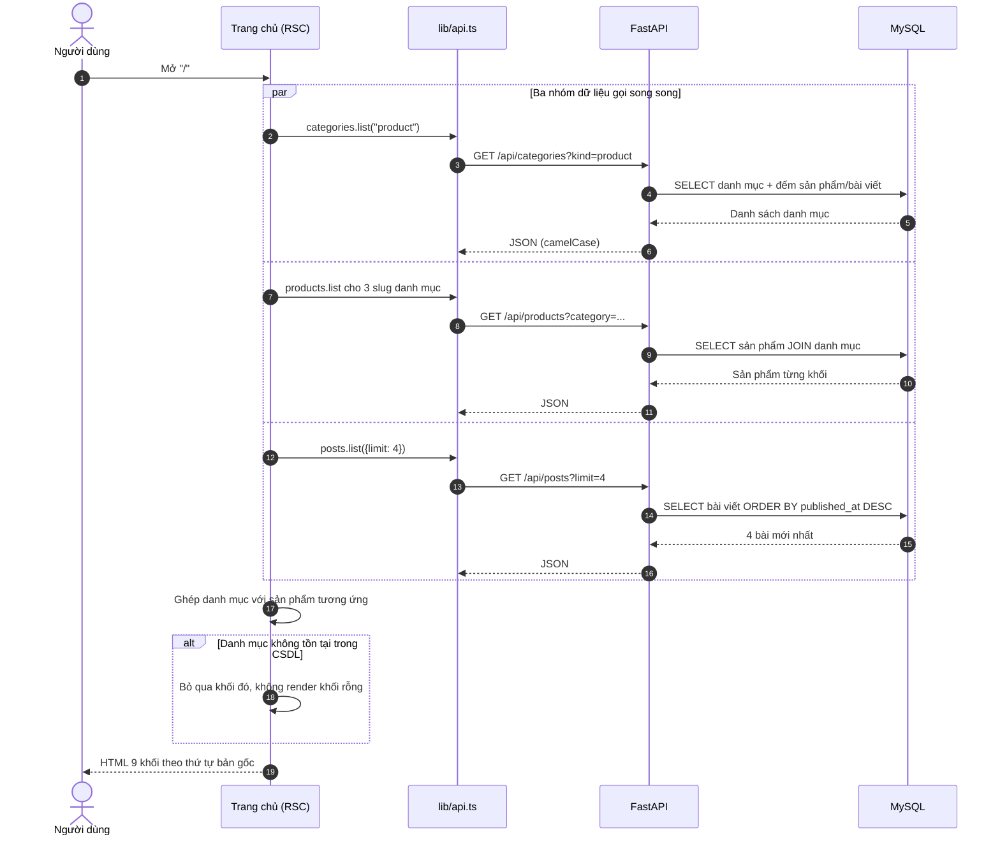
```mermaid
sequenceDiagram
    autonumber
    actor U as Người dùng
    participant UI as Trang chủ (RSC)
    participant AC as lib/api.ts
    participant API as FastAPI
    participant DB as MySQL

    U->>UI: Mở "/"
    par Ba nhóm dữ liệu gọi song song
        UI->>AC: categories.list("product")
        AC->>API: GET /api/categories?kind=product
        API->>DB: SELECT danh mục + đếm sản phẩm/bài viết
        DB-->>API: Danh sách danh mục
        API-->>AC: JSON (camelCase)
    and
        UI->>AC: products.list cho 3 slug danh mục
        AC->>API: GET /api/products?category=...
        API->>DB: SELECT sản phẩm JOIN danh mục
        DB-->>API: Sản phẩm từng khối
        API-->>AC: JSON
    and
        UI->>AC: posts.list({limit: 4})
        AC->>API: GET /api/posts?limit=4
        API->>DB: SELECT bài viết ORDER BY published_at DESC
        DB-->>API: 4 bài mới nhất
        API-->>AC: JSON
    end
    UI->>UI: Ghép danh mục với sản phẩm tương ứng
    alt Danh mục không tồn tại trong CSDL
        UI->>UI: Bỏ qua khối đó, không render khối rỗng
    end
    UI-->>U: HTML 9 khối theo thứ tự bản gốc
```

#### SD-CT-02 — Duyệt cửa hàng và danh mục (UC-CT-02)

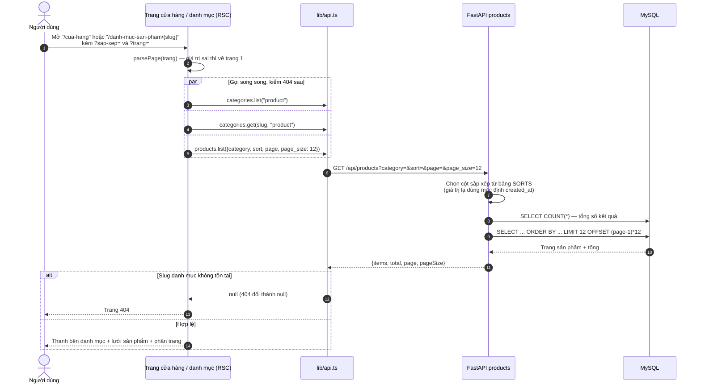
```mermaid
sequenceDiagram
    autonumber
    actor U as Người dùng
    participant UI as Trang cửa hàng / danh mục (RSC)
    participant AC as lib/api.ts
    participant API as FastAPI products
    participant DB as MySQL

    U->>UI: Mở "/cua-hang" hoặc "/danh-muc-san-pham/{slug}"<br/>kèm ?sap-xep= và ?trang=
    UI->>UI: parsePage(trang) — giá trị sai thì về trang 1
    par Gọi song song, kiểm 404 sau
        UI->>AC: categories.list("product")
    and
        UI->>AC: categories.get(slug, "product")
    and
        UI->>AC: products.list({category, sort, page, page_size: 12})
    end
    AC->>API: GET /api/products?category=&sort=&page=&page_size=12
    API->>API: Chọn cột sắp xếp từ bảng SORTS<br/>(giá trị lạ dùng mặc định created_at)
    API->>DB: SELECT COUNT(*) — tổng số kết quả
    API->>DB: SELECT ... ORDER BY ... LIMIT 12 OFFSET (page-1)*12
    DB-->>API: Trang sản phẩm + tổng
    API-->>AC: {items, total, page, pageSize}
    alt Slug danh mục không tồn tại
        AC-->>UI: null (404 đổi thành null)
        UI-->>U: Trang 404
    else Hợp lệ
        UI-->>U: Thanh bên danh mục + lưới sản phẩm + phân trang
    end
```

#### SD-CT-03 — Xem chi tiết sản phẩm (UC-CT-03)

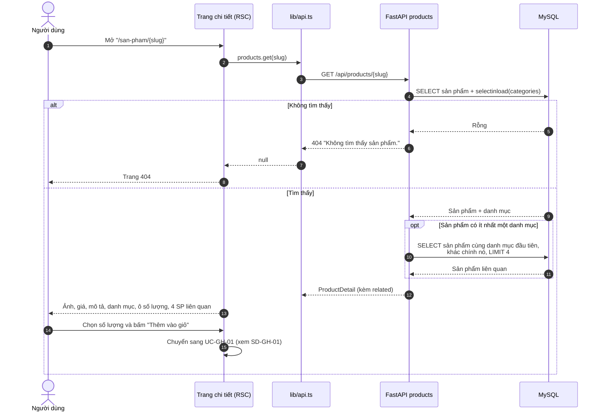
```mermaid
sequenceDiagram
    autonumber
    actor U as Người dùng
    participant UI as Trang chi tiết (RSC)
    participant AC as lib/api.ts
    participant API as FastAPI products
    participant DB as MySQL

    U->>UI: Mở "/san-pham/{slug}"
    UI->>AC: products.get(slug)
    AC->>API: GET /api/products/{slug}
    API->>DB: SELECT sản phẩm + selectinload(categories)
    alt Không tìm thấy
        DB-->>API: Rỗng
        API-->>AC: 404 "Không tìm thấy sản phẩm."
        AC-->>UI: null
        UI-->>U: Trang 404
    else Tìm thấy
        DB-->>API: Sản phẩm + danh mục
        opt Sản phẩm có ít nhất một danh mục
            API->>DB: SELECT sản phẩm cùng danh mục đầu tiên,<br/>khác chính nó, LIMIT 4
            DB-->>API: Sản phẩm liên quan
        end
        API-->>AC: ProductDetail (kèm related)
        UI-->>U: Ảnh, giá, mô tả, danh mục, ô số lượng, 4 SP liên quan
        U->>UI: Chọn số lượng và bấm "Thêm vào giỏ"
        UI->>UI: Chuyển sang UC-GH-01 (xem SD-GH-01)
    end
```

#### SD-CT-04 — Tìm kiếm sản phẩm (UC-CT-04)

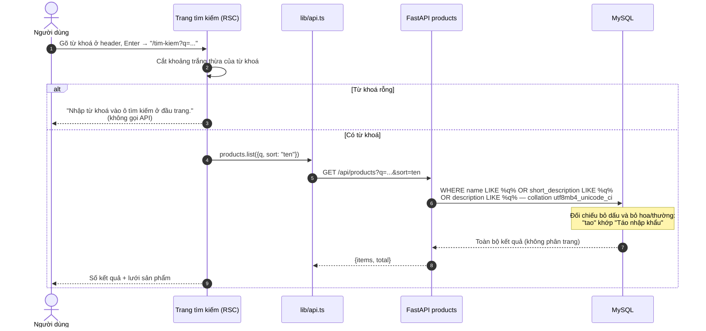
```mermaid
sequenceDiagram
    autonumber
    actor U as Người dùng
    participant UI as Trang tìm kiếm (RSC)
    participant AC as lib/api.ts
    participant API as FastAPI products
    participant DB as MySQL

    U->>UI: Gõ từ khoá ở header, Enter → "/tim-kiem?q=..."
    UI->>UI: Cắt khoảng trắng thừa của từ khoá
    alt Từ khoá rỗng
        UI-->>U: "Nhập từ khoá vào ô tìm kiếm ở đầu trang."<br/>(không gọi API)
    else Có từ khoá
        UI->>AC: products.list({q, sort: "ten"})
        AC->>API: GET /api/products?q=...&sort=ten
        API->>DB: WHERE name LIKE %q% OR short_description LIKE %q%<br/>OR description LIKE %q% — collation utf8mb4_unicode_ci
        Note over DB: Đối chiếu bỏ dấu và bỏ hoa/thường:<br/>"tao" khớp "Táo nhập khẩu"
        DB-->>API: Toàn bộ kết quả (không phân trang)
        API-->>AC: {items, total}
        UI-->>U: Số kết quả + lưới sản phẩm
    end
```

### 5.2. Giỏ hàng & Đặt hàng

#### SD-GH-01 — Quản lý giỏ hàng (UC-GH-01)

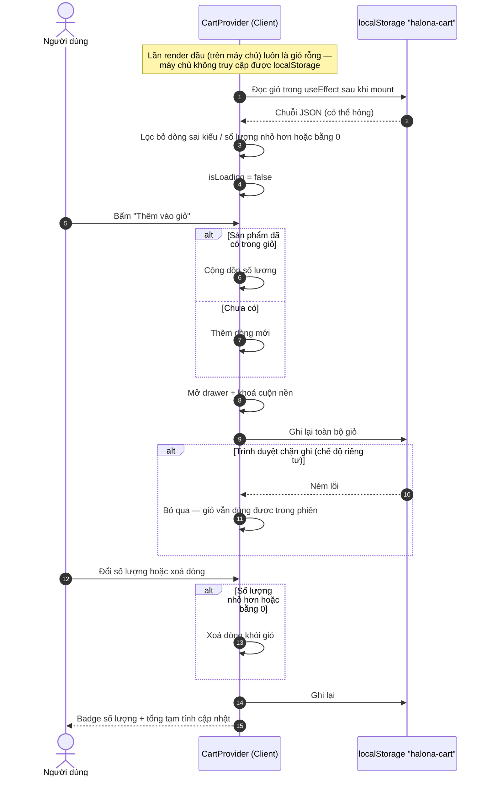
```mermaid
sequenceDiagram
    autonumber
    actor U as Người dùng
    participant UI as CartProvider (Client)
    participant LS as localStorage "halona-cart"

    Note over UI: Lần render đầu (trên máy chủ) luôn là giỏ rỗng —<br/>máy chủ không truy cập được localStorage
    UI->>LS: Đọc giỏ trong useEffect sau khi mount
    LS-->>UI: Chuỗi JSON (có thể hỏng)
    UI->>UI: Lọc bỏ dòng sai kiểu / số lượng nhỏ hơn hoặc bằng 0
    UI->>UI: isLoading = false

    U->>UI: Bấm "Thêm vào giỏ"
    alt Sản phẩm đã có trong giỏ
        UI->>UI: Cộng dồn số lượng
    else Chưa có
        UI->>UI: Thêm dòng mới
    end
    UI->>UI: Mở drawer + khoá cuộn nền
    UI->>LS: Ghi lại toàn bộ giỏ
    alt Trình duyệt chặn ghi (chế độ riêng tư)
        LS-->>UI: Ném lỗi
        UI->>UI: Bỏ qua — giỏ vẫn dùng được trong phiên
    end

    U->>UI: Đổi số lượng hoặc xoá dòng
    alt Số lượng nhỏ hơn hoặc bằng 0
        UI->>UI: Xoá dòng khỏi giỏ
    end
    UI->>LS: Ghi lại
    UI-->>U: Badge số lượng + tổng tạm tính cập nhật
```

#### SD-GH-02 — Thanh toán và tạo đơn hàng (UC-GH-02)

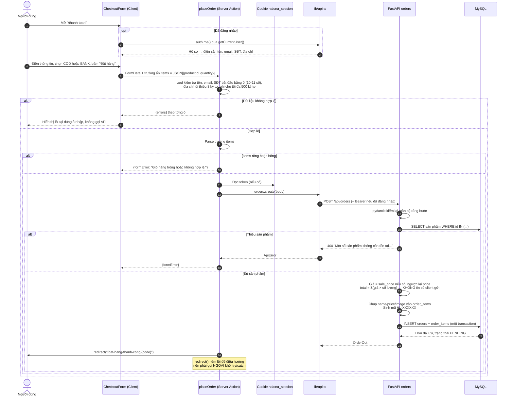
```mermaid
sequenceDiagram
    autonumber
    actor U as Người dùng
    participant UI as CheckoutForm (Client)
    participant SA as placeOrder (Server Action)
    participant CK as Cookie halona_session
    participant AC as lib/api.ts
    participant API as FastAPI orders
    participant DB as MySQL

    U->>UI: Mở "/thanh-toan"
    opt Đã đăng nhập
        UI->>AC: auth.me() qua getCurrentUser()
        AC-->>UI: Hồ sơ → điền sẵn tên, email, SĐT, địa chỉ
    end
    U->>UI: Điền thông tin, chọn COD hoặc BANK, bấm "Đặt hàng"
    UI->>SA: FormData + trường ẩn items = JSON[{productId, quantity}]

    SA->>SA: zod kiểm tra tên, email, SĐT bắt đầu bằng 0 (10-11 số),<br/>địa chỉ tối thiểu 8 ký tự, ghi chú tối đa 500 ký tự
    alt Dữ liệu không hợp lệ
        SA-->>UI: {errors} theo từng ô
        UI-->>U: Hiển thị lỗi tại đúng ô nhập, không gọi API
    else Hợp lệ
        SA->>SA: Parse trường items
        alt items rỗng hoặc hỏng
            SA-->>UI: {formError: "Giỏ hàng trống hoặc không hợp lệ."}
        else
            SA->>CK: Đọc token (nếu có)
            SA->>AC: orders.create(body)
            AC->>API: POST /api/orders (+ Bearer nếu đã đăng nhập)
            API->>API: pydantic kiểm lại toàn bộ ràng buộc
            API->>DB: SELECT sản phẩm WHERE id IN (...)
            alt Thiếu sản phẩm
                API-->>AC: 400 "Một số sản phẩm không còn tồn tại..."
                AC-->>SA: ApiError
                SA-->>UI: {formError}
            else Đủ sản phẩm
                API->>API: Giá = sale_price nếu có, ngược lại price<br/>total = Σ(giá × số lượng) — KHÔNG tin số client gửi
                API->>API: Chụp name/price/image vào order_items<br/>Sinh mã HL-XXXXXX
                API->>DB: INSERT orders + order_items (một transaction)
                DB-->>API: Đơn đã lưu, trạng thái PENDING
                API-->>AC: OrderOut
                SA->>U: redirect("/dat-hang-thanh-cong/{code}")
                Note over SA: redirect() ném lỗi để điều hướng<br/>nên phải gọi NGOÀI khối try/catch
            end
        end
    end
```

#### SD-GH-03 / SD-GH-04 — Tra cứu đơn theo mã & lịch sử đơn hàng (UC-GH-03, UC-GH-04)

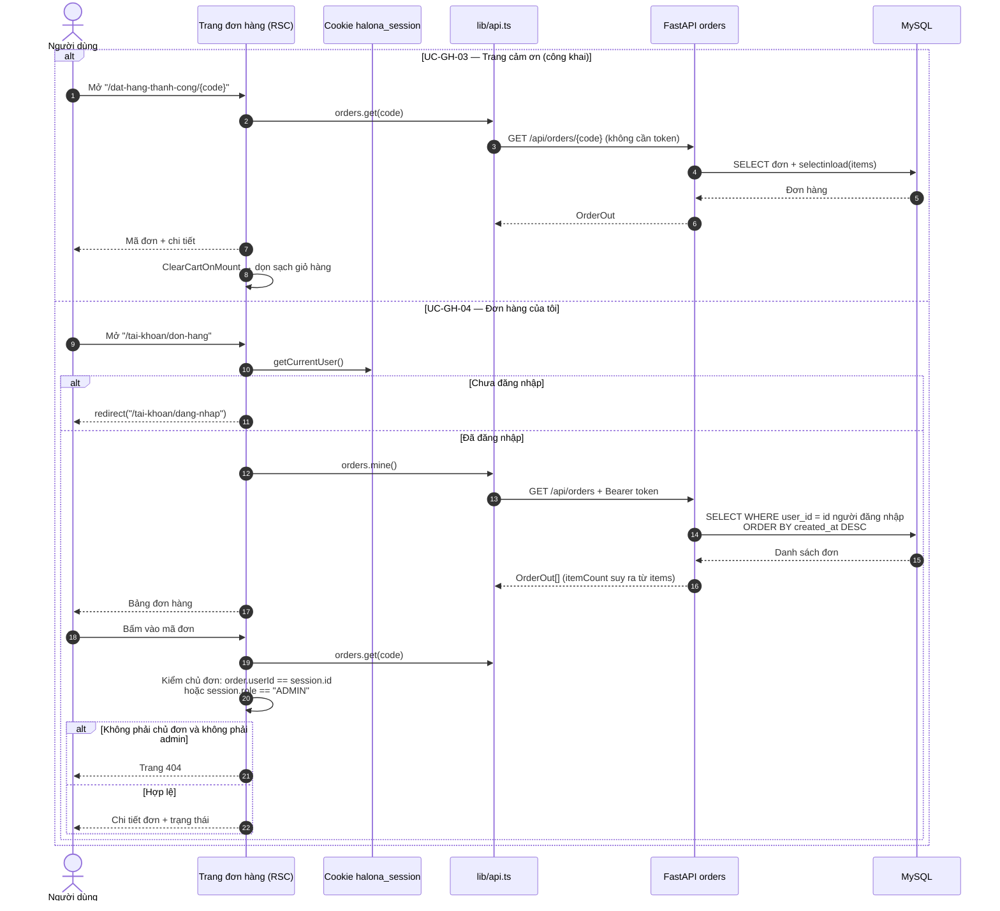
```mermaid
sequenceDiagram
    autonumber
    actor U as Người dùng
    participant UI as Trang đơn hàng (RSC)
    participant CK as Cookie halona_session
    participant AC as lib/api.ts
    participant API as FastAPI orders
    participant DB as MySQL

    alt UC-GH-03 — Trang cảm ơn (công khai)
        U->>UI: Mở "/dat-hang-thanh-cong/{code}"
        UI->>AC: orders.get(code)
        AC->>API: GET /api/orders/{code} (không cần token)
        API->>DB: SELECT đơn + selectinload(items)
        DB-->>API: Đơn hàng
        API-->>AC: OrderOut
        UI-->>U: Mã đơn + chi tiết
        UI->>UI: ClearCartOnMount → dọn sạch giỏ hàng
    else UC-GH-04 — Đơn hàng của tôi
        U->>UI: Mở "/tai-khoan/don-hang"
        UI->>CK: getCurrentUser()
        alt Chưa đăng nhập
            UI-->>U: redirect("/tai-khoan/dang-nhap")
        else Đã đăng nhập
            UI->>AC: orders.mine()
            AC->>API: GET /api/orders + Bearer token
            API->>DB: SELECT WHERE user_id = id người đăng nhập<br/>ORDER BY created_at DESC
            DB-->>API: Danh sách đơn
            API-->>AC: OrderOut[] (itemCount suy ra từ items)
            UI-->>U: Bảng đơn hàng
            U->>UI: Bấm vào mã đơn
            UI->>AC: orders.get(code)
            UI->>UI: Kiểm chủ đơn: order.userId == session.id<br/>hoặc session.role == "ADMIN"
            alt Không phải chủ đơn và không phải admin
                UI-->>U: Trang 404
            else Hợp lệ
                UI-->>U: Chi tiết đơn + trạng thái
            end
        end
    end
```

### 5.3. Tài khoản

#### SD-TK-01 — Đăng ký tài khoản (UC-TK-01)

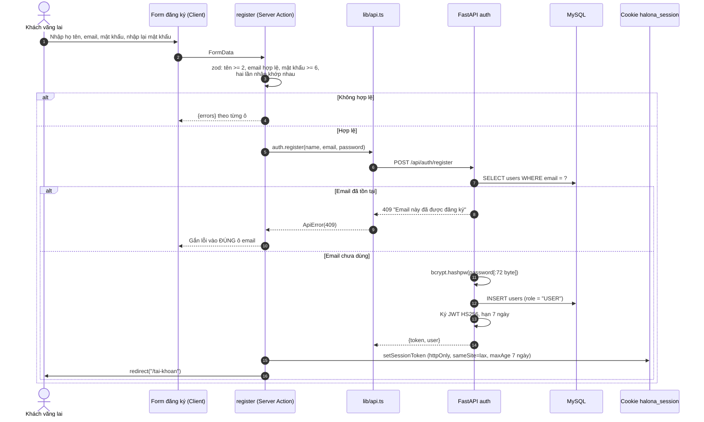
```mermaid
sequenceDiagram
    autonumber
    actor U as Khách vãng lai
    participant UI as Form đăng ký (Client)
    participant SA as register (Server Action)
    participant AC as lib/api.ts
    participant API as FastAPI auth
    participant DB as MySQL
    participant CK as Cookie halona_session

    U->>UI: Nhập họ tên, email, mật khẩu, nhập lại mật khẩu
    UI->>SA: FormData
    SA->>SA: zod: tên >= 2, email hợp lệ, mật khẩu >= 6,<br/>hai lần nhập khớp nhau
    alt Không hợp lệ
        SA-->>UI: {errors} theo từng ô
    else Hợp lệ
        SA->>AC: auth.register(name, email, password)
        AC->>API: POST /api/auth/register
        API->>DB: SELECT users WHERE email = ?
        alt Email đã tồn tại
            API-->>AC: 409 "Email này đã được đăng ký"
            AC-->>SA: ApiError(409)
            SA-->>UI: Gắn lỗi vào ĐÚNG ô email
        else Email chưa dùng
            API->>API: bcrypt.hashpw(password[:72 byte])
            API->>DB: INSERT users (role = "USER")
            API->>API: Ký JWT HS256, hạn 7 ngày
            API-->>AC: {token, user}
            SA->>CK: setSessionToken (httpOnly, sameSite=lax, maxAge 7 ngày)
            SA->>U: redirect("/tai-khoan")
        end
    end
```

#### SD-TK-02 — Đăng nhập / Đăng xuất (UC-TK-02)

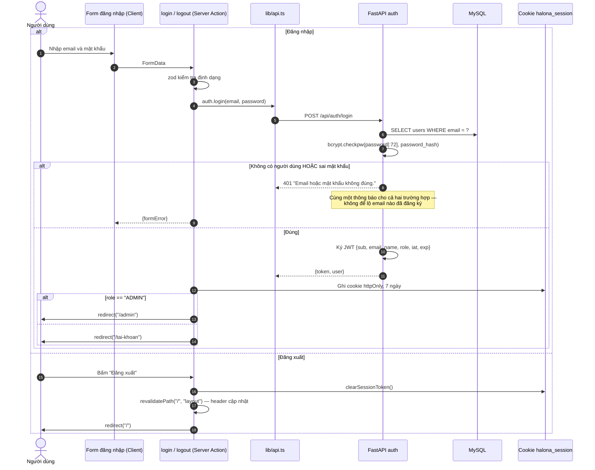
```mermaid
sequenceDiagram
    autonumber
    actor U as Người dùng
    participant UI as Form đăng nhập (Client)
    participant SA as login / logout (Server Action)
    participant AC as lib/api.ts
    participant API as FastAPI auth
    participant DB as MySQL
    participant CK as Cookie halona_session

    alt Đăng nhập
        U->>UI: Nhập email và mật khẩu
        UI->>SA: FormData
        SA->>SA: zod kiểm tra định dạng
        SA->>AC: auth.login(email, password)
        AC->>API: POST /api/auth/login
        API->>DB: SELECT users WHERE email = ?
        API->>API: bcrypt.checkpw(password[:72], password_hash)
        alt Không có người dùng HOẶC sai mật khẩu
            API-->>AC: 401 "Email hoặc mật khẩu không đúng."
            Note over API: Cùng một thông báo cho cả hai trường hợp —<br/>không để lộ email nào đã đăng ký
            SA-->>UI: {formError}
        else Đúng
            API->>API: Ký JWT {sub, email, name, role, iat, exp}
            API-->>AC: {token, user}
            SA->>CK: Ghi cookie httpOnly, 7 ngày
            alt role == "ADMIN"
                SA->>U: redirect("/admin")
            else
                SA->>U: redirect("/tai-khoan")
            end
        end
    else Đăng xuất
        U->>SA: Bấm "Đăng xuất"
        SA->>CK: clearSessionToken()
        SA->>SA: revalidatePath("/", "layout") — header cập nhật
        SA->>U: redirect("/")
    end
```

#### SD-TK-03 — Cập nhật hồ sơ (UC-TK-03)

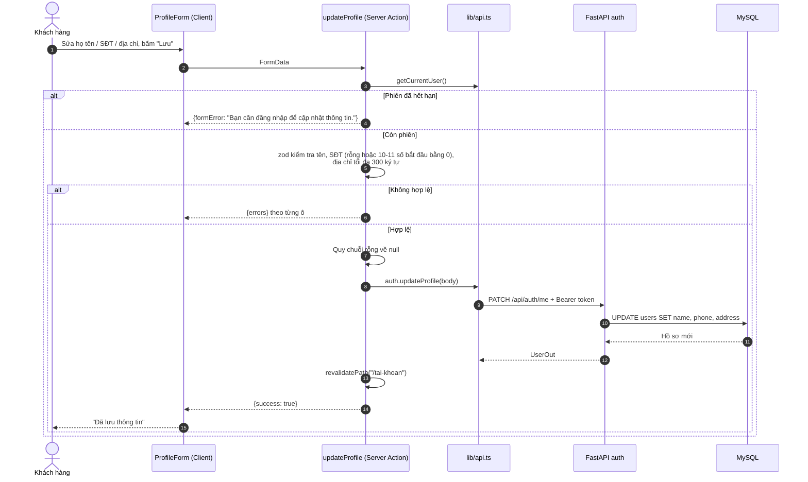
```mermaid
sequenceDiagram
    autonumber
    actor U as Khách hàng
    participant UI as ProfileForm (Client)
    participant SA as updateProfile (Server Action)
    participant AC as lib/api.ts
    participant API as FastAPI auth
    participant DB as MySQL

    U->>UI: Sửa họ tên / SĐT / địa chỉ, bấm "Lưu"
    UI->>SA: FormData
    SA->>AC: getCurrentUser()
    alt Phiên đã hết hạn
        SA-->>UI: {formError: "Bạn cần đăng nhập để cập nhật thông tin."}
    else Còn phiên
        SA->>SA: zod kiểm tra tên, SĐT (rỗng hoặc 10-11 số bắt đầu bằng 0),<br/>địa chỉ tối đa 300 ký tự
        alt Không hợp lệ
            SA-->>UI: {errors} theo từng ô
        else Hợp lệ
            SA->>SA: Quy chuỗi rỗng về null
            SA->>AC: auth.updateProfile(body)
            AC->>API: PATCH /api/auth/me + Bearer token
            API->>DB: UPDATE users SET name, phone, address
            DB-->>API: Hồ sơ mới
            API-->>AC: UserOut
            SA->>SA: revalidatePath("/tai-khoan")
            SA-->>UI: {success: true}
            UI-->>U: "Đã lưu thông tin"
        end
    end
```

#### SD-TK-04 — Phân quyền và phiên đăng nhập (UC-TK-04)

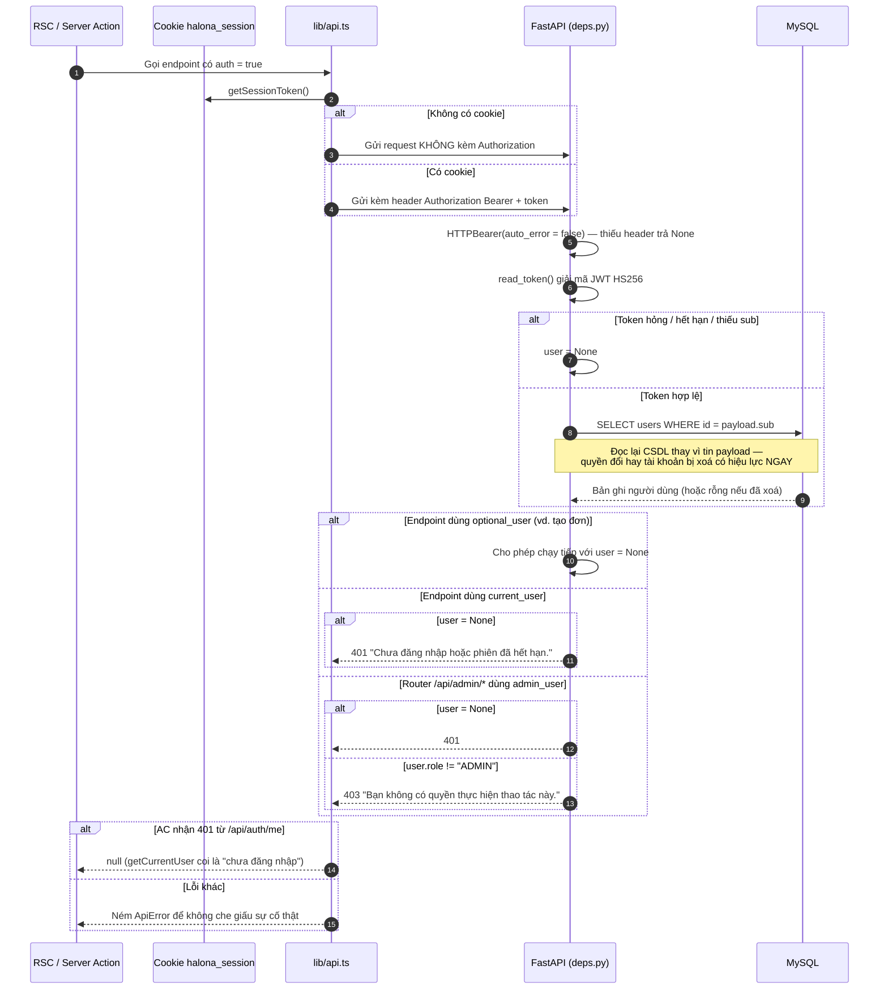
```mermaid
sequenceDiagram
    autonumber
    participant UI as RSC / Server Action
    participant CK as Cookie halona_session
    participant AC as lib/api.ts
    participant API as FastAPI (deps.py)
    participant DB as MySQL

    UI->>AC: Gọi endpoint có auth = true
    AC->>CK: getSessionToken()
    alt Không có cookie
        AC->>API: Gửi request KHÔNG kèm Authorization
    else Có cookie
        AC->>API: Gửi kèm header Authorization Bearer + token
    end

    API->>API: HTTPBearer(auto_error = false) — thiếu header trả None
    API->>API: read_token() giải mã JWT HS256
    alt Token hỏng / hết hạn / thiếu sub
        API->>API: user = None
    else Token hợp lệ
        API->>DB: SELECT users WHERE id = payload.sub
        Note over API,DB: Đọc lại CSDL thay vì tin payload —<br/>quyền đổi hay tài khoản bị xoá có hiệu lực NGAY
        DB-->>API: Bản ghi người dùng (hoặc rỗng nếu đã xoá)
    end

    alt Endpoint dùng optional_user (vd. tạo đơn)
        API->>API: Cho phép chạy tiếp với user = None
    else Endpoint dùng current_user
        alt user = None
            API-->>AC: 401 "Chưa đăng nhập hoặc phiên đã hết hạn."
        end
    else Router /api/admin/* dùng admin_user
        alt user = None
            API-->>AC: 401
        else user.role != "ADMIN"
            API-->>AC: 403 "Bạn không có quyền thực hiện thao tác này."
        end
    end

    alt AC nhận 401 từ /api/auth/me
        AC-->>UI: null (getCurrentUser coi là "chưa đăng nhập")
    else Lỗi khác
        AC-->>UI: Ném ApiError để không che giấu sự cố thật
    end
```

### 5.4. Nội dung & Liên hệ

#### SD-ND-01 — Xem tin tức và chuyên mục (UC-ND-01)

```mermaid
sequenceDiagram
    autonumber
    actor U as Người dùng
    participant UI as Trang tin tức (RSC)
    participant AC as lib/api.ts
    participant API as FastAPI posts / categories
    participant DB as MySQL

    U->>UI: Mở "/tin-tuc" hoặc "/chuyen-muc/{slug}"
    par Nội dung chính và thanh bên gọi song song
        UI->>AC: posts.list({category?})
        AC->>API: GET /api/posts?category=...
        API->>DB: SELECT bài viết ORDER BY published_at DESC
        DB-->>API: Danh sách bài
    and
        UI->>AC: getSidebarData() — categories.list("post") + posts.list({limit: 4})
        AC->>API: GET /api/categories?kind=post
        AC->>API: GET /api/posts?limit=4
        API->>DB: SELECT chuyên mục + 4 bài mới nhất
        DB-->>API: Dữ liệu thanh bên
    end
    API-->>AC: JSON
    UI-->>U: Lưới bài viết + thanh bên

    U->>UI: Bấm vào một bài
    UI->>AC: posts.get(slug)
    AC->>API: GET /api/posts/{slug}
    API->>DB: SELECT bài + selectinload(categories)
    alt Không tìm thấy
        API-->>AC: 404
        AC-->>UI: null
        UI-->>U: Trang 404
    else Tìm thấy
        API-->>AC: PostOut (content là HTML lấy từ RSS lưu trữ)
        UI-->>U: Nội dung bài + chuyên mục + thanh bên
    end
```

#### SD-ND-03 — Gửi tin nhắn liên hệ (UC-ND-03)

```mermaid
sequenceDiagram
    autonumber
    actor U as Người dùng
    participant UI as ContactForm (Client)
    participant SA as submitContact (Server Action)
    participant AC as lib/api.ts
    participant API as FastAPI contact
    participant DB as MySQL

    U->>UI: Điền họ tên, email, SĐT, tiêu đề, nội dung
    UI->>SA: FormData
    SA->>SA: zod kiểm tra: tên và email bắt buộc,<br/>SĐT tuỳ chọn, nội dung tối thiểu 10 ký tự
    alt Không hợp lệ
        SA-->>UI: {errors} theo từng ô
        UI-->>U: Hiển thị lỗi tại đúng ô nhập
    else Hợp lệ
        SA->>SA: Quy chuỗi rỗng của SĐT/tiêu đề về null
        SA->>AC: contact.create(body)
        AC->>API: POST /api/contact
        API->>API: pydantic kiểm lại ở biên API
        API->>DB: INSERT contact_messages (handled = FALSE)
        alt Lỗi API
            API-->>AC: 4xx/5xx kèm detail
            AC-->>SA: ApiError
            SA-->>UI: {formError} — KHÔNG nuốt lỗi rồi báo thành công
        else Thành công
            DB-->>API: Bản ghi đã lưu
            SA-->>UI: {success: true}
            UI-->>U: "Đã gửi tin nhắn"
            Note over DB: Tin nhắn vào hàng chờ của quản trị viên (UC-QT-05) —<br/>hệ thống KHÔNG gửi email thông báo
        end
    end
```

### 5.5. Quản trị

#### SD-QT-01 — Bảng điều khiển (UC-QT-01)

```mermaid
sequenceDiagram
    autonumber
    actor AD as Quản trị viên
    participant LY as AdminLayout (RSC)
    participant UI as Trang /admin (RSC)
    participant AC as lib/api.ts
    participant API as FastAPI admin
    participant DB as MySQL

    AD->>LY: Mở "/admin"
    LY->>AC: getCurrentUser()
    alt Chưa đăng nhập
        LY-->>AD: redirect("/tai-khoan/dang-nhap")
    else role != ADMIN
        LY-->>AD: redirect("/tai-khoan")
    else Là ADMIN
        LY->>UI: Render nội dung
        UI->>AC: admin.stats()
        AC->>API: GET /api/admin/stats + Bearer token
        API->>API: Depends(admin_user) kiểm lại quyền ở backend
        par Năm chỉ số + đơn gần đây
            API->>DB: COUNT sản phẩm / đơn hàng / bài viết
        and
            API->>DB: COUNT liên hệ WHERE handled = FALSE
        and
            API->>DB: SUM(total) WHERE status != 'CANCELLED'
        and
            API->>DB: SELECT 5 đơn mới nhất + selectinload(items)
        end
        DB-->>API: Số liệu
        API-->>AC: AdminStats
        UI-->>AD: 5 ô chỉ số + bảng 5 đơn gần đây
    end
```

#### SD-QT-02 — Quản lý sản phẩm (UC-QT-02)

```mermaid
sequenceDiagram
    autonumber
    actor AD as Quản trị viên
    participant UI as ProductForm (Client)
    participant SA as saveProduct / deleteProduct
    participant AC as lib/api.ts
    participant API as FastAPI admin
    participant DB as MySQL

    AD->>UI: Điền form sản phẩm, bấm "Lưu"
    UI->>SA: FormData (+ productId nếu đang sửa)
    SA->>SA: assertAdmin() — chặn sớm cho thông báo thân thiện
    alt Không phải ADMIN
        SA-->>UI: {formError: "Bạn không có quyền thực hiện thao tác này."}
    else Là ADMIN
        SA->>SA: zod: slug ^[a-z0-9-]+$, giá > 0, tồn kho >= 0,<br/>giá KM nhỏ hơn giá gốc
        alt Không hợp lệ
            SA-->>UI: {errors} theo từng ô
        else Hợp lệ
            alt Đang sửa
                SA->>AC: admin.updateProduct(id, body)
                AC->>API: PUT /api/admin/products/{id}
            else Thêm mới
                SA->>AC: admin.createProduct(body)
                AC->>API: POST /api/admin/products
            end
            API->>API: Depends(admin_user)
            API->>DB: SELECT sản phẩm có cùng slug (loại chính nó khi sửa)
            alt Slug đã dùng
                API-->>AC: 409 "Slug này đã được dùng cho sản phẩm khác"
                SA-->>UI: Gắn lỗi vào ĐÚNG ô slug
            else Slug tự do
                API->>API: Kiểm giá khuyến mãi nhỏ hơn giá gốc (nếu sai: 422)
                API->>DB: SELECT danh mục theo categoryIds (id lạ bị bỏ qua)
                alt Đang sửa
                    Note over API: Loại hover_image khỏi payload —<br/>form không có ô này, ghi đè sẽ xoá ảnh đang lưu
                end
                API->>DB: INSERT / UPDATE products + gán danh mục
                DB-->>API: Sản phẩm đã lưu
                SA->>SA: revalidatePath("/admin/san-pham") và revalidatePath("/")
                SA->>AD: redirect("/admin/san-pham")
            end
        end
    end

    AD->>SA: Bấm "Xoá" trên một dòng
    SA->>AC: admin.deleteProduct(id)
    AC->>API: DELETE /api/admin/products/{id}
    alt Sản phẩm đã bị xoá trước đó
        API-->>AC: 404
        SA->>SA: Coi như thành công (bấm hai lần)
    else Tồn tại
        API->>DB: DELETE products<br/>order_items.product_id được đặt NULL (ON DELETE SET NULL)
        Note over DB: Đơn cũ vẫn giữ nguyên tên/giá/ảnh<br/>vì đã được chụp lại lúc đặt hàng
    end
    SA->>SA: revalidatePath danh sách và trang chủ
```

#### SD-QT-03 — Quản lý đơn hàng (UC-QT-03)

```mermaid
sequenceDiagram
    autonumber
    actor AD as Quản trị viên
    participant UI as Trang /admin/don-hang (RSC)
    participant SA as updateOrderStatus (Server Action)
    participant AC as lib/api.ts
    participant API as FastAPI admin
    participant DB as MySQL

    AD->>UI: Mở "/admin/don-hang"
    UI->>AC: admin.orders()
    AC->>API: GET /api/admin/orders + Bearer token
    API->>DB: SELECT đơn ORDER BY created_at DESC + selectinload(items)
    DB-->>API: Toàn bộ đơn hàng
    API-->>AC: OrderOut[]
    UI-->>AD: Bảng đơn kèm ô chọn trạng thái

    AD->>SA: Chọn trạng thái mới
    SA->>SA: assertAdmin()
    SA->>SA: Đối chiếu giá trị với ORDER_STATUSES
    alt Trạng thái không hợp lệ
        SA->>SA: Im lặng bỏ qua, không gọi API
    else Hợp lệ
        SA->>AC: admin.updateOrderStatus(id, status)
        AC->>API: PATCH /api/admin/orders/{id}
        API->>API: Literal của Pydantic chặn giá trị lạ (422)
        API->>DB: UPDATE orders SET status — updated_at tự đổi theo onupdate
        Note over API: Hệ thống KHÔNG ràng buộc thứ tự chuyển trạng thái —<br/>enum chỉ giới hạn tập giá trị
        DB-->>API: Đơn đã cập nhật
        SA->>SA: revalidatePath("/admin/don-hang")
        UI-->>AD: Trạng thái mới hiển thị ngay
    end
```

#### SD-QT-04 / SD-QT-05 — Quản lý bài viết & xử lý tin nhắn liên hệ (UC-QT-04, UC-QT-05)

```mermaid
sequenceDiagram
    autonumber
    actor AD as Quản trị viên
    participant UI as Trang quản trị (RSC)
    participant SA as toggleContactHandled
    participant AC as lib/api.ts
    participant API as FastAPI admin
    participant DB as MySQL

    alt UC-QT-04 — Bài viết (chỉ đọc)
        AD->>UI: Mở "/admin/bai-viet"
        UI->>AC: admin.posts()
        AC->>API: GET /api/admin/posts + Bearer token
        API->>DB: SELECT bài ORDER BY published_at DESC + selectinload(categories)
        DB-->>API: Danh sách bài
        API-->>AC: PostOut[]
        UI-->>AD: Bảng tiêu đề / chuyên mục / ngày đăng
        Note over UI: Không có thêm/sửa/xoá — nội dung nạp một lần qua seed.py
    else UC-QT-05 — Tin nhắn liên hệ
        AD->>UI: Mở "/admin/lien-he"
        UI->>AC: admin.contacts()
        AC->>API: GET /api/admin/contacts
        API->>DB: SELECT tin nhắn ORDER BY created_at DESC
        DB-->>API: Danh sách tin nhắn
        UI-->>AD: Bảng tin nhắn kèm cờ "đã xử lý"

        AD->>SA: Bấm đánh dấu trên một tin nhắn
        SA->>SA: assertAdmin()
        SA->>AC: admin.toggleContact(id)
        AC->>API: PATCH /api/admin/contacts/{id}
        API->>DB: UPDATE handled = NOT handled
        Note over API: Endpoint là toggle, không nhận giá trị mong muốn —<br/>hai người bấm gần như đồng thời có thể triệt tiêu nhau
        DB-->>API: Bản ghi mới
        SA->>SA: revalidatePath("/admin/lien-he")
        UI-->>AD: Cờ đảo trạng thái, chỉ số ở bảng điều khiển đổi theo
    end
```

### 5.6. Hệ thống chung

#### SD-HT-01 — SEO: sitemap, robots và metadata (UC-HT-01)

```mermaid
sequenceDiagram
    autonumber
    actor BOT as Trình thu thập
    participant SM as sitemap.ts / robots.ts
    participant AC as lib/api.ts
    participant API as FastAPI
    participant DB as MySQL

    BOT->>SM: GET /sitemap.xml
    Note over SM: dynamic = "force-dynamic" —<br/>dữ liệu lấy lúc chạy nên không prerender tĩnh được
    par Ba nguồn dữ liệu song song
        SM->>AC: products.list()
    and
        SM->>AC: posts.list()
    and
        SM->>AC: categories.list()
    end
    AC->>API: GET /api/products, /api/posts, /api/categories
    API->>DB: SELECT toàn bộ (không phân trang)
    DB-->>API: Dữ liệu
    API-->>AC: JSON
    SM->>SM: Sinh URL: 5 trang tĩnh + mọi danh mục<br/>(/danh-muc-san-pham hoặc /chuyen-muc theo kind)<br/>+ mọi sản phẩm + mọi bài viết
    SM->>SM: lastModified = updatedAt (sản phẩm) / publishedAt (bài viết)
    SM-->>BOT: sitemap.xml theo SITE_URL

    BOT->>SM: GET /robots.txt
    SM-->>BOT: allow "/" nhưng disallow /admin, /tai-khoan,<br/>/thanh-toan, /gio-hang, /dat-hang-thanh-cong
```

#### SD-HT-02 — Xử lý lỗi và mất kết nối API (UC-HT-02)

```mermaid
sequenceDiagram
    autonumber
    actor U as Người dùng
    participant UI as Trang bất kỳ (RSC)
    participant AC as lib/api.ts
    participant API as FastAPI
    participant EB as error.tsx / not-found.tsx

    UI->>AC: Gọi một endpoint
    AC->>API: fetch(...)

    alt fetch ném TypeError (backend chưa chạy, sai địa chỉ, lỗi mạng)
        AC->>AC: Ném ApiError(503, "Không kết nối được tới máy chủ API.")<br/>giữ lỗi gốc trong cause
        AC-->>UI: ApiError
        UI->>EB: Ngoại lệ lọt tới ranh giới lỗi
        EB-->>U: "Đã có lỗi xảy ra" + nút Thử lại + về trang chủ
    else fetch ném lỗi KHÁC TypeError
        AC->>AC: Ném tiếp — đó là tín hiệu điều khiển của Next<br/>(NEXT_REDIRECT, NEXT_NOT_FOUND, DYNAMIC_SERVER_USAGE)
        Note over AC: Nuốt các lỗi này sẽ làm hỏng luồng render và chuyển hướng
    else Phản hồi 204 No Content
        AC-->>UI: undefined (không cố đọc JSON)
    else Phản hồi lỗi có thân JSON
        AC->>AC: readDetail — detail là chuỗi (HTTPException)<br/>hoặc mảng issue (Pydantic 422)
        alt detail là mảng
            AC->>AC: Ghép thành "Dữ liệu không hợp lệ: ..."
        end
        alt Mã lỗi 404 và lời gọi dùng findOrNull
            AC-->>UI: null
            UI->>EB: notFound()
            EB-->>U: Trang 404 + lối về trang chủ và cửa hàng
        else Mã lỗi khác
            AC-->>UI: ApiError(status, detail)
            UI-->>U: Thông báo tiếng Việt tại form hoặc màn hình lỗi
        end
    else Thành công
        AC-->>UI: Dữ liệu JSON
        UI-->>U: Nội dung trang
    end
```

---

### 5.7. Trợ lý ảo

#### SD-TL-01 — Hỏi trợ lý tư vấn

```mermaid
sequenceDiagram
    actor U as Khách
    participant UI as ChatPanel (Client Component)
    participant LS as localStorage
    participant SA as actions/chat.ts
    participant AC as api.ts
    participant API as router chat
    participant DB as MySQL
    participant GM as Gemini API

    U->>UI: Mở khung chat
    UI->>LS: Đọc halona-chat (client_key)
    LS-->>UI: UUID (sinh mới nếu chưa có)
    UI->>SA: loadChatHistory(clientKey)
    SA->>AC: api.chat.history
    AC->>API: GET /api/chat/sessions/{clientKey}
    API->>DB: SELECT chat_messages ORDER BY created_at
    DB-->>API: Danh sách tin (rỗng nếu chưa từng hỏi)
    API-->>UI: messages

    U->>UI: Gõ câu hỏi rồi gửi
    UI->>UI: Hiện bong bóng của khách NGAY + chỉ báo đang gõ
    UI->>SA: sendChatMessage(clientKey, message)
    SA->>SA: zod kiểm (1..1000 ký tự)
    SA->>AC: api.chat.send
    AC->>API: POST /api/chat/messages

    alt Thiếu GEMINI_API_KEY
        API-->>UI: 503 "Trợ lý ảo chưa được cấu hình..."
        Note over API,DB: KHÔNG ghi gì vào CSDL — tránh để lại hội thoại cụt
        UI-->>U: Bong bóng lỗi + nút Thử lại
    else Vượt hạn mức (20 câu/phiên hoặc 60 câu/IP trong 10 phút)
        API->>DB: COUNT tin nhắn role='user' gần đây
        API-->>UI: 429 "Bạn đang gửi hơi nhanh..."
    else Bình thường
        API->>DB: SELECT products + categories (tối đa 80)
        DB-->>API: Danh mục sản phẩm
        API->>DB: SELECT 12 tin nhắn gần nhất làm ngữ cảnh
        API->>GM: POST generateContent<br/>systemInstruction = prompt + danh mục<br/>thinkingBudget = 0
        alt Gemini lỗi
            GM-->>API: timeout / 5xx / 401 / 429
            API-->>UI: 504 / 502 / 503 / 429 kèm câu tiếng Việt riêng
        else Gemini trả lời
            GM-->>API: Văn bản trả lời
            API->>DB: INSERT cặp (user, model) trong MỘT transaction
            API->>API: match_products — dò tên SP trong câu trả lời
            API-->>UI: reply + suggestions (giá & slug lấy từ MySQL)
            UI-->>U: Bong bóng trả lời + thẻ sản phẩm bấm được
        end
    end
```

Ba điểm đáng chú ý trong sơ đồ trên:

1. **Kiểm cấu hình đứng trước mọi thao tác CSDL.** Nhờ vậy khi chưa có khoá, bảng `chat_sessions` vẫn sạch — không có phiên nào chỉ có câu hỏi mà thiếu câu trả lời.
2. **Ghi CSDL nằm sau lời gọi Gemini**, và ghi cả cặp trong một transaction. Lịch sử vì thế luôn xen kẽ `user` → `model` đúng như Gemini yêu cầu khi phát lại ngữ cảnh.
3. **`suggestions` không do model sinh ra.** Model chỉ viết chữ; backend dò tên sản phẩm rồi lấy `slug`, `price`, `salePrice`, `image` từ MySQL. Đây là lý do giá trên thẻ luôn đúng kể cả khi model viết sai số, và đường dẫn không bao giờ 404.

---

## 6. Sơ đồ hoạt động (Activity Diagrams)

Sơ đồ hoạt động mô tả **luồng công việc** (workflow) của từng use case dưới góc nhìn các bước xử lý và điểm rẽ nhánh — bổ sung cho sơ đồ tuần tự (vốn nhấn mạnh thứ tự trao đổi giữa các thành phần). Mã sơ đồ **AD-xx** tương ứng 1-1 với sơ đồ tuần tự **SD-xx** ở mục 5. Quy ước:

| Ký hiệu | Ý nghĩa |
|---|---|
| `([...])` bo tròn | Điểm **bắt đầu** / **kết thúc** |
| `[...]` chữ nhật | Hành động (activity) |
| `{...}` hình thoi | Điểm quyết định (decision) |
| `subgraph` | Phân làn (swimlane) theo tác nhân / thành phần |

### 6.1. Danh mục sản phẩm

#### AD-CT-01 / AD-CT-02 — Xem trang chủ và duyệt cửa hàng (UC-CT-01, UC-CT-02)

```mermaid
flowchart TD
    S([Bắt đầu]) --> A["Người dùng mở trang chủ<br/>hoặc trang cửa hàng/danh mục"]

    subgraph FE["Next.js — Server Component"]
        A --> B["Đọc tham số URL:<br/>?sap-xep= và ?trang="]
        B --> C{"?trang= là<br/>số nguyên dương?"}
        C -- Không --> D["Dùng trang 1"]
        C -- Có --> E["Dùng số trang đã nhập"]
        D --> F["Gọi song song:<br/>danh mục · sản phẩm · bài viết"]
        E --> F
    end

    subgraph BE["FastAPI"]
        F --> G{"Có tham số<br/>category?"}
        G -- Có --> H["JOIN product_categories<br/>lọc theo slug danh mục"]
        G -- Không --> I["Lấy toàn bộ sản phẩm"]
        H --> J{"sort thuộc<br/>gia-tang / gia-giam / ten?"}
        I --> J
        J -- Có --> K["ORDER BY cột tương ứng"]
        J -- Không --> L["ORDER BY created_at tăng dần"]
        K --> M{"Có truyền<br/>page_size?"}
        L --> M
        M -- Có --> N["LIMIT 12 OFFSET (trang-1)*12"]
        M -- Không --> O["Trả toàn bộ kết quả"]
    end

    N --> P{"Slug danh mục<br/>tồn tại?"}
    O --> P
    P -- Không --> Q["Trang 404"] --> Z([Kết thúc])
    P -- Có --> R{"Trang chủ?"}
    R -- Có --> S1["Bỏ qua khối có<br/>danh mục không tồn tại"] --> T
    R -- Không --> T["Render lưới sản phẩm<br/>+ thanh bên + phân trang"]
    T --> Z
```

#### AD-CT-03 / AD-CT-04 — Xem chi tiết sản phẩm và tìm kiếm (UC-CT-03, UC-CT-04)

```mermaid
flowchart TD
    S([Bắt đầu]) --> A{"Người dùng làm gì?"}

    A -- "Mở /san-pham/{slug}" --> B["Truy vấn sản phẩm theo slug<br/>+ nạp kèm danh mục"]
    B --> C{"Tìm thấy?"}
    C -- Không --> D["API trả 404 → lớp api.ts đổi thành null<br/>→ trang gọi notFound()"] --> Z([Kết thúc])
    C -- Có --> E{"Sản phẩm có<br/>danh mục nào không?"}
    E -- Không --> F["Danh sách liên quan rỗng"]
    E -- Có --> G["Lấy tối đa 4 sản phẩm<br/>cùng danh mục đầu tiên, khác chính nó"]
    F --> H["Hiển thị ảnh, giá, mô tả,<br/>ô số lượng, sản phẩm liên quan"]
    G --> H
    H --> I{"Bấm Thêm vào giỏ?"}
    I -- Có --> J["Chuyển sang UC-GH-01"] --> Z
    I -- Không --> Z

    A -- "Tìm kiếm ?q=" --> K["Cắt khoảng trắng thừa"]
    K --> L{"Từ khoá rỗng?"}
    L -- Có --> M["Hiện lời nhắc, KHÔNG gọi API"] --> Z
    L -- Không --> N["LIKE %q% trên name,<br/>short_description, description"]
    N --> O["Đối chiếu utf8mb4_unicode_ci<br/>bỏ dấu và bỏ hoa/thường"]
    O --> P["Hiển thị số kết quả + lưới<br/>(không phân trang)"] --> Z
```

### 6.2. Giỏ hàng & Đặt hàng

#### AD-GH-01 — Quản lý giỏ hàng (UC-GH-01)

```mermaid
flowchart TD
    S([Bắt đầu]) --> A["Render lần đầu trên máy chủ:<br/>giỏ rỗng, isLoading = true"]
    A --> B["useEffect sau khi mount:<br/>đọc localStorage halona-cart"]
    B --> C{"Dữ liệu đọc được<br/>có hợp lệ?"}
    C -- "Hỏng/không phải mảng" --> D["Dùng giỏ rỗng"]
    C -- "Hợp lệ" --> E["Lọc bỏ từng dòng sai kiểu<br/>hoặc số lượng không dương"]
    D --> F["isLoading = false"]
    E --> F

    F --> G{"Người dùng thao tác gì?"}
    G -- "Thêm vào giỏ" --> H{"Sản phẩm đã<br/>có trong giỏ?"}
    H -- Có --> I["Cộng dồn số lượng"]
    H -- Không --> J["Thêm dòng mới"]
    I --> K["Mở drawer + khoá cuộn nền"]
    J --> K
    K --> P

    G -- "Đổi số lượng" --> L{"Số lượng mới<br/>lớn hơn 0?"}
    L -- Có --> M["Cập nhật dòng"] --> P
    L -- Không --> N["Xoá dòng khỏi giỏ"] --> P

    G -- "Xoá dòng" --> N
    G -- "Thanh toán" --> Q["Chuyển sang UC-GH-02"] --> Z([Kết thúc])

    P["Ghi lại toàn bộ giỏ<br/>xuống localStorage"] --> R{"Trình duyệt<br/>chặn ghi?"}
    R -- Có --> T["Bỏ qua lỗi — giỏ vẫn dùng<br/>được trong phiên hiện tại"] --> U
    R -- Không --> U["Cập nhật badge và tổng tạm tính"]
    U --> G
```

#### AD-GH-02 — Thanh toán và tạo đơn hàng (UC-GH-02)

```mermaid
flowchart TD
    S([Bắt đầu]) --> A{"Đã đăng nhập?"}
    A -- Có --> B["Điền sẵn tên, email,<br/>SĐT, địa chỉ từ hồ sơ"]
    A -- Không --> C["Form trống"]
    B --> D
    C --> D["Người dùng điền thông tin,<br/>chọn COD hoặc chuyển khoản"]

    subgraph SA["Server Action — placeOrder"]
        D --> E["zod kiểm tra từng ô nhập"]
        E --> F{"Hợp lệ?"}
        F -- Không --> G["Trả lỗi theo từng ô,<br/>KHÔNG gọi API"] --> Z([Kết thúc])
        F -- Có --> H["Đọc trường ẩn items"]
        H --> I{"items hợp lệ và<br/>có ít nhất 1 dòng?"}
        I -- Không --> J["Lỗi chung: Giỏ hàng trống<br/>hoặc không hợp lệ"] --> Z
    end

    subgraph BE["FastAPI — POST /api/orders"]
        I -- Có --> K["pydantic kiểm lại toàn bộ ràng buộc"]
        K --> L["SELECT sản phẩm theo danh sách id"]
        L --> M{"Đủ tất cả<br/>sản phẩm?"}
        M -- Không --> N["400: Một số sản phẩm<br/>không còn tồn tại"] --> Z
        M -- Có --> O["Giá = sale_price nếu có,<br/>ngược lại price"]
        O --> P["total = tổng (giá × số lượng)<br/>KHÔNG tin số client gửi"]
        P --> Q["Chụp name/price/image<br/>vào order_items"]
        Q --> R["Sinh mã HL-XXXXXX"]
        R --> T{"Có token<br/>đăng nhập?"}
        T -- Có --> U["user_id = người đăng nhập"]
        T -- Không --> V["user_id = NULL (khách vãng lai)"]
        U --> W["INSERT orders + order_items<br/>trong một transaction, status = PENDING"]
        V --> W
    end

    W --> X["Chuyển hướng tới trang cảm ơn"]
    X --> Y["ClearCartOnMount dọn sạch giỏ hàng"]
    Y --> Z
```

#### AD-GH-03 / AD-GH-04 — Tra cứu đơn và lịch sử đơn hàng (UC-GH-03, UC-GH-04)

```mermaid
flowchart TD
    S([Bắt đầu]) --> A{"Vào bằng đường nào?"}

    A -- "/dat-hang-thanh-cong/{code}" --> B["GET /api/orders/{code}<br/>KHÔNG cần token"]
    B --> C{"Đơn tồn tại?"}
    C -- Không --> D["Trang 404"] --> Z([Kết thúc])
    C -- Có --> E["Hiển thị mã đơn và chi tiết<br/>+ dọn giỏ hàng"] --> Z

    A -- "/tai-khoan/don-hang" --> F{"Đã đăng nhập?"}
    F -- Không --> G["Chuyển hướng tới trang đăng nhập"] --> Z
    F -- Có --> H["GET /api/orders + token<br/>lọc user_id, mới nhất trước"]
    H --> I{"Có đơn nào?"}
    I -- Không --> J["Trạng thái rỗng + nút Mua sắm ngay"] --> Z
    I -- Có --> K["Bảng đơn: mã, ngày, số SP,<br/>trạng thái, tổng tiền"]
    K --> L{"Bấm vào một mã đơn?"}
    L -- Không --> Z
    L -- Có --> M["Tải chi tiết đơn theo mã"]
    M --> N{"Là chủ đơn<br/>hoặc là ADMIN?"}
    N -- Không --> D
    N -- Có --> O["Hiển thị chi tiết đơn<br/>+ nhãn trạng thái"] --> Z
```

### 6.3. Tài khoản

#### AD-TK-01 / AD-TK-02 — Đăng ký, đăng nhập, đăng xuất (UC-TK-01, UC-TK-02)

```mermaid
flowchart TD
    S([Bắt đầu]) --> A{"Thao tác nào?"}

    A -- "Đăng ký" --> B["zod: tên, email, mật khẩu >= 6,<br/>hai lần nhập khớp nhau"]
    B --> C{"Hợp lệ?"}
    C -- Không --> D["Lỗi theo từng ô"] --> Z([Kết thúc])
    C -- Có --> E["POST /api/auth/register"]
    E --> F{"Email đã<br/>đăng ký?"}
    F -- Có --> G["409 → gắn lỗi vào ĐÚNG ô email"] --> Z
    F -- Không --> H["Cắt mật khẩu còn 72 byte<br/>rồi băm bcrypt"]
    H --> I["INSERT users với role = USER"]
    I --> J

    A -- "Đăng nhập" --> K["POST /api/auth/login"]
    K --> L["Tìm người dùng theo email"]
    L --> M{"Có người dùng<br/>VÀ đúng mật khẩu?"}
    M -- Không --> N["401 với CÙNG một thông báo<br/>cho cả hai trường hợp"] --> Z
    M -- Có --> J["Ký JWT HS256 hạn 7 ngày"]

    J --> O["Ghi cookie httpOnly halona_session<br/>sameSite=lax, maxAge 7 ngày"]
    O --> P{"role = ADMIN?"}
    P -- Có --> Q["Chuyển tới /admin"] --> Z
    P -- Không --> R["Chuyển tới /tai-khoan"] --> Z

    A -- "Đăng xuất" --> T["Xoá cookie phiên"]
    T --> U["revalidatePath layout<br/>để header cập nhật"]
    U --> V["Về trang chủ"] --> Z
```

#### AD-TK-03 / AD-TK-04 — Cập nhật hồ sơ và phân quyền (UC-TK-03, UC-TK-04)

```mermaid
flowchart TD
    S([Bắt đầu]) --> A["Mọi lời gọi API có auth = true"]

    subgraph FE["Next.js"]
        A --> B{"Cookie phiên<br/>tồn tại?"}
        B -- Có --> C["Gắn header Authorization Bearer"]
        B -- Không --> D["Gửi request không kèm token"]
    end

    subgraph BE["FastAPI — deps.py"]
        C --> E["Giải mã JWT HS256"]
        D --> F["credentials = None"]
        E --> G{"Token hợp lệ<br/>và còn hạn?"}
        G -- Không --> F
        G -- Có --> H["SELECT users theo sub<br/>(đọc lại CSDL, không tin payload)"]
        H --> I{"Tài khoản<br/>còn tồn tại?"}
        I -- Không --> F
        I -- Có --> J["Gắn user vào request"]
        F --> K{"Endpoint dùng<br/>dependency nào?"}
        J --> K
        K -- optional_user --> L["Cho chạy tiếp với user = None<br/>(vd. khách vãng lai đặt hàng)"]
        K -- current_user --> M{"Có user?"}
        M -- Không --> N["401 Chưa đăng nhập<br/>hoặc phiên đã hết hạn"] --> Z([Kết thúc])
        M -- Có --> O["Cho chạy tiếp"]
        K -- "admin_user (/api/admin/*)" --> P{"Có user?"}
        P -- Không --> N
        P -- Có --> Q{"role = ADMIN?"}
        Q -- Không --> R["403 Bạn không có quyền<br/>thực hiện thao tác này"] --> Z
        Q -- Có --> O
    end

    L --> T["Thực thi nghiệp vụ"]
    O --> T
    T --> U{"Là cập nhật hồ sơ?"}
    U -- Có --> V["Quy chuỗi rỗng về NULL<br/>rồi UPDATE users"]
    V --> W["revalidatePath /tai-khoan"] --> Z
    U -- Không --> Z
```

### 6.4. Nội dung & Liên hệ

#### AD-ND-01 / AD-ND-03 — Xem tin tức và gửi liên hệ (UC-ND-01, UC-ND-03)

```mermaid
flowchart TD
    S([Bắt đầu]) --> A{"Người dùng làm gì?"}

    A -- "Xem tin tức" --> B["Gọi song song: danh sách bài viết<br/>+ thanh bên (chuyên mục kind=post, 4 bài mới)"]
    B --> C{"Có lọc theo<br/>chuyên mục?"}
    C -- Có --> D["JOIN post_categories lọc theo slug"]
    C -- Không --> E["Lấy toàn bộ bài viết"]
    D --> F["ORDER BY published_at DESC<br/>(không phân trang)"]
    E --> F
    F --> G{"Bấm vào một bài?"}
    G -- Không --> Z([Kết thúc])
    G -- Có --> H{"Slug tồn tại?"}
    H -- Không --> I["Trang 404"] --> Z
    H -- Có --> J["Render HTML nội dung<br/>lấy từ RSS lưu trữ"] --> Z

    A -- "Gửi liên hệ" --> K["zod: tên, email bắt buộc;<br/>SĐT tuỳ chọn; nội dung >= 10 ký tự"]
    K --> L{"Hợp lệ?"}
    L -- Không --> M["Lỗi theo từng ô"] --> Z
    L -- Có --> N["Quy chuỗi rỗng về null"]
    N --> O["POST /api/contact"]
    O --> P{"API trả lỗi?"}
    P -- Có --> Q["Hiện lỗi chung trên form<br/>KHÔNG nuốt lỗi rồi báo thành công"] --> Z
    P -- Không --> R["INSERT contact_messages<br/>handled = FALSE"]
    R --> T["Hiện thông báo đã gửi<br/>(hệ thống không gửi email)"] --> Z
```

### 6.5. Quản trị

#### AD-QT-01 — Bảng điều khiển (UC-QT-01)

```mermaid
flowchart TD
    S([Bắt đầu]) --> A["Quản trị viên mở /admin"]

    subgraph FE["AdminLayout — chặn sớm"]
        A --> B{"Đã đăng nhập?"}
        B -- Không --> C["Chuyển tới /tai-khoan/dang-nhap"] --> Z([Kết thúc])
        B -- Có --> D{"role = ADMIN?"}
        D -- Không --> E["Chuyển tới /tai-khoan"] --> Z
    end

    subgraph BE["FastAPI — GET /api/admin/stats"]
        D -- Có --> F["Depends(admin_user) kiểm lại quyền"]
        F --> G["COUNT sản phẩm, đơn hàng, bài viết"]
        G --> H["COUNT liên hệ có handled = FALSE"]
        H --> I["SUM(total) các đơn có<br/>status khác CANCELLED"]
        I --> J["SELECT 5 đơn mới nhất<br/>+ nạp kèm dòng đơn hàng"]
    end

    J --> K{"Có đơn hàng nào?"}
    K -- Không --> L["Bảng đơn hiện trạng thái rỗng"] --> M
    K -- Có --> M["Hiển thị 5 ô chỉ số<br/>+ bảng đơn gần đây"]
    M --> Z
```

#### AD-QT-02 — Quản lý sản phẩm (UC-QT-02)

```mermaid
flowchart TD
    S([Bắt đầu]) --> A{"Thao tác nào?"}

    A -- "Thêm / Sửa" --> B["assertAdmin() ở Server Action"]
    B --> C{"Là ADMIN?"}
    C -- Không --> D["Lỗi: Bạn không có quyền<br/>thực hiện thao tác này"] --> Z([Kết thúc])
    C -- Có --> E["zod: slug chỉ gồm a-z 0-9 và dấu gạch ngang,<br/>giá dương, tồn kho không âm,<br/>giá KM nhỏ hơn giá gốc"]
    E --> F{"Hợp lệ?"}
    F -- Không --> G["Lỗi theo từng ô"] --> Z
    F -- Có --> H["Gọi POST (thêm) hoặc PUT (sửa)"]
    H --> I{"Slug đã dùng cho<br/>sản phẩm khác?"}
    I -- Có --> J["409 → gắn lỗi vào ĐÚNG ô slug"] --> Z
    I -- Không --> K{"Giá KM nhỏ hơn<br/>giá gốc?"}
    K -- Không --> L["422 Giá khuyến mãi<br/>phải nhỏ hơn giá gốc"] --> Z
    K -- Có --> M["Nạp danh mục theo categoryIds<br/>(id không tồn tại bị bỏ qua)"]
    M --> N{"Đang sửa?"}
    N -- Có --> O["LOẠI hover_image khỏi payload<br/>để không xoá ảnh đang lưu"]
    N -- Không --> P["Lưu đầy đủ các trường"]
    O --> Q["Ghi CSDL + gán lại danh mục"]
    P --> Q
    Q --> R["revalidatePath /admin/san-pham và /"]
    R --> T["Quay về danh sách sản phẩm"] --> Z

    A -- "Xoá" --> U["DELETE /api/admin/products/{id}"]
    U --> V{"Sản phẩm<br/>còn tồn tại?"}
    V -- Không --> W["404 → coi như thành công<br/>(đã bấm xoá trước đó)"] --> R
    V -- Có --> X["Xoá cứng sản phẩm;<br/>order_items.product_id đặt NULL"]
    X --> Y["Đơn cũ vẫn giữ nguyên tên/giá/ảnh<br/>đã chụp lúc đặt hàng"] --> R
```

#### AD-QT-03 / AD-QT-04 / AD-QT-05 — Đơn hàng, bài viết, tin nhắn liên hệ (UC-QT-03, UC-QT-04, UC-QT-05)

```mermaid
flowchart TD
    S([Bắt đầu]) --> A{"Khu quản lý nào?"}

    A -- "Đơn hàng" --> B["Tải toàn bộ đơn, mới nhất trước"]
    B --> C{"Đổi trạng thái<br/>một đơn?"}
    C -- Không --> Z([Kết thúc])
    C -- Có --> D["assertAdmin() + đối chiếu giá trị<br/>với danh sách ORDER_STATUSES"]
    D --> E{"Giá trị hợp lệ?"}
    E -- Không --> F["Im lặng bỏ qua, không gọi API"] --> Z
    E -- Có --> G["PATCH /api/admin/orders/{id}<br/>Literal của Pydantic chặn giá trị lạ"]
    G --> H["UPDATE status;<br/>updated_at tự đổi theo onupdate"]
    H --> I["KHÔNG kiểm tra thứ tự chuyển trạng thái —<br/>enum chỉ giới hạn tập giá trị"]
    I --> J["revalidatePath /admin/don-hang"] --> Z

    A -- "Bài viết" --> K["GET /api/admin/posts<br/>mới nhất trước, kèm chuyên mục"]
    K --> L["Hiển thị bảng CHỈ ĐỌC —<br/>không có thêm/sửa/xoá"] --> Z

    A -- "Tin nhắn liên hệ" --> M["GET /api/admin/contacts<br/>mới nhất trước"]
    M --> N{"Bấm đánh dấu<br/>một tin nhắn?"}
    N -- Không --> Z
    N -- Có --> O["PATCH /api/admin/contacts/{id}<br/>ĐẢO giá trị handled"]
    O --> P["revalidatePath /admin/lien-he"]
    P --> Q["Chỉ số 'Liên hệ chưa xử lý'<br/>ở bảng điều khiển đổi theo"] --> Z
```

### 6.6. Hệ thống chung

#### AD-HT-01 / AD-HT-02 — SEO và xử lý lỗi (UC-HT-01, UC-HT-02)

```mermaid
flowchart TD
    S([Bắt đầu]) --> A{"Ngữ cảnh nào?"}

    A -- "Trình thu thập gọi /sitemap.xml" --> B["force-dynamic: sinh theo từng request"]
    B --> C["Gọi song song sản phẩm,<br/>bài viết, danh mục"]
    C --> D["5 trang tĩnh + mọi danh mục<br/>+ mọi sản phẩm + mọi bài viết"]
    D --> E{"Danh mục thuộc<br/>kind nào?"}
    E -- product --> F["/danh-muc-san-pham/{slug}"]
    E -- post --> G["/chuyen-muc/{slug}"]
    F --> H["lastModified = updatedAt / publishedAt"]
    G --> H
    H --> I["Trả sitemap.xml theo SITE_URL"] --> Z([Kết thúc])

    A -- "Gọi /robots.txt" --> J["allow / nhưng chặn /admin, /tai-khoan,<br/>/thanh-toan, /gio-hang, /dat-hang-thanh-cong"] --> Z

    A -- "Một lời gọi API bất kỳ" --> K{"fetch ném lỗi?"}
    K -- "TypeError" --> L["ApiError(503) Không kết nối được<br/>tới máy chủ API, giữ lỗi gốc ở cause"] --> T
    K -- "Lỗi khác" --> M["Ném tiếp — đó là tín hiệu điều khiển<br/>của Next (NEXT_REDIRECT...)"] --> Z
    K -- "Không" --> N{"Mã phản hồi?"}
    N -- "204" --> O["Trả undefined, không đọc JSON"] --> Z
    N -- "2xx" --> P["Trả dữ liệu JSON"] --> Z
    N -- "4xx/5xx" --> Q["Đọc detail: chuỗi (HTTPException)<br/>hoặc mảng issue (Pydantic 422)"]
    Q --> R{"404 và lời gọi<br/>dùng findOrNull?"}
    R -- Có --> U["Trả null → trang gọi notFound()<br/>→ giao diện 404"] --> Z
    R -- Không --> T["Ném ApiError kèm thông điệp tiếng Việt"]
    T --> V{"Có form đang<br/>chờ kết quả?"}
    V -- Có --> W["Hiện lỗi chung trên form"] --> Z
    V -- Không --> X["error.tsx: Đã có lỗi xảy ra<br/>+ nút Thử lại"] --> Z
```

---

## 7. Sơ đồ lớp (Class Diagram)

Sơ đồ lớp mô tả **mô hình miền nghiệp vụ** của Halona Fruist: các thực thể dữ liệu, thuộc tính, ràng buộc và quan hệ — nền tảng để thiết kế CSDL (mục 8, 9) và các router phía backend. Quy ước:

| Ký hiệu | Ý nghĩa |
|---|---|
| `*--` (composition) | Quan hệ **sở hữu** — phần tử con không tồn tại độc lập với phần tử cha |
| `o--` (aggregation) | Quan hệ **tập hợp** lỏng — hai bên tồn tại độc lập |
| `-->` (association) | Quan hệ **tham chiếu** |
| `..>` (dependency) | Quan hệ **phụ thuộc** — lớp tính toán đọc dữ liệu từ lớp khác |
| `<<enumeration>>` | Kiểu liệt kê. Trong hệ thống này enum **không** là kiểu CSDL — chỉ là chuỗi được `Literal` của Pydantic ràng buộc |
| `<<computed>>` | Lớp **giá trị tính toán** — không có bảng tương ứng, được suy ra khi hiển thị hoặc khi truy vấn |

Tên lớp và thuộc tính viết theo quy ước mã nguồn (`camelCase` như JSON mà API trả về); tên cột CSDL tương ứng ở dạng `snake_case` được nêu tại mục 8 và 9.

### 7.1. Sơ đồ lớp tổng quát

```mermaid
classDiagram
    direction LR

    Category "*" o-- "*" Product : phân loại
    Category "*" o-- "*" Post : phân loại
    User "1" o-- "*" Order : đặt hàng — userId có thể NULL
    Order "1" *-- "1..*" OrderItem : gồm các dòng
    OrderItem "*" --> "0..1" Product : tham chiếu — NULL khi SP bị xoá

    Cart "1" *-- "*" CartLine : dòng trong giỏ
    CartLine ..> Product : chụp lại id, tên, giá, ảnh
    Order ..> Cart : tạo từ

    AdminStats ..> Product : đếm
    AdminStats ..> Order : đếm và tính doanh thu
    AdminStats ..> Post : đếm
    AdminStats ..> ContactMessage : đếm chưa xử lý

    Session ..> User : định danh qua JWT

    User "0..1" o-- "*" ChatSession : trò chuyện — userId có thể NULL
    ChatSession "1" *-- "*" ChatMessage : gồm các tin nhắn
    ChatReply ..> ChatMessage : câu trả lời
    ChatReply ..> Product : thẻ gợi ý lấy giá từ CSDL
```

**Bốn lớp không có bảng trong CSDL:**

| Lớp | Sống ở đâu | Vì sao không lưu |
|---|---|---|
| `Cart` / `CartLine` | `localStorage` của trình duyệt | Giỏ hàng là trạng thái tạm của một thiết bị; lưu vào CSDL sẽ kéo theo nhu cầu đồng bộ, dọn giỏ cũ và phiên cho khách vãng lai — không tương xứng với lợi ích. |
| `AdminStats` | Tính bằng `COUNT`/`SUM` mỗi lần tải bảng điều khiển | Dữ liệu của bài toán ở quy mô vài trăm đơn; bảng tổng hợp sẽ tạo thêm nguy cơ lệch số. |
| `Session` | JWT trong cookie `httpOnly` | Phiên không trạng thái (stateless) — máy chủ không lưu bảng phiên, hệ quả là **không thu hồi được token trước hạn**. |
| `ChatReply` | Dựng lại ở mỗi lần trả lời | Chỉ là gói dữ liệu trả về: câu trả lời (đã lưu ở `chat_messages`) cộng danh sách sản phẩm dò được. Lưu thêm sẽ là bản sao thừa của dữ liệu đã có trong `products`. |

### 7.2. Phân hệ Danh mục sản phẩm & Nội dung

```mermaid
classDiagram
    direction TB

    class Category {
        +id: string
        +slug: string
        +name: string
        +kind: CategoryKind
        +subtitle: string?
        +position: int
        +productCount: int «computed»
        +postCount: int «computed»
    }

    class Product {
        +id: string
        +slug: string
        +name: string
        +price: int
        +salePrice: int?
        +image: string
        +hoverImage: string?
        +shortDescription: string
        +description: text
        +stock: int
        +createdAt: datetime
        +updatedAt: datetime
        +giaThucTe() int
        +dangGiamGia() bool
    }

    class Post {
        +id: string
        +slug: string
        +title: string
        +excerpt: text
        +content: text
        +image: string
        +publishedAt: datetime
    }

    class CategoryKind {
        <<enumeration>>
        product
        post
    }

    class ProductPage {
        <<computed>>
        +items: Product[]
        +total: int
        +page: int
        +pageSize: int?
    }

    Category --> CategoryKind
    Category "*" o-- "*" Product : product_categories
    Category "*" o-- "*" Post : post_categories
    ProductPage ..> Product : một trang kết quả
```

| Lớp / thuộc tính | Ghi chú |
|---|---|
| `Category.kind` | **Một bảng dùng chung** cho danh mục sản phẩm và chuyên mục bài viết. Mọi truy vấn phải kèm `kind` để không trộn lẫn hai loại. |
| `Category.subtitle` | Phụ đề hiển thị dưới tiêu đề khối ở trang chủ; chỉ danh mục sản phẩm dùng tới. |
| `Category.position` | Quyết định thứ tự hiển thị và **danh mục nào là "danh mục đầu tiên"** khi chọn sản phẩm liên quan. |
| `Product.price` | Đơn vị **VND**, kiểu **số nguyên** — tiền Việt không có phần lẻ nên không cần `DECIMAL`. |
| `Product.salePrice` | `NULL` nghĩa là **không giảm giá**. `giaThucTe()` trả `salePrice` nếu có, ngược lại `price`. |
| `Product.hoverImage` | Ảnh thứ hai hiện khi rê chuột lên card. **Không có ô nhập trong form quản trị** nên bị loại khỏi thao tác sửa (UC-QT-02). |
| `Product.stock` | Chỉ để hiển thị/quản trị; **không** bị trừ khi đặt hàng và **không** chặn việc mua. |
| `Post.content` | HTML lấy nguyên từ RSS lưu trữ của site gốc, nạp qua `seed.py`. |
| `ProductPage` | Kết quả phân trang; `pageSize = null` nghĩa là **không phân trang** (trang chủ, tìm kiếm, sitemap dùng chế độ này). |

### 7.3. Phân hệ Giỏ hàng & Đặt hàng

```mermaid
classDiagram
    direction TB

    class Cart {
        <<computed>>
        +items: CartLine[]
        +count: int
        +subtotal: int
        +isOpen: bool
        +isLoading: bool
        +add() void
        +setQuantity() void
        +remove() void
        +clear() void
    }

    class CartLine {
        <<computed>>
        +productId: string
        +slug: string
        +name: string
        +price: int
        +image: string
        +quantity: int
    }

    class Order {
        +id: string
        +code: string
        +userId: string?
        +customerName: string
        +email: string
        +phone: string
        +address: string
        +note: string?
        +paymentMethod: PaymentMethod
        +status: OrderStatus
        +total: int
        +createdAt: datetime
        +updatedAt: datetime
        +itemCount: int «computed»
    }

    class OrderItem {
        +id: string
        +orderId: string
        +productId: string?
        +name: string
        +price: int
        +quantity: int
        +image: string
        +thanhTien() int
    }

    class OrderStatus {
        <<enumeration>>
        PENDING
        CONFIRMED
        SHIPPING
        COMPLETED
        CANCELLED
    }

    class PaymentMethod {
        <<enumeration>>
        COD
        BANK
    }

    Cart "1" *-- "*" CartLine
    Order "1" *-- "1..*" OrderItem
    Order --> OrderStatus
    Order --> PaymentMethod
    Order ..> Cart : sinh ra từ
```

| Lớp / thuộc tính | Ghi chú |
|---|---|
| `Order.code` | Mã hiển thị cho khách, sinh bằng `secrets.token_hex(3)` → 6 ký tự hex viết hoa. Là **khoá tra cứu công khai** (UC-GH-03). |
| `Order.userId` | `NULL` khi khách vãng lai đặt hàng. Khoá ngoại dùng `ON DELETE SET NULL` — xoá tài khoản **không** xoá đơn. |
| `Order.total` | **Chốt tại thời điểm đặt**, do backend tính từ CSDL. Không bao giờ lấy từ client. |
| `Order.itemCount` | Trường **suy ra** bằng `@computed_field` của Pydantic từ độ dài `items` — không có cột trong CSDL. |
| `OrderItem` | **Ảnh chụp** tên, giá, ảnh sản phẩm tại thời điểm đặt. Nhờ vậy đơn cũ không đổi khi sản phẩm đổi giá hoặc bị xoá. |
| `OrderItem.productId` | `NULL` khi sản phẩm gốc đã bị xoá (`ON DELETE SET NULL`) — dòng đơn vẫn hiển thị đầy đủ nhờ dữ liệu đã chụp. |
| `OrderStatus` | Enum giới hạn **tập giá trị**, không giới hạn **đường đi** giữa các trạng thái. |
| `CartLine.price` | Giá tại thời điểm **thêm vào giỏ**; chỉ dùng để hiển thị, backend tính lại khi đặt hàng. |

### 7.4. Phân hệ Tài khoản & Liên hệ

```mermaid
classDiagram
    direction TB

    class User {
        +id: string
        +email: string
        +name: string
        +passwordHash: string
        +role: Role
        +phone: string?
        +address: string?
        +createdAt: datetime
        +laQuanTri() bool
    }

    class Role {
        <<enumeration>>
        USER
        ADMIN
    }

    class Session {
        <<computed>>
        +token: string
        +sub: string
        +email: string
        +name: string
        +role: Role
        +iat: int
        +exp: int
    }

    class ContactMessage {
        +id: string
        +name: string
        +email: string
        +phone: string?
        +subject: string?
        +message: text
        +handled: bool
        +createdAt: datetime
        +danhDauDaXuLy() void
    }

    class AdminStats {
        <<computed>>
        +productCount: int
        +orderCount: int
        +postCount: int
        +pendingContactCount: int
        +revenue: int
        +recentOrders: Order[]
    }

    User --> Role
    Session ..> User : giải mã sub rồi đọc lại CSDL
    AdminStats ..> ContactMessage : đếm handled = false
```

| Lớp / thuộc tính | Ghi chú |
|---|---|
| `User.passwordHash` | Chuỗi bcrypt `$2b$...`, **cùng định dạng** với `bcryptjs` của bản Next.js cũ nên dữ liệu người dùng cũ vẫn đăng nhập được. |
| `User.role` | Chỉ hai giá trị; **không có giao diện đổi vai trò** — phải sửa trực tiếp trong CSDL hoặc chạy `seed.py`. |
| `Session` | Không lưu ở đâu ngoài cookie của trình duyệt. Backend **giải mã `sub` rồi đọc lại bảng `users`** mỗi request, nên `role` trong token chỉ mang tính tham khảo. |
| `ContactMessage.handled` | Cờ nội bộ. Endpoint cập nhật là **toggle** (đảo giá trị), không nhận giá trị mong muốn. |
| `AdminStats.revenue` | `SUM(total)` của các đơn có `status != 'CANCELLED'` — **bao gồm cả đơn chưa xác nhận**. |

### 7.5. Phân hệ Trợ lý ảo

```mermaid
classDiagram
    direction TB

    class ChatSession {
        +id: string
        +clientKey: string
        +userId: string?
        +ipHash: string?
        +title: string?
        +createdAt: datetime
        +updatedAt: datetime
    }

    class ChatMessage {
        +id: string
        +sessionId: string
        +role: ChatRole
        +content: string
        +createdAt: datetime
    }

    class ChatRole {
        <<enumeration>>
        user
        model
    }

    class ChatReply {
        <<computed>>
        +sessionId: string
        +reply: ChatMessage
        +suggestions: Product[]
    }

    class GeminiClient {
        <<service>>
        +isConfigured() bool
        +generateReply(systemPrompt, history, message) string
    }

    class ChatPrompt {
        <<service>>
        +loadCatalog(db) Product[]
        +buildSystemPrompt(products, total) string
        +matchProducts(reply, catalog) Product[]
    }

    User "0..1" --> "*" ChatSession : trò chuyện
    ChatSession "1" *-- "*" ChatMessage : gồm
    ChatMessage --> ChatRole
    ChatReply ..> ChatMessage
    ChatReply ..> Product : gợi ý
    ChatPrompt ..> Product : nhồi vào prompt
    GeminiClient ..> ChatPrompt : dùng system prompt
```

| Lớp / thuộc tính | Ghi chú |
|---|---|
| `ChatSession.clientKey` | UUIDv4 do **trình duyệt** sinh và giữ ở `localStorage`; đóng vai trò "vé" nhận lại phiên, kể cả khi khách chưa đăng nhập. Là ràng buộc `UNIQUE`. |
| `ChatSession.userId` | `NULL` = khách vãng lai. Khi khách đăng nhập rồi hỏi tiếp, phiên được gắn tài khoản và từ đó có kiểm chủ sở hữu (403 với người khác). |
| `ChatSession.ipHash` | SHA-256 của IP kèm muối `AUTH_SECRET`. Chỉ dùng đếm hạn mức — **không lưu IP thật**. |
| `ChatMessage.role` | Dùng **đúng hai chuỗi của Gemini** (`user` / `model`) nên phát lại lịch sử không cần bảng ánh xạ. |
| `ChatReply` | Lớp tính toán, **không có bảng**. `suggestions` do `matchProducts` dò tên sản phẩm trong câu trả lời rồi lấy dữ liệu **từ MySQL**, không phải do mô hình sinh ra. |
| `GeminiClient` | Bọc một lời gọi REST bằng `httpx`. `isConfigured()` cho phép router trả 503 **trước khi** chạm CSDL khi thiếu khoá. |
| `ChatPrompt` | Không giữ trạng thái; dựng lại system prompt cho **mỗi** request để danh mục sản phẩm luôn mới. |

---

## 8. Sơ đồ thực thể – quan hệ (ERD)

ERD ánh xạ mô hình lớp ở mục 7 xuống **thiết kế bảng CSDL quan hệ**. Tên bảng và cột dùng `snake_case` không dấu, đúng như trong `backend/app/models.py`. Quy ước:

| Ký hiệu | Ý nghĩa |
|---|---|
| `PK` / `FK` / `UK` | Khoá chính / Khoá ngoại / Ràng buộc duy nhất (unique) |
| `\|\|--\|{` | Quan hệ 1 — nhiều (bắt buộc) |
| `\|\|--o{` | Quan hệ 1 — không hoặc nhiều |
| `}o--o{` | Quan hệ nhiều — nhiều (hiện thực bằng bảng nối) |

Bốn lớp `<<computed>>` ở mục 7 (`Cart`, `AdminStats`, `Session`, `ChatReply`) và hai lớp `<<service>>` (`GeminiClient`, `ChatPrompt`) **không có bảng** — xem ghi chú 8.6.

### 8.1. ERD tổng quát

```mermaid
erDiagram
    CATEGORIES ||--o{ PRODUCT_CATEGORIES : "phân loại sản phẩm"
    PRODUCTS   ||--o{ PRODUCT_CATEGORIES : "thuộc danh mục"
    CATEGORIES ||--o{ POST_CATEGORIES : "phân loại bài viết"
    POSTS      ||--o{ POST_CATEGORIES : "thuộc chuyên mục"

    USERS    ||--o{ ORDERS : "đặt hàng"
    ORDERS   ||--|{ ORDER_ITEMS : "gồm các dòng"
    PRODUCTS ||--o{ ORDER_ITEMS : "được đặt mua"

    USERS         ||--o{ CHAT_SESSIONS : "trò chuyện (có thể vô danh)"
    CHAT_SESSIONS ||--o{ CHAT_MESSAGES : "gồm các tin nhắn"
```

Bảng độc lập, không có khoá ngoại nào: `CONTACT_MESSAGES`.

### 8.2. Danh mục sản phẩm & Nội dung

```mermaid
erDiagram
    CATEGORIES {
        varchar36 id PK
        varchar191 slug UK
        varchar255 name
        varchar20 kind "product hoặc post"
        varchar500 subtitle "NULL được"
        int position "thứ tự hiển thị"
    }
    PRODUCTS {
        varchar36 id PK
        varchar191 slug UK
        varchar255 name
        int price "VND"
        int sale_price "NULL = không giảm giá"
        varchar500 image
        varchar500 hover_image "NULL được"
        varchar500 short_description
        text description
        int stock "không tự trừ khi đặt hàng"
        datetime6 created_at
        datetime6 updated_at
    }
    POSTS {
        varchar36 id PK
        varchar191 slug UK
        varchar255 title
        text excerpt
        text content "HTML từ RSS lưu trữ"
        varchar500 image
        datetime6 published_at
    }
    PRODUCT_CATEGORIES {
        varchar36 product_id PK "FK, ON DELETE CASCADE"
        varchar36 category_id PK "FK, ON DELETE CASCADE"
    }
    POST_CATEGORIES {
        varchar36 post_id PK "FK, ON DELETE CASCADE"
        varchar36 category_id PK "FK, ON DELETE CASCADE"
    }

    CATEGORIES ||--o{ PRODUCT_CATEGORIES : ""
    PRODUCTS   ||--o{ PRODUCT_CATEGORIES : ""
    CATEGORIES ||--o{ POST_CATEGORIES : ""
    POSTS      ||--o{ POST_CATEGORIES : ""
```

### 8.3. Tài khoản & Đơn hàng

```mermaid
erDiagram
    USERS {
        varchar36 id PK
        varchar191 email UK
        varchar255 name
        varchar255 password_hash "bcrypt"
        varchar20 role "USER hoặc ADMIN"
        varchar30 phone "NULL được"
        varchar500 address "NULL được"
        datetime6 created_at
    }
    ORDERS {
        varchar36 id PK
        varchar30 code UK "HL-XXXXXX"
        varchar36 user_id FK "NULL nếu khách vãng lai, ON DELETE SET NULL"
        varchar255 customer_name
        varchar255 email
        varchar30 phone
        varchar500 address
        varchar500 note "NULL được"
        varchar20 payment_method "COD hoặc BANK"
        varchar20 status "PENDING CONFIRMED SHIPPING COMPLETED CANCELLED"
        int total "backend tính lại từ CSDL"
        datetime6 created_at
        datetime6 updated_at
    }
    ORDER_ITEMS {
        varchar36 id PK
        varchar36 order_id FK "ON DELETE CASCADE"
        varchar36 product_id FK "NULL khi SP bị xoá, ON DELETE SET NULL"
        varchar255 name "chụp lại lúc đặt"
        int price "chụp lại lúc đặt"
        int quantity
        varchar500 image "chụp lại lúc đặt"
    }

    USERS    ||--o{ ORDERS : "đặt"
    ORDERS   ||--|{ ORDER_ITEMS : "gồm"
    PRODUCTS ||--o{ ORDER_ITEMS : "tham chiếu"
```

### 8.4. Liên hệ

```mermaid
erDiagram
    CONTACT_MESSAGES {
        varchar36 id PK
        varchar255 name
        varchar255 email
        varchar30 phone "NULL được"
        varchar255 subject "NULL được"
        text message
        boolean handled "mặc định FALSE, endpoint đảo giá trị"
        datetime6 created_at
    }
```

### 8.5. Trợ lý ảo

```mermaid
erDiagram
    CHAT_SESSIONS ||--o{ CHAT_MESSAGES : "gồm các tin nhắn"

    CHAT_SESSIONS {
        varchar36 id PK
        varchar64 client_key UK "UUID trình duyệt sinh, lưu ở localStorage"
        varchar36 user_id FK "NULL được — khách vãng lai; ON DELETE SET NULL"
        varchar64 ip_hash "SHA-256 của IP + muối, chỉ để đếm hạn mức"
        varchar255 title "120 ký tự đầu của câu hỏi đầu tiên"
        datetime6 created_at
        datetime6 updated_at
    }

    CHAT_MESSAGES {
        varchar36 id PK
        varchar36 session_id FK "ON DELETE CASCADE"
        varchar10 role "'user' | 'model' — đúng tên vai trò của Gemini"
        text content
        datetime6 created_at
    }
```

Ba điểm cần lưu ý:

- **`client_key` là "vé" nhận diện phiên**, không phải khoá bí mật. Trình duyệt sinh một UUIDv4 rồi giữ trong `localStorage` (khoá `halona-chat`), gửi kèm mỗi request. Nhờ vậy **khách chưa đăng nhập vẫn có lịch sử** qua các lần tải trang. Khách đăng nhập thì phiên được gắn thêm `user_id` và từ đó có kiểm chủ sở hữu.
- **`role` lưu đúng chuỗi của Gemini** (`user` / `model`) để lúc phát lại lịch sử không phải ánh xạ qua bảng trung gian.
- **Không lưu IP thật**, chỉ lưu bản băm có muối — đủ để đếm hạn mức chống spam mà không giữ dữ liệu định danh của khách.

### 8.6. Ghi chú cài đặt

- **Không có bảng cho giá trị tính toán.** Giỏ hàng (`Cart`) nằm ở `localStorage`; thống kê quản trị (`AdminStats`) tính bằng `COUNT`/`SUM` mỗi lần tải trang; phiên đăng nhập (`Session`) chỉ là JWT trong cookie. Hệ quả cần biết: **không thu hồi được token trước hạn** và **không thống kê được giỏ hàng bị bỏ dở**.
- **Khoá chính là chuỗi UUID `VARCHAR(36)`**, không phải số tự tăng. Lý do: bản trước dùng `cuid()` của Prisma, giữ kiểu chuỗi để giỏ hàng trong `localStorage` và các route `/admin/san-pham/[id]` không phải đổi kiểu dữ liệu. UUID cũng cho phép sinh id ở tầng ứng dụng trước khi ghi.
- **Mọi cột thời điểm dùng `DATETIME(6)`** (độ chính xác micro-giây). `DATETIME` thường làm tròn xuống giây, khiến các bản ghi tạo trong cùng một giây — như dữ liệu seed hoặc hai đơn đặt liên tiếp — **mất thứ tự khi `ORDER BY`**.
- **Không lưu múi giờ.** Quy ước: mọi giá trị đã ở UTC. Khi trả JSON, lớp `schemas.py` gắn lại hậu tố `Z`; thiếu chữ này thì `new Date(...)` bên JavaScript sẽ hiểu là giờ địa phương và ngày hiển thị có thể lệch một ngày.
- **Enum lưu dạng `VARCHAR` không kèm CHECK constraint.** Giá trị hợp lệ được ràng buộc ở tầng ứng dụng bằng `Literal` của Pydantic. Đổi lại là dễ đọc khi tra CSDL và dễ thêm giá trị mới, nhưng ghi thẳng vào CSDL bằng SQL thì **không có gì chặn giá trị sai**.
- **`ON DELETE` phân biệt sở hữu và tham chiếu.** Quan hệ sở hữu dùng `CASCADE` (`order_items` theo `orders`, hai bảng nối theo bản ghi gốc); quan hệ tham chiếu dùng `SET NULL` (`orders.user_id`, `order_items.product_id`) để **không bao giờ mất đơn hàng** khi xoá tài khoản hay sản phẩm.
- **Không có cột `version` hay khoá lạc quan.** Hai quản trị viên sửa cùng một bản ghi thì người ghi sau thắng, không có cảnh báo.

---

## 9. Thiết kế cơ sở dữ liệu (Database Design)

Mục này chuyển ERD ở mục 8 thành lược đồ CSDL chạy được. Nguồn sự thật của lược đồ là `backend/app/models.py`; hai migration `c2e89c660e4e_tao_lieu_do_ban_dau.py` (9 bảng đầu) và `d30a18851a31_them_bang_tro_ly_ao.py` (hai bảng hội thoại) sinh ra đúng các bảng dưới đây bằng `alembic upgrade head`.

### 9.1. Lựa chọn công nghệ & nguyên tắc thiết kế

| Quyết định | Lý do |
|---|---|
| **MySQL 8.4** chạy trong Docker | Phổ biến trong môi trường học tập và triển khai thực tế; hỗ trợ `utf8mb4` đầy đủ cho tiếng Việt; quy mô bài toán (vài trăm sản phẩm, vài nghìn đơn) nằm gọn trong một instance đơn. |
| Bộ ký tự `utf8mb4`, đối chiếu `utf8mb4_unicode_ci` | Lưu đúng tiếng Việt có dấu và emoji trong nội dung bài viết; đối chiếu `_ci` bỏ qua **cả hoa/thường lẫn dấu**, biến `LIKE '%tao%'` thành tìm kiếm không dấu mà **không cần thư viện phụ**. |
| Driver **PyMySQL** | Thuần Python, không cần trình biên dịch C — `pip install` là chạy được trên mọi máy, kể cả máy chưa cài công cụ build. |
| Khoá chính `VARCHAR(36)` chứa UUID | Giữ kiểu chuỗi để giỏ hàng ở `localStorage` và các route `/admin/san-pham/[id]` không phải đổi khi chuyển từ Prisma `cuid()` sang MySQL. |
| Tên cột `snake_case` ở CSDL, `camelCase` ở JSON | `snake_case` đúng quy ước MySQL; `ApiModel` (Pydantic `alias_generator=to_camel`) đổi tên ở **một chỗ duy nhất**, nên frontend không phải sửa gì khi đổi backend. |
| Tiền lưu bằng `INT` (đơn vị VND) | Tiền Việt không có phần lẻ; số nguyên tránh hoàn toàn sai số dấu phẩy động. Giới hạn `INT` (~2,1 tỷ) đủ cho một đơn hàng bán lẻ. |
| Cột thời điểm `DATETIME(6)` | Giữ thứ tự các bản ghi tạo trong cùng một giây khi `ORDER BY`. |
| Giá trị mặc định đặt ở **tầng ứng dụng**, không phải `DEFAULT` trong DDL | SQLAlchemy gán `stock = 100`, `role = 'USER'`, `status = 'PENDING'`, `payment_method = 'COD'`, `handled = FALSE`, `position = 0` lúc tạo đối tượng. Hệ quả: **`INSERT` thủ công bằng SQL phải tự truyền đủ các cột này**. |
| `ON DELETE CASCADE` chỉ cho quan hệ sở hữu | `order_items` theo `orders`, hai bảng nối theo bản ghi gốc. Tham chiếu danh mục thì dùng `SET NULL` để không mất dữ liệu lịch sử. |

### 9.2. Lược đồ DDL

```sql
-- Halona Fruist — lược đồ MySQL 8.4
-- Sinh bởi: alembic upgrade head (revision c2e89c660e4e → d30a18851a31)
-- Mọi bảng: ENGINE=InnoDB, CHARSET=utf8mb4, COLLATE=utf8mb4_unicode_ci

-- ---------------------------------------------
-- Danh mục dùng chung cho sản phẩm và bài viết
-- ---------------------------------------------
CREATE TABLE categories (
    id        VARCHAR(36)  NOT NULL,
    slug      VARCHAR(191) NOT NULL,
    name      VARCHAR(255) NOT NULL,
    -- 'product' cho danh mục sản phẩm, 'post' cho chuyên mục bài viết
    kind      VARCHAR(20)  NOT NULL,
    -- phụ đề hiển thị dưới tiêu đề khối ở trang chủ
    subtitle  VARCHAR(500) NULL,
    position  INT          NOT NULL,
    PRIMARY KEY (id),
    UNIQUE KEY uq_categories_slug (slug),
    KEY ix_categories_kind (kind)
);

CREATE TABLE products (
    id                VARCHAR(36)  NOT NULL,
    slug              VARCHAR(191) NOT NULL,
    name              VARCHAR(255) NOT NULL,
    -- giá niêm yết, đơn vị VND nên dùng số nguyên
    price             INT          NOT NULL,
    -- giá khuyến mãi; NULL nghĩa là không giảm giá
    sale_price        INT          NULL,
    image             VARCHAR(500) NOT NULL,
    -- ảnh thứ hai hiện khi rê chuột lên card sản phẩm
    hover_image       VARCHAR(500) NULL,
    short_description VARCHAR(500) NOT NULL,
    description       TEXT         NOT NULL,
    -- chỉ để hiển thị/quản trị; hệ thống KHÔNG trừ khi có đơn hàng
    stock             INT          NOT NULL,
    created_at        DATETIME(6)  NOT NULL,
    updated_at        DATETIME(6)  NOT NULL,
    PRIMARY KEY (id),
    UNIQUE KEY uq_products_slug (slug)
);

CREATE TABLE posts (
    id           VARCHAR(36)  NOT NULL,
    slug         VARCHAR(191) NOT NULL,
    title        VARCHAR(255) NOT NULL,
    excerpt      TEXT         NOT NULL,
    -- HTML lấy nguyên từ RSS lưu trữ của site gốc
    content      TEXT         NOT NULL,
    image        VARCHAR(500) NOT NULL,
    published_at DATETIME(6)  NOT NULL,
    PRIMARY KEY (id),
    UNIQUE KEY uq_posts_slug (slug)
);

-- ---------------------------------------------
-- Bảng nối nhiều-nhiều
-- ---------------------------------------------
CREATE TABLE product_categories (
    product_id  VARCHAR(36) NOT NULL,
    category_id VARCHAR(36) NOT NULL,
    PRIMARY KEY (product_id, category_id),
    CONSTRAINT fk_pc_product  FOREIGN KEY (product_id)
        REFERENCES products (id)   ON DELETE CASCADE,
    CONSTRAINT fk_pc_category FOREIGN KEY (category_id)
        REFERENCES categories (id) ON DELETE CASCADE
);

CREATE TABLE post_categories (
    post_id     VARCHAR(36) NOT NULL,
    category_id VARCHAR(36) NOT NULL,
    PRIMARY KEY (post_id, category_id),
    CONSTRAINT fk_poc_post     FOREIGN KEY (post_id)
        REFERENCES posts (id)      ON DELETE CASCADE,
    CONSTRAINT fk_poc_category FOREIGN KEY (category_id)
        REFERENCES categories (id) ON DELETE CASCADE
);

-- ---------------------------------------------
-- Tài khoản
-- ---------------------------------------------
CREATE TABLE users (
    id            VARCHAR(36)  NOT NULL,
    -- 191 ký tự: giới hạn an toàn cho chỉ mục utf8mb4 trên MySQL cũ
    email         VARCHAR(191) NOT NULL,
    name          VARCHAR(255) NOT NULL,
    -- chuỗi bcrypt dạng $2b$..., tương thích với bcryptjs của bản Next.js cũ
    password_hash VARCHAR(255) NOT NULL,
    -- 'USER' hoặc 'ADMIN' — ràng buộc ở tầng ứng dụng
    role          VARCHAR(20)  NOT NULL,
    phone         VARCHAR(30)  NULL,
    address       VARCHAR(500) NULL,
    created_at    DATETIME(6)  NOT NULL,
    PRIMARY KEY (id),
    UNIQUE KEY uq_users_email (email)
);

-- ---------------------------------------------
-- Đơn hàng
-- ---------------------------------------------
CREATE TABLE orders (
    id             VARCHAR(36)  NOT NULL,
    -- mã hiển thị cho khách, vd. 'HL-8F3K2A'
    code           VARCHAR(30)  NOT NULL,
    -- NULL nghĩa là đơn của khách vãng lai
    user_id        VARCHAR(36)  NULL,
    customer_name  VARCHAR(255) NOT NULL,
    email          VARCHAR(255) NOT NULL,
    phone          VARCHAR(30)  NOT NULL,
    address        VARCHAR(500) NOT NULL,
    note           VARCHAR(500) NULL,
    -- 'COD' hoặc 'BANK'
    payment_method VARCHAR(20)  NOT NULL,
    -- PENDING | CONFIRMED | SHIPPING | COMPLETED | CANCELLED
    status         VARCHAR(20)  NOT NULL,
    -- tổng tiền chốt lúc đặt, do backend tính lại từ CSDL
    total          INT          NOT NULL,
    created_at     DATETIME(6)  NOT NULL,
    updated_at     DATETIME(6)  NOT NULL,
    PRIMARY KEY (id),
    UNIQUE KEY uq_orders_code (code),
    KEY ix_orders_user_id (user_id),
    KEY ix_orders_status (status),
    CONSTRAINT fk_orders_user FOREIGN KEY (user_id)
        REFERENCES users (id) ON DELETE SET NULL
);

-- Chụp lại tên/giá/ảnh tại thời điểm đặt, để đơn cũ không đổi
-- khi sản phẩm đổi giá hoặc bị xoá.
CREATE TABLE order_items (
    id         VARCHAR(36)  NOT NULL,
    order_id   VARCHAR(36)  NOT NULL,
    -- NULL khi sản phẩm gốc đã bị xoá
    product_id VARCHAR(36)  NULL,
    name       VARCHAR(255) NOT NULL,
    price      INT          NOT NULL,
    quantity   INT          NOT NULL,
    image      VARCHAR(500) NOT NULL,
    PRIMARY KEY (id),
    KEY ix_order_items_order_id (order_id),
    CONSTRAINT fk_oi_order   FOREIGN KEY (order_id)
        REFERENCES orders (id)   ON DELETE CASCADE,
    CONSTRAINT fk_oi_product FOREIGN KEY (product_id)
        REFERENCES products (id) ON DELETE SET NULL
);

-- ---------------------------------------------
-- Tin nhắn liên hệ (bảng độc lập, không khoá ngoại)
-- ---------------------------------------------
CREATE TABLE contact_messages (
    id         VARCHAR(36)  NOT NULL,
    name       VARCHAR(255) NOT NULL,
    email      VARCHAR(255) NOT NULL,
    phone      VARCHAR(30)  NULL,
    subject    VARCHAR(255) NULL,
    message    TEXT         NOT NULL,
    -- cờ nội bộ; endpoint PATCH đảo giá trị này
    handled    TINYINT(1)   NOT NULL,
    created_at DATETIME(6)  NOT NULL,
    PRIMARY KEY (id)
);

-- ---------------------------------------------
-- Hội thoại với trợ lý ảo Gemini
-- ---------------------------------------------
CREATE TABLE chat_sessions (
    id         VARCHAR(36) NOT NULL,
    -- UUID do trình duyệt sinh và giữ ở localStorage; nhận lại phiên qua các lần tải trang
    client_key VARCHAR(64) NOT NULL,
    -- NULL = khách vãng lai. SET NULL để xoá tài khoản không mất lịch sử hội thoại
    user_id    VARCHAR(36) NULL,
    -- SHA-256 của IP kèm muối; chỉ dùng để đếm hạn mức, không lưu IP thật
    ip_hash    VARCHAR(64)  NULL,
    -- 120 ký tự đầu của câu hỏi đầu tiên, cho trang quản trị dễ đọc
    title      VARCHAR(255) NULL,
    created_at DATETIME(6)  NOT NULL,
    updated_at DATETIME(6)  NOT NULL,
    PRIMARY KEY (id),
    UNIQUE KEY client_key (client_key),
    KEY ix_chat_sessions_user_id (user_id),
    KEY ix_chat_sessions_ip_hash (ip_hash),
    KEY ix_chat_sessions_updated_at (updated_at),
    CONSTRAINT chat_sessions_ibfk_1 FOREIGN KEY (user_id)
        REFERENCES users (id) ON DELETE SET NULL
);

CREATE TABLE chat_messages (
    id         VARCHAR(36) NOT NULL,
    session_id VARCHAR(36) NOT NULL,
    -- 'user' | 'model' — đúng tên vai trò của Gemini nên phát lại lịch sử khỏi phải ánh xạ
    role       VARCHAR(10) NOT NULL,
    content    TEXT        NOT NULL,
    created_at DATETIME(6) NOT NULL,
    PRIMARY KEY (id),
    KEY ix_chat_messages_session_id (session_id),
    CONSTRAINT chat_messages_ibfk_1 FOREIGN KEY (session_id)
        REFERENCES chat_sessions (id) ON DELETE CASCADE
);
```

### 9.3. Chỉ mục & hiệu năng

| Chỉ mục | Phục vụ |
|---|---|
| `uq_products_slug`, `uq_posts_slug`, `uq_categories_slug` UNIQUE | Tra cứu theo slug ở mọi trang chi tiết (`/san-pham/{slug}`, `/tin-tuc/{slug}`, `/danh-muc-san-pham/{slug}`) — đường vào chính của toàn site. Đồng thời chặn slug trùng ở UC-QT-02 (lỗi 409). |
| `ix_categories_kind` | Mọi truy vấn danh mục đều lọc `kind = 'product'` hoặc `kind = 'post'` (thanh bên cửa hàng, thanh bên tin tức, trang chủ, sitemap). |
| `uq_users_email` UNIQUE | Đăng nhập tra theo email; chặn đăng ký trùng (lỗi 409). Độ dài 191 ký tự là giới hạn an toàn cho chỉ mục `utf8mb4` trên các phiên bản MySQL cũ. |
| `uq_orders_code` UNIQUE | Tra cứu đơn theo mã ở trang cảm ơn và trang chi tiết đơn; đồng thời chặn mã trùng do `secrets.token_hex` sinh ra. |
| `ix_orders_user_id` | Trang "Đơn hàng của tôi" lọc theo `user_id`. |
| `uq_chat_sessions_client_key` UNIQUE | Mỗi request của trợ lý ảo đều tra phiên theo `client_key`; UNIQUE vừa tăng tốc vừa chặn hai phiên trùng vé. `VARCHAR(64)` = 256 byte utf8mb4, dưới hạn 3072 byte của InnoDB. |
| `ix_chat_messages_session_id` | Nạp lịch sử một phiên và đếm hạn mức chống spam. |
| `ix_chat_sessions_updated_at` | Trang quản trị liệt kê 200 hội thoại gần nhất. |
| `ix_orders_status` | Lọc đơn theo trạng thái. Lưu ý: truy vấn doanh thu dùng điều kiện phủ định `status <> 'CANCELLED'` nên trên thực tế MySQL vẫn quét toàn bảng — chỉ mục này chỉ có ích cho các truy vấn lọc **bằng** một trạng thái cụ thể. |
| `ix_order_items_order_id` | Nạp dòng đơn hàng bằng `selectinload` cho danh sách đơn — tránh N+1. |
| Khoá chính tổ hợp của hai bảng nối | Vừa chặn gán trùng một sản phẩm vào cùng một danh mục hai lần, vừa là chỉ mục cho phép lọc sản phẩm theo danh mục. |

**Điểm chưa tối ưu, cần biết khi dữ liệu lớn lên:**

- Tìm kiếm dùng `LIKE '%q%'` trên ba cột (`name`, `short_description`, `description`) — **không dùng được chỉ mục**, MySQL phải quét toàn bảng. Với vài trăm sản phẩm thì không đáng kể; muốn mở rộng cần `FULLTEXT INDEX` hoặc công cụ tìm kiếm riêng.
- Đếm sản phẩm/bài viết theo danh mục dùng **truy vấn con tương quan** cho từng dòng danh mục — chấp nhận được vì số danh mục nhỏ và cố định.
- Các trang quản trị (`/admin/san-pham`, `/admin/don-hang`, `/admin/bai-viet`, `/admin/lien-he`) **không phân trang** — trả toàn bộ bảng về một lần.
- Tổng số đơn và doanh thu tính lại bằng `COUNT`/`SUM` mỗi lần mở bảng điều khiển, không có cache.

### 9.4. Quy tắc buộc phải xử lý ở tầng ứng dụng

Những ràng buộc sau vượt khả năng của constraint trong một dòng/bảng, hoặc được cố ý đặt ở tầng ứng dụng:

- **Tính lại tổng tiền khi tạo đơn** (UC-GH-02): backend đọc lại `products`, chọn `sale_price` nếu có, rồi `total = Σ(giá × số lượng)`. **Không bao giờ** tin số tiền do client gửi.
- **Chụp dữ liệu sản phẩm vào `order_items`**: `name`, `price`, `image` được sao chép lúc đặt, nên đơn cũ bất biến trước mọi thay đổi sau đó của sản phẩm.
- **Sinh mã đơn duy nhất**: `secrets.token_hex(3)` + ràng buộc UNIQUE trên `code`. Hệ thống **không thử lại** khi trùng — sẽ là lỗi 500 (xác suất rất thấp).
- **Giá khuyến mãi phải nhỏ hơn giá gốc** (UC-QT-02): kiểm ở cả `zod` (frontend) lẫn `_assert_sale_price` (backend). CSDL **không** có CHECK constraint cho việc này.
- **Slug duy nhất khi sửa sản phẩm**: `_assert_slug_free` loại chính sản phẩm đang sửa ra khỏi phép kiểm trước khi báo 409.
- **Giữ `hover_image` khi cập nhật sản phẩm**: cột này bị loại khỏi payload `PUT` vì form quản trị không có ô nhập tương ứng.
- **Ràng buộc tập giá trị enum** (`role`, `status`, `payment_method`, `kind`): do `Literal` của Pydantic đảm nhiệm; CSDL chỉ thấy `VARCHAR`.
- **Giá trị mặc định khi tạo bản ghi**: gán ở tầng SQLAlchemy, không có `DEFAULT` trong DDL.
- **Cắt mật khẩu còn 72 byte trước khi băm**: để `bcrypt` của Python hành xử giống `bcryptjs` và tương thích với dữ liệu người dùng cũ.
- **Quy chuỗi rỗng về `NULL`** ở hồ sơ người dùng và tin nhắn liên hệ, tránh hai cách biểu diễn cùng một ý nghĩa.
- **Kiểm chủ sở hữu đơn hàng** ở trang chi tiết đơn — thực hiện **ở frontend** vì endpoint tra theo mã vốn công khai (xem UC-GH-03, UC-GH-04).

### 9.5. Truy vấn tiêu biểu

Doanh thu và các chỉ số của bảng điều khiển (UC-QT-01):

```sql
SELECT
    (SELECT COUNT(*) FROM products)                              AS product_count,
    (SELECT COUNT(*) FROM orders)                                AS order_count,
    (SELECT COUNT(*) FROM posts)                                 AS post_count,
    (SELECT COUNT(*) FROM contact_messages WHERE handled = 0)    AS pending_contact_count,
    -- đơn PENDING vẫn được tính vào doanh thu; chỉ loại đơn đã huỷ
    (SELECT COALESCE(SUM(total), 0) FROM orders
      WHERE status <> 'CANCELLED')                               AS revenue;
```

Một trang sản phẩm theo danh mục, có sắp xếp và phân trang (UC-CT-02):

```sql
SELECT p.*
FROM   products p
JOIN   product_categories pc ON pc.product_id = p.id
JOIN   categories c          ON c.id = pc.category_id
WHERE  c.slug = :slug
ORDER  BY p.price ASC          -- hoặc p.price DESC, p.name ASC, mặc định p.created_at ASC
LIMIT  12 OFFSET :offset;
```

Đếm sản phẩm và bài viết của từng danh mục — thay cho `_count` của Prisma ở bản trước:

```sql
SELECT c.*,
       (SELECT COUNT(*) FROM product_categories pc
         WHERE pc.category_id = c.id) AS product_count,
       (SELECT COUNT(*) FROM post_categories poc
         WHERE poc.category_id = c.id) AS post_count
FROM   categories c
WHERE  c.kind = :kind
ORDER  BY c.position;
```

Tìm kiếm sản phẩm — đối chiếu `utf8mb4_unicode_ci` khiến truy vấn này bỏ qua cả dấu lẫn hoa/thường (UC-CT-04):

```sql
SELECT *
FROM   products
WHERE  name              LIKE CONCAT('%', :q, '%')
   OR  short_description LIKE CONCAT('%', :q, '%')
   OR  description       LIKE CONCAT('%', :q, '%')
ORDER  BY name ASC;
```

Sản phẩm liên quan: cùng danh mục đầu tiên, loại chính nó, tối đa 4 (UC-CT-03):

```sql
SELECT p.*
FROM   products p
JOIN   product_categories pc ON pc.product_id = p.id
WHERE  pc.category_id = :category_id
  AND  p.id <> :product_id
LIMIT  4;
```

Danh sách đơn của một người dùng, kèm dòng đơn hàng (UC-GH-04):

```sql
SELECT * FROM orders
WHERE  user_id = :user_id
ORDER  BY created_at DESC;

-- selectinload: một truy vấn thứ hai cho toàn bộ dòng đơn hàng, tránh N+1
SELECT * FROM order_items WHERE order_id IN (:order_ids);
```

---

## 10. Yêu cầu phi chức năng

Mỗi dòng ghi **yêu cầu → cách hệ thống đáp ứng → nơi kiểm chứng trong mã nguồn**.

### 10.1. Bảo mật

| Yêu cầu | Cách đáp ứng | Kiểm chứng tại |
|---|---|---|
| Mật khẩu không được lưu dạng rõ | Băm bằng **bcrypt** với salt ngẫu nhiên; mật khẩu cắt còn 72 byte để tương thích `bcryptjs` | `backend/app/security.py` |
| Token phiên không được lộ ra JavaScript trong trình duyệt | JWT chỉ nằm trong cookie `httpOnly`, `sameSite=lax`, `secure` khi production; lớp gọi API đánh dấu `server-only` | `src/lib/session.ts`, `src/lib/api.ts` |
| Khoá ký phải bắt buộc cấu hình | Thiếu `AUTH_SECRET` (hoặc `DATABASE_URL`) thì API **không khởi động được**, thay vì chạy với khoá mặc định | `backend/app/config.py` |
| Quyền bị thu hồi phải có hiệu lực ngay | Mỗi request xác thực đều **đọc lại bảng `users`** thay vì tin payload token | `backend/app/deps.py` |
| Khu quản trị không truy cập được bằng cách gọi thẳng API | `Depends(admin_user)` gắn ở **cấp router** `/api/admin/*` (401 thiếu token, 403 sai quyền); frontend chỉ chặn sớm cho thân thiện | `backend/app/routers/admin.py`, `src/app/admin/layout.tsx` |
| Số tiền không được client quyết định | Backend đọc lại giá từ CSDL và tính lại `total`; client chỉ gửi `productId` và `quantity` | `backend/app/routers/orders.py` |
| Không để lộ email nào đã đăng ký | Sai email và sai mật khẩu trả **cùng một thông báo 401** | `backend/app/routers/auth.py` |
| Dữ liệu vào phải được kiểm ở biên hệ thống | `pydantic` kiểm mọi payload tại biên API, độc lập với `zod` ở frontend | `backend/app/schemas.py` |
| Giới hạn nguồn gọi API từ trình duyệt | CORS chỉ mở cho các origin liệt kê trong `CORS_ORIGINS` | `backend/app/main.py` |
| Trang riêng tư không bị lập chỉ mục | `robots.txt` chặn `/admin`, `/tai-khoan`, `/thanh-toan`, `/gio-hang`, `/dat-hang-thanh-cong` | `src/app/robots.ts` |

**Rủi ro đã biết, chấp nhận trong phạm vi đồ án:** endpoint tra đơn theo mã là công khai (ai biết mã đều xem được đơn); không có giới hạn số lần đăng nhập sai, captcha, xác minh email, đổi/quên mật khẩu, hay cơ chế thu hồi token trước hạn. Với trợ lý ảo, `chat_sessions.client_key` đóng vai trò "vé" — ai biết chuỗi UUID đó thì đọc được lịch sử của phiên **vô danh** tương ứng (122 bit ngẫu nhiên nên không đoán được); phiên đã gắn tài khoản thì có kiểm chủ sở hữu và trả **403**. Hạn mức chống spam đếm bằng truy vấn CSDL nên một loạt request đồng thời vẫn có thể lọt qua trước khi commit.

### 10.2. Hiệu năng

| Yêu cầu | Cách đáp ứng | Kiểm chứng tại |
|---|---|---|
| Trang cửa hàng không tải toàn bộ catalog | Phân trang **phía CSDL** 12 sản phẩm/trang bằng `LIMIT/OFFSET` | `src/lib/catalog.ts`, `backend/app/routers/products.py` |
| Không lặp truy vấn khi nạp quan hệ | `selectinload` cho `Order.items`, `Product.categories`, `Post.categories` — tránh N+1 | các router backend |
| Nhiều nguồn dữ liệu độc lập không chờ nhau | Trang chủ, trang danh mục, trang tin tức, sitemap đều dùng `Promise.all` | `src/app/page.tsx`, `src/app/sitemap.ts` |
| Không gọi trùng backend trong một lượt render | `cache: 'no-store'` **không** tắt việc gộp request — Next bỏ trường `cache` khỏi khoá gộp, nên các `GET` giống hệt nhau trong cùng lượt render chỉ đi một vòng | `src/lib/api.ts` |
| Kết nối MySQL nhàn rỗi không gây lỗi | `pool_pre_ping=True` — MySQL tự ngắt kết nối sau 8 tiếng, ping trước khi dùng lại | `backend/app/database.py` |
| Dữ liệu quản trị sửa xong phải thấy ngay | Không giữ Data Cache giữa các request; `revalidatePath` sau mỗi thao tác ghi | `src/actions/admin.ts` |

### 10.3. Tin cậy và xử lý sự cố

| Yêu cầu | Cách đáp ứng | Kiểm chứng tại |
|---|---|---|
| Backend chết không được thành trang trắng | Lỗi mạng đổi thành `ApiError(503)` với thông báo tiếng Việt, giữ lỗi gốc ở `cause` | `src/lib/api.ts` |
| Không nuốt nhầm tín hiệu nội bộ của Next | Chỉ `TypeError` mới coi là lỗi mạng; các lỗi khác (`NEXT_REDIRECT`, `NEXT_NOT_FOUND`…) được ném tiếp | `src/lib/api.ts` |
| Lỗi nhập liệu phải hiện đúng nội dung | `readDetail` xử lý cả `detail` dạng chuỗi lẫn mảng issue của Pydantic | `src/lib/api.ts` |
| Ngoại lệ khi render phải có lối thoát | `error.tsx` (nút Thử lại), `global-error.tsx`, `not-found.tsx` | `src/app/` |
| Thao tác lặp không được báo lỗi vô cớ | Xoá sản phẩm hai lần (404) được coi như thành công | `src/actions/admin.ts` |
| Một bản ghi hỏng không làm mất cả giỏ hàng | `readStorage` lọc bỏ từng dòng sai kiểu | `src/components/cart/CartProvider.tsx` |
| Chuỗi băm hỏng không làm sập API | `verify_password` bắt `ValueError` và coi như sai mật khẩu | `backend/app/security.py` |
| Đơn hàng phải sống sót qua việc xoá tài khoản/sản phẩm | Khoá ngoại dùng `ON DELETE SET NULL`; dữ liệu sản phẩm đã được chụp vào `order_items` | `backend/app/models.py` |
| Thiếu khoá Gemini không được làm sập website | `GEMINI_API_KEY` **không** fail-fast như `DATABASE_URL`; `is_configured()` kiểm trước khi chạm CSDL rồi trả **503** kèm thông báo tiếng Việt, phần còn lại của site chạy bình thường | `backend/app/config.py`, `backend/app/routers/chat.py` |
| Trợ lý ảo lỗi phải nói rõ lỗi gì | Timeout → **504**, mất mạng/5xx → **502**, khoá sai → **503**, quá hạn mức → **429**; mỗi mã một câu tiếng Việt riêng | `backend/app/gemini.py` |
| Gọi Gemini hỏng không được để lại hội thoại cụt | Chỉ ghi CSDL **sau khi** có câu trả lời, cả cặp user+model trong một transaction | `backend/app/routers/chat.py` |
| Trợ lý bịa giá không được lừa khách | Câu trả lời chỉ là chữ; thẻ sản phẩm bấm được do backend dò tên rồi lấy giá/slug **từ MySQL** | `backend/app/chat_prompt.py` |

### 10.4. Khả dụng và giao diện

| Yêu cầu | Cách đáp ứng |
|---|---|
| Hiển thị tốt trên điện thoại | Bố cục responsive tới **375px**; bảng dữ liệu cuộn ngang trong khung riêng (`overflow-x-auto`) |
| Giữ nguyên đường dẫn tiếng Việt của bản gốc | `/cua-hang`, `/danh-muc-san-pham/{slug}`, `/thanh-toan`, `/tai-khoan/don-hang`… |
| Thông báo lỗi phải bằng tiếng Việt và đúng chỗ | `zod` sinh lỗi theo từng ô, hiển thị qua `useActionState`; lỗi chung của form nằm ở `formError` |
| Trạng thái chờ phải rõ ràng | Giỏ hàng hiện "Đang tải giỏ hàng..." cho tới khi đọc xong `localStorage` |
| Giao diện đồng nhất với bản gốc | CSS tự viết theo design token quan sát từ HTML lưu trữ (màu `#669933`, font Roboto / Roboto Condensed / Pattaya); **không sao chép CSS/JS của theme thương mại Flatsome** |

### 10.5. SEO

| Yêu cầu | Cách đáp ứng | Kiểm chứng tại |
|---|---|---|
| Nội dung phải render sẵn ở phía máy chủ | Toàn bộ trang nội dung là Server Component; JavaScript client chỉ dùng cho giỏ hàng và form | `src/app/` |
| Sitemap phải phản ánh dữ liệu thật | `sitemap.ts` đọc sản phẩm/bài viết/danh mục lúc chạy (`force-dynamic`) | `src/app/sitemap.ts` |
| Metadata theo từng trang | `metadataBase` + `title.template`; trang danh mục và sản phẩm dùng `generateMetadata` | `src/app/layout.tsx` |
| URL tuyệt đối phải đúng khi triển khai | Lấy từ `NEXT_PUBLIC_SITE_URL`; **quên đổi thì mọi URL vẫn trỏ `localhost`** | `src/lib/site.ts` |

> **Lưu ý khi build:** vì `sitemap.xml` và `generateStaticParams` của trang danh mục đọc dữ liệu thật, **`npm run build` yêu cầu backend đang chạy**.

### 10.6. Dữ liệu và tiếng Việt

| Yêu cầu | Cách đáp ứng |
|---|---|
| Lưu đúng tiếng Việt có dấu và emoji | `utf8mb4` + `utf8mb4_unicode_ci` đặt ở cấp server MySQL trong `docker-compose.yml` |
| Tìm kiếm bỏ dấu mà không cần thư viện phụ | Đối chiếu `_ci` khiến `LIKE '%tao%'` khớp `Táo nhập khẩu` |
| Bản ghi cùng giây không được mất thứ tự | Mọi cột thời điểm dùng `DATETIME(6)` |
| Ngày hiển thị không lệch múi giờ | API gắn hậu tố `Z` khi trả thời điểm; thiếu chữ này thì `new Date()` bên JS hiểu là giờ địa phương |
| Tiền không có sai số | Lưu `INT`, đơn vị VND |

### 10.7. Vận hành và bảo trì

| Yêu cầu | Cách đáp ứng |
|---|---|
| Cấu hình tách khỏi mã nguồn | Biến môi trường: `API_URL`, `NEXT_PUBLIC_SITE_URL` (frontend); `DATABASE_URL`, `AUTH_SECRET`, `CORS_ORIGINS` (backend) |
| Đổi lược đồ CSDL phải có vết | Alembic: `alembic revision --autogenerate` rồi `alembic upgrade head` |
| Dựng môi trường nhanh | `docker compose up -d` cho MySQL + phpMyAdmin; `python seed.py` nạp dữ liệu mẫu |
| Không đụng MySQL sẵn có trên máy dev | Container ánh xạ cổng **3307** thay vì 3306 |
| Tài liệu API luôn khớp mã nguồn | FastAPI tự sinh Swagger tại `/docs` từ chính các lớp Pydantic |
| Kiểm chứng hành vi sau khi đổi tầng backend | `node scripts/e2e.mjs` — 43 kiểm thử đầu-cuối chạy qua giao diện thật; 38 kiểm thử đầu **không bị sửa** khi chuyển stack, mục 11 (trợ lý ảo) thêm sau và chạy đúng ở cả trạng thái chưa có `GEMINI_API_KEY` |

---

## Phụ lục A — Danh mục API endpoint

Toàn bộ **31 endpoint** của backend FastAPI. Tài liệu tương tác được sinh tự động tại `http://localhost:8000/docs`.

**Cột "Quyền"**: *Công khai* = không cần token · *Đăng nhập* = cần token hợp lệ (401 nếu thiếu) · *ADMIN* = cần token và `role = ADMIN` (401 nếu thiếu token, 403 nếu sai quyền).

### A.1. Sản phẩm — `products` (2)

| Phương thức & đường dẫn | Quyền | Mô tả | Use case |
|---|---|---|---|
| `GET /api/products` | Công khai | Danh sách sản phẩm; tham số `category`, `q`, `sort`, `page`, `page_size`. Bỏ trống `page_size` thì trả tất cả | UC-CT-01, UC-CT-02, UC-CT-04, UC-HT-01 |
| `GET /api/products/{slug}` | Công khai | Chi tiết sản phẩm kèm danh mục và tối đa 4 sản phẩm liên quan; 404 nếu không có | UC-CT-03 |

### A.2. Danh mục — `categories` (2)

| Phương thức & đường dẫn | Quyền | Mô tả | Use case |
|---|---|---|---|
| `GET /api/categories` | Công khai | Danh mục kèm `productCount` và `postCount`; lọc bằng `kind` | UC-CT-01, UC-CT-02, UC-ND-01, UC-HT-01 |
| `GET /api/categories/{slug}` | Công khai | Một danh mục theo slug; lọc thêm bằng `kind`; 404 nếu không có | UC-CT-02, UC-ND-01 |

### A.3. Bài viết — `posts` (2)

| Phương thức & đường dẫn | Quyền | Mô tả | Use case |
|---|---|---|---|
| `GET /api/posts` | Công khai | Danh sách bài viết, mới nhất trước; tham số `category`, `exclude`, `limit` | UC-CT-01, UC-ND-01, UC-HT-01 |
| `GET /api/posts/{slug}` | Công khai | Chi tiết bài viết kèm chuyên mục; 404 nếu không có | UC-ND-01 |

### A.4. Xác thực — `auth` (4)

| Phương thức & đường dẫn | Quyền | Mô tả | Use case |
|---|---|---|---|
| `POST /api/auth/login` | Công khai | Đăng nhập, trả `{token, user}`; 401 khi sai email **hoặc** mật khẩu (cùng một thông báo) | UC-TK-02 |
| `POST /api/auth/register` | Công khai | Đăng ký (201) rồi cấp token luôn; 409 khi email đã dùng | UC-TK-01 |
| `GET /api/auth/me` | Đăng nhập | Hồ sơ người dùng hiện tại; là nguồn của `getCurrentUser()` | UC-TK-04 |
| `PATCH /api/auth/me` | Đăng nhập | Cập nhật họ tên, điện thoại, địa chỉ | UC-TK-03 |

### A.5. Đơn hàng — `orders` (3)

| Phương thức & đường dẫn | Quyền | Mô tả | Use case |
|---|---|---|---|
| `POST /api/orders` | Công khai (token **tuỳ chọn**) | Tạo đơn (201); backend tính lại tổng tiền; có token thì gán `user_id`; 400 khi sản phẩm không còn tồn tại | UC-GH-02 |
| `GET /api/orders` | Đăng nhập | Đơn hàng của chính người đang đăng nhập, mới nhất trước | UC-GH-04 |
| `GET /api/orders/{code}` | **Công khai** | Chi tiết đơn theo mã — công khai có chủ đích để khách vãng lai xem trang cảm ơn | UC-GH-03 |

### A.6. Liên hệ — `contact` (1)

| Phương thức & đường dẫn | Quyền | Mô tả | Use case |
|---|---|---|---|
| `POST /api/contact` | Công khai | Gửi tin nhắn liên hệ (201), lưu với `handled = FALSE` | UC-ND-03 |

### A.7. Quản trị — `admin` (13)

Toàn bộ nhóm này được bảo vệ bằng `dependencies=[Depends(admin_user)]` gắn ở **cấp router**.

| Phương thức & đường dẫn | Quyền | Mô tả | Use case |
|---|---|---|---|
| `GET /api/admin/stats` | ADMIN | 5 chỉ số + 5 đơn hàng gần đây | UC-QT-01 |
| `GET /api/admin/products` | ADMIN | Toàn bộ sản phẩm kèm danh mục (không phân trang) | UC-QT-02 |
| `GET /api/admin/products/{id}` | ADMIN | Một sản phẩm theo **id** (không phải slug), dùng cho form sửa | UC-QT-02 |
| `POST /api/admin/products` | ADMIN | Tạo sản phẩm (201); 409 slug trùng, 422 giá khuyến mãi sai | UC-QT-02 |
| `PUT /api/admin/products/{id}` | ADMIN | Cập nhật sản phẩm; **bỏ qua `hover_image`** để không xoá ảnh đang lưu | UC-QT-02 |
| `DELETE /api/admin/products/{id}` | ADMIN | Xoá cứng sản phẩm (204); dòng đơn hàng liên quan được đặt `product_id = NULL` | UC-QT-02 |
| `GET /api/admin/orders` | ADMIN | Toàn bộ đơn hàng kèm dòng đơn, mới nhất trước | UC-QT-03 |
| `PATCH /api/admin/orders/{id}` | ADMIN | Đổi trạng thái đơn; `Literal` chặn giá trị lạ (422) | UC-QT-03 |
| `GET /api/admin/posts` | ADMIN | Toàn bộ bài viết kèm chuyên mục (chỉ đọc) | UC-QT-04 |
| `GET /api/admin/contacts` | ADMIN | Toàn bộ tin nhắn liên hệ, mới nhất trước | UC-QT-05 |
| `PATCH /api/admin/contacts/{id}` | ADMIN | **Đảo** cờ `handled` của một tin nhắn | UC-QT-05 |
| `GET /api/admin/chats` | ADMIN | 200 phiên trò chuyện gần nhất kèm tên khách và số tin (chỉ đọc) | UC-QT-06 |
| `GET /api/admin/chats/{id}` | ADMIN | Toàn văn một cuộc trò chuyện; 404 nếu không có | UC-QT-06 |

### A.8. Trợ lý ảo — `chat` (3)

| Phương thức & đường dẫn | Quyền | Mô tả | Use case |
|---|---|---|---|
| `POST /api/chat/messages` | Công khai | Gửi câu hỏi, nhận câu trả lời trong một lượt kèm `suggestions` là các sản phẩm được nhắc tên. **503** khi thiếu `GEMINI_API_KEY`, 504 timeout, 502 mất kết nối, 429 quá hạn mức | UC-TL-01 |
| `GET /api/chat/sessions/{clientKey}` | Công khai | Lịch sử hội thoại của một trình duyệt; chưa có thì trả danh sách rỗng (**không** 404); 403 nếu phiên đã gắn tài khoản khác | UC-TL-02 |
| `DELETE /api/chat/sessions/{clientKey}` | Công khai | Xoá cuộc trò chuyện (204); tin nhắn đi theo nhờ `ON DELETE CASCADE`; xoá hai lần vẫn là 204 | UC-TL-03 |

### A.9. Tình trạng — `health` (1)

| Phương thức & đường dẫn | Quyền | Mô tả | Use case |
|---|---|---|---|
| `GET /api/health` | Công khai | Trả `{"status": "ok"}` — dùng để kiểm tra backend đã sẵn sàng | UC-HT-02 |

---

*Tài liệu này mô tả hệ thống tại thời điểm nhánh `feature/python-backend`. Khi mã nguồn thay đổi, các mục 3, 7, 8, 9 và Phụ lục A cần được rà lại theo `backend/app/`, `src/lib/api.ts` và migration mới nhất.*
